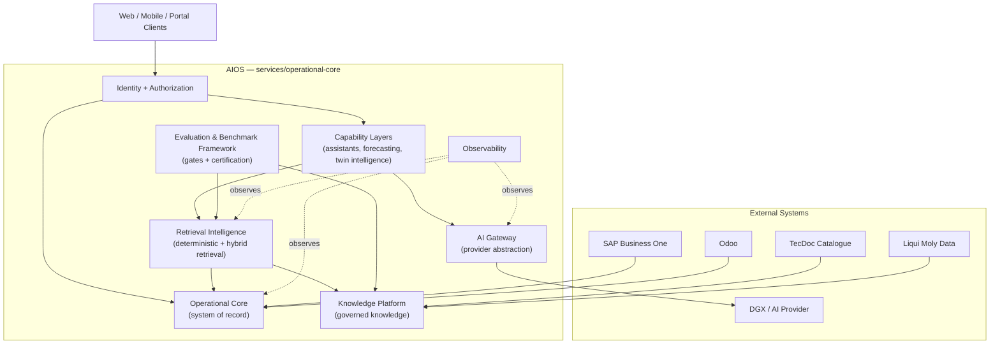
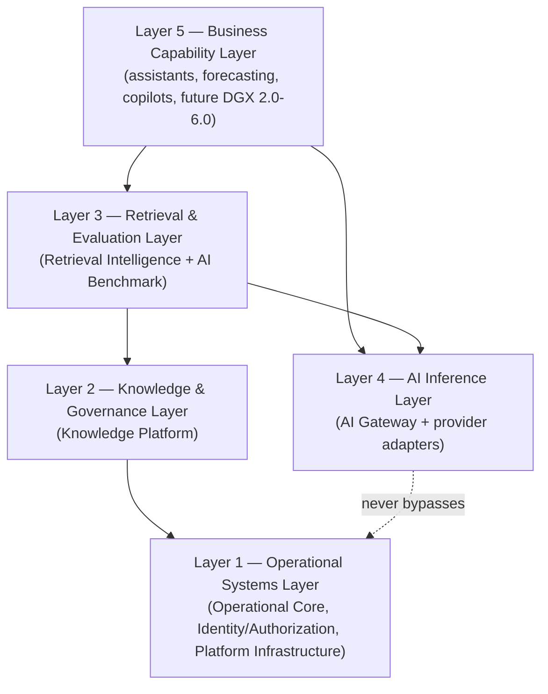
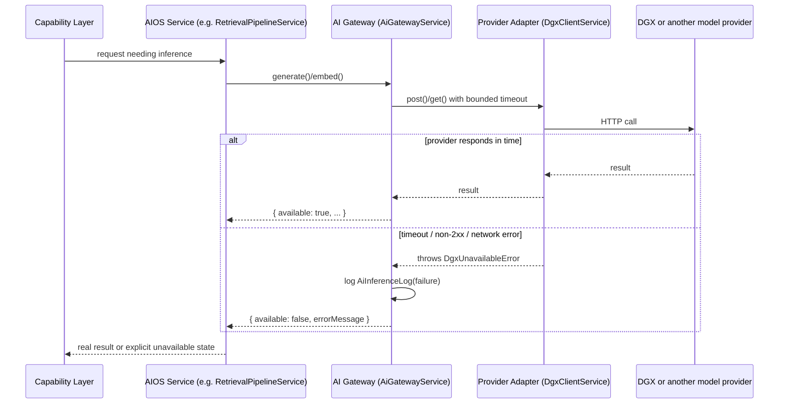
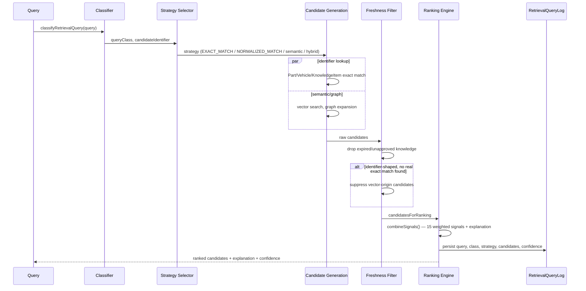
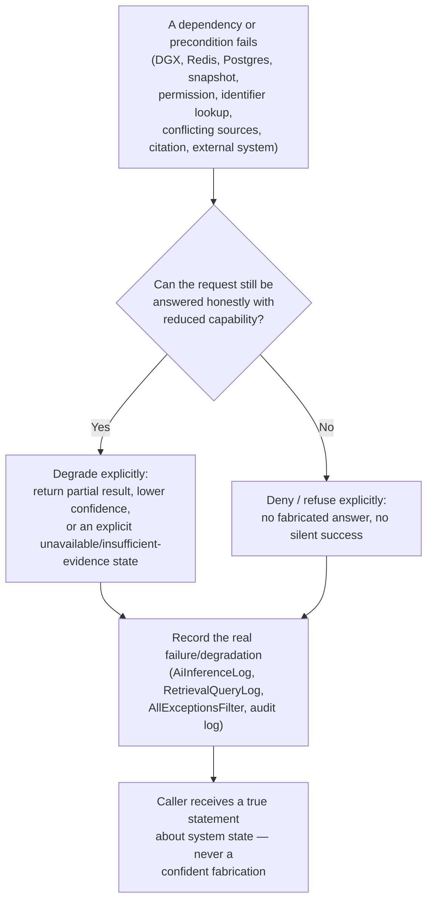
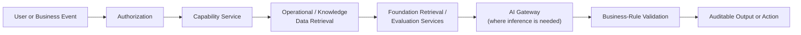
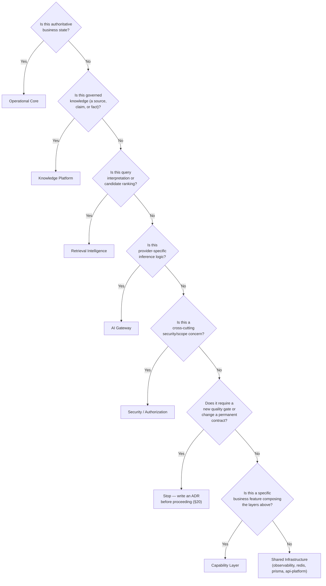

# AIOS Foundation Architecture Specification v1.0

### The Philosophy, Architectural Boundaries, Engineering Principles, and Permanent Contracts of the Molas Solutions Automotive Intelligence Operating System

---

## 1. Document Control

| Field | Value |
|---|---|
| Document name | AIOS Foundation Architecture Specification |
| Version | 1.0 |
| Organization | Molas Solutions |
| Classification | Internal Engineering Standard — Confidential |
| Approval status | APPROVED FOUNDATION BASELINE |
| Foundation certification verdict | `AI_FOUNDATION_CERTIFIED` |
| Certification evidence | `docs/ai-foundation-certification/final-report.md`, `docs/ai-foundation-certification/verification-results.md` |
| Gold Dataset version | v2 — 1,851 real benchmark cases (`RETRIEVAL_INTELLIGENCE_GOLD_EVAL_V1`, version 2) |
| Intended audience | New engineers, senior architecture reviewers, technical managers, and future maintainers replacing any AI provider, model, database, or framework |
| Document owner | AIOS Architecture (Molas Solutions Engineering) |
| Review cadence | Reviewed at every AI Foundation certification cycle, and at minimum annually |
| Change-control policy | Changes to any **Permanent Contract** or **Architectural Invariant** (§16) in this document require a formal Architecture Decision Record (§20) before implementation. Changes to prose, examples, or known-gap status do not require an ADR. |
| Supersedes | None — this is the first version of this document. |
| Superseded by | N/A |
| Repository scope covered | `services/operational-core` (the single AIOS backend at the time of writing), its Prisma schema, and the documentation under `docs/` |

This document is the constitution of AIOS. It is written to remain true for years, across model changes, framework upgrades, and new capability layers. It is not a sprint report, a release note, or a changelog — those exist elsewhere (see `docs/ai-foundation-certification/`, `docs/retrieval-intelligence/`, and the numbered phase docs under `docs/architecture/`). This document tells you what must never change while everything around it does.

---

## 2. Read This Before Writing AIOS Code

**AIOS is an Automotive Intelligence Operating System.**

It is **not**:

- a chatbot,
- a single language model,
- a DGX application,
- a vector database,
- a RAG demo,
- or a collection of unrelated AI modules bolted onto a database.

**AIOS is an enterprise platform** that combines automotive operational systems, governed knowledge, deterministic and hybrid retrieval, evaluation, security, permissions, business rules, and replaceable AI inference engines into one coherent system with permanent behavioral contracts.

> **"DGX provides inference capability; DGX is not the AIOS."**

DGX (Molas Solutions' current AI inference provider) can be replaced — by a different model, a different vendor, or a different deployment — while every architectural contract in this document remains intact. If a change to DGX, an embedding model, or any AI provider would force AIOS itself to break its promises about correctness, authorization, or auditability, that change was implemented wrongly. The provider is a plug-in; the platform is not.

### The automotive analogy (explanatory only — not the architecture itself)

| Vehicle part | AIOS equivalent |
|---|---|
| The complete vehicle | AIOS as a whole |
| The engine | DGX (the current inference provider) |
| The chassis | Operational Core — the system of record for vehicles, parts, inventory, sales, garage jobs |
| The transmission | Retrieval Intelligence — converts a request into the right knowledge, in the right order |
| The fuel system | Knowledge Platform — stores and moves governed knowledge |
| The fuel filter and quality control | Trusted Knowledge Governance — nothing reaches the engine unfiltered or unapproved |
| The ECU and diagnostic system | Evaluation Framework — measures, gates, and certifies behavior before it ships |
| Keys, immobilizer, and brakes | Authorization — decides who may do what, and stops unsafe actions |
| The dashboard and warning lights | Observability — makes system state visible and auditable |
| The vehicle's usable functions | Capability Layers — the business-facing features built on top of the foundation |

This analogy exists to build intuition on your first read. It is not a substitute for the five architectural layers defined in §5, and it should never be quoted as if it were a technical specification.

### Before your first commit

You must be able to answer "yes" to every item below before you open a pull request against AIOS:

- [ ] I know which of the five architectural layers (§5) my change belongs to, and why.
- [ ] I know AIOS's source-of-truth rules (§4, §7) and I am not creating a second source of truth for data that already has one.
- [ ] I understand the exact-identifier-first retrieval rule (§9) and why it exists.
- [ ] I understand the trusted-knowledge lifecycle (§8) and I am not treating unapproved or unreviewed content as verified truth.
- [ ] I understand the public retrieval contract my change must honor, and I am not silently changing its shape.
- [ ] I understand the security/authorization boundaries that apply to my change (§12), including the difference between the intended model and the currently known gaps.
- [ ] I understand what evaluation coverage (§10, §11) my change requires before it can ship.
- [ ] I am not calling DGX, or any model provider, directly from business or capability code (§6, §17).
- [ ] I am not bypassing the foundation's retrieval, evaluation, or governance services from a capability layer (§17).

If you cannot check every box, stop and read the relevant section below before writing code.

---

## 3. Why AIOS Exists

AIOS exists to prevent specific, real business failures — not to showcase AI:

- **Wrong part identification** — a technician or customer receiving a part that does not match the real, requested identifier.
- **Wrong vehicle fitment** — a part recommended for a vehicle it does not actually fit.
- **Wrong lubricant approval** — a lubricant recommended without a real, verified manufacturer approval, risking engine damage and warranty claims.
- **Unsupported technical claims** — a generated answer stating something as fact that no governed source actually supports.
- **Leakage of restricted knowledge** — confidential or access-restricted content reaching a user or system that is not authorized to see it.
- **AI hallucination** — a fluent, confident answer that is simply wrong.
- **Decisions based on stale or unreviewed data** — content that was superseded, expired, or never approved being treated as current truth.
- **Non-reproducible answers** — the same real question producing different, unexplainable answers on different days.
- **Untraceable model behavior** — an answer with no way to determine what knowledge, ranking, or reasoning produced it.
- **Tight coupling to one AI vendor or model** — the business becoming unable to change providers without rewriting the platform.
- **Operational systems becoming dependent on model availability** — core business operations halting because an AI service is down.

### The business philosophy

> **Verify before retrieval.**
> **Retrieve before generation.**
> **Measure before release.**
> **Preserve evidence after release.**

Every architectural decision documented below exists in service of these four sentences. When a new requirement seems to conflict with one of them, the requirement is wrong for AIOS, or it belongs in a capability layer with its own, separately governed risk model (§17) — not in the foundation.

---

## 4. AIOS Definition and System Boundaries

**AIOS** is the single backend platform (`services/operational-core`, a NestJS/Prisma application) that owns: automotive operational data, governed knowledge, retrieval and ranking logic, evaluation and certification, and the security/authorization model that binds them together. It exposes capability layers (assistants, forecasting, and future AI-driven features) that consume the foundation but do not replace it.

### What belongs inside AIOS

- **Operational Core** — vehicles, parts, lubricants, customers, suppliers, organizations, branches, warehouses, inventory, sales, purchases, garage operations, and the analytics/recommendation engines built directly on that data.
- **Knowledge Platform** — `src/knowledge-platform/`: source registry, versioned knowledge items, structured facts, claims, review workflow, conflict management, expiry/supersession, snapshots, and the knowledge graph.
- **Retrieval Intelligence Platform** — `src/retrieval-intelligence/`: query understanding, strategy selection, candidate generation, ranking, graph expansion, and the Retrieval Laboratory.
- **Evaluation and Benchmark Framework** — `src/ai-benchmark/`: the Benchmark Registry, Gold Datasets, quality gates, regression detection, and dashboards.
- **AI Gateway** — `src/ai-gateway/`: the single abstraction between AIOS and any inference provider.
- **Security and Authorization** — `src/identity/`, `src/authorization/`, `src/common/permissions/`.
- **Platform Infrastructure** — `src/observability/`, `src/redis/`, `src/prisma/`, `src/api-platform/`, `src/branch-gateway/`, `src/cdc/`, `src/backup/`.
- **Capability Layers** — `src/ai-assistants/`, `src/forecasting/`, `src/twin-intelligence/`, and future DGX 2.0-6.0 modules.

### What remains external to AIOS

- **Source systems**: SAP Business One, Odoo, the TecDoc parts/fitment catalogue, the Liqui Moly lubricant data source, and any future external system — these are *inputs*, ingested and governed through the Knowledge Platform or Data Consolidation layer, never trusted directly.
- **DGX and any AI inference provider** — external services accessed only through the AI Gateway (§6).
- **Client applications** — web, mobile, and portal frontends that call AIOS; they hold no business logic of their own that AIOS depends on.

### Distinguishing five concepts that are easy to conflate

| Concept | Definition | Example |
|---|---|---|
| **System of record** | The single authoritative store for a fact about the business. | `Part`, `Vehicle`, `Customer` rows in Postgres (Operational Core). |
| **Knowledge source** | An external or internal origin of information that has not yet been governed. | A raw TecDoc export, a Liqui Moly PDF, a workshop SOP document. |
| **Trusted snapshot** | An immutable, versioned, approved slice of governed knowledge, safe for AI consumption. | A `KnowledgeSnapshot` row with `status = APPROVED` or `ACTIVE`. |
| **Retrieval result** | A ranked, explainable set of candidates returned for a specific query, with signals and confidence. | The output of `RetrievalPipelineService.retrieve()`. |
| **AI-generated response** | Natural-language text produced by an inference provider, grounded in a retrieval result. | A RAG answer with citations back to specific `KnowledgeItemVersion` rows. |
| **Business decision** | An action taken by a human or an authorized workflow, informed by (but never automatically equal to) the above. | A technician approving a repair using a retrieved, cited part recommendation. |

An AI-generated response is never, by itself, a business decision. A retrieval result is never, by itself, verified truth — it is evidence, ranked and explained, that a human or a governed workflow uses to make a decision.

### System context



---

## 5. The Five Architectural Layers

AIOS is organized into five permanent conceptual layers. Modules move, get renamed, or get split over time; the layers themselves do not.



### Layer 1 — Operational Systems Layer

- **Responsibility**: own authoritative business data and enforce identity/authorization for every request.
- **Inputs**: direct API calls, integration adapters (SAP/Odoo/file-drop), user actions.
- **Outputs**: authoritative records; authorization decisions.
- **Owned data**: `Part`, `Vehicle`, `Customer`, `Supplier`, `Inventory`, `Sale`, `Purchase`, garage-operations records, and the identity/permission model.
- **Dependencies**: none upward — this layer must function even if every AI-related layer above it is unavailable.
- **Forbidden responsibilities**: must never depend on an AI provider to answer a request for its own authoritative data; must never let AI-generated text silently overwrite a record it owns.
- **Failure behavior**: operational workflows continue to function with AI-derived features degraded, not operational data itself becoming inconsistent.
- **Current modules**: `vehicles/`, `parts/`, `lubricants/`, `customers/`, `suppliers/`, `organizations/`, `branches/`, `warehouses/`, `inventory/`, `sales/`, `purchases/`, `garage-jobs/`, `diagnostics/`, `inspections/`, `estimates/`, `technicians/`, `labour/`, `identity/`, `authorization/`, `common/permissions/`, `redis/`, `prisma/`, `api-platform/`.
- **Replaceable technologies**: NestJS, Prisma, PostgreSQL, Redis (see §15).
- **Permanent contracts**: authoritative data has exactly one system of record; authorization is enforced before access to protected data; this layer never becomes unusable because an AI provider is down.

### Layer 2 — Knowledge & Governance Layer

- **Responsibility**: turn raw sources into governed, versioned, citable knowledge.
- **Inputs**: documents, structured exports, and internal-authored content from real sources (TecDoc, Liqui Moly, internal SOPs, repair cases).
- **Outputs**: `KnowledgeItem`/`KnowledgeItemVersion` rows, `KnowledgeClaim` rows, `StructuredFact` rows, `KnowledgeSnapshot` rows.
- **Owned data**: everything under the `KnowledgeSource`/`KnowledgeItem`/`KnowledgeItemVersion`/`KnowledgeClaim`/`StructuredFact`/`KnowledgeSnapshot` Prisma models (`prisma/schema.prisma`, lines 4478 onward).
- **Dependencies**: Layer 1 for authorization and audit; no dependency on Layer 3 or 4.
- **Forbidden responsibilities**: must never rank or retrieve knowledge (that is Layer 3's job); must never call an AI provider to decide whether content is "true" (that is a human review responsibility, see §8).
- **Failure behavior**: if ingestion or review is unavailable, existing approved snapshots remain usable; nothing is auto-approved to compensate.
- **Current modules**: `knowledge-platform/source-registry/`, `versioning/`, `structured-facts/`, `provenance/`, `review-workflow/`, `conflicts/`, `expiry-supersession/`, `snapshots/`, `graph/`, `ingestion/`, `parsing/`, `security/`, `acquisition/`.
- **Replaceable technologies**: the specific parsers, OCR engine, and malware-scanning adapter.
- **Permanent contracts**: no unapproved claim is presented as verified truth; provenance is never discarded; snapshot activation is explicit and auditable (§8).

### Layer 3 — Retrieval & Evaluation Layer

- **Responsibility**: turn a query into a ranked, explainable set of candidates drawn from governed knowledge and operational data; measure and certify that this works correctly before anything downstream trusts it.
- **Inputs**: a query (from a capability layer), the governed knowledge base, operational identifiers (OEM numbers, VINs, engine codes).
- **Outputs**: a `RetrievalResult` (candidates + explanation + confidence + citations) and, separately, real gate results/certification verdicts.
- **Owned data**: `RetrievalQueryLog`, `RetrievalExperiment`, `Benchmark`/`BenchmarkCase`/`BenchmarkRun`.
- **Dependencies**: Layer 2 for knowledge, Layer 1 for identifier data (`Part`, `Vehicle`), Layer 4 only for embedding/semantic-search support — never for identifier-exact resolution.
- **Forbidden responsibilities**: must never generate natural-language answers (that is Layer 4/5's job); must never be bypassed by a capability layer that wants "just the AI's opinion."
- **Failure behavior**: if semantic search is degraded, exact-identifier retrieval must keep working; if a query is identifier-shaped and no real match exists, no lower-quality result may impersonate one (§9).
- **Current modules**: `retrieval-intelligence/query-understanding/`, `strategy/`, `ranking/`, `graph-expansion/`, `pipeline/`, `lab/`, `failure-analysis/`, `benchmarking/`; `ai-benchmark/registry/`, `pipeline/`, `categories/`, `reports/`.
- **Replaceable technologies**: the specific embedding model, the vector index implementation, the BM25 tuning parameters.
- **Permanent contracts**: identifier-shaped queries always attempt deterministic resolution first (§9); every certified metric is measured against real, gold-standard data, never fabricated (§10, §11).

### Layer 4 — AI Inference Layer

- **Responsibility**: provide embedding generation, natural-language generation, and reasoning assistance as a service, through one abstraction.
- **Inputs**: prompts/text from the AI Gateway's callers.
- **Outputs**: embeddings, generated text, or an explicit unavailability signal.
- **Owned data**: none of AIOS's business data. `AiInferenceLog` (a record of calls made, for audit) is owned here.
- **Dependencies**: none within AIOS other than the AI Gateway's own rate limiter/timeout logic.
- **Forbidden responsibilities**: must never own business truth, retrieval policy, authorization, or certification status (§6).
- **Failure behavior**: on timeout or error, the caller receives an explicit unavailable state (`{ available: false, errorMessage }`), never a fabricated success.
- **Current modules**: `ai-gateway/ai-gateway.service.ts`, `ai-gateway/dgx-client.service.ts`, `ai-gateway/rate-limiter.service.ts`, `ai-gateway/prompt-sanitizer.ts`.
- **Replaceable technologies**: DGX itself, any specific model, any specific embedding model.
- **Permanent contracts**: this is the *only* path from AIOS to an inference provider (§6, invariant 2-3).

### Layer 5 — Business Capability Layer

- **Responsibility**: deliver a specific business feature by composing Layers 1-4, plus its own business rules, evaluation, and human oversight.
- **Inputs**: user/business events, authorized requests.
- **Outputs**: business-facing answers or actions, always auditable, always citing the foundation evidence they relied on.
- **Owned data**: capability-specific state only (e.g., an assistant's conversation log) — never a duplicate of Layer 1/2 data.
- **Dependencies**: all layers below; never the reverse.
- **Forbidden responsibilities**: must never call DGX directly; must never write AI-generated content straight into an authoritative operational record; must never invent its own retrieval or knowledge-approval logic.
- **Failure behavior**: a capability layer degrades or refuses before it fabricates.
- **Current modules**: `ai-assistants/`, `forecasting/`, `twin-intelligence/`, `ai-feedback/`.
- **Replaceable technologies**: the entire capability implementation — capability layers are, by design, the most disposable and replaceable part of AIOS.
- **Permanent contracts**: every new capability layer follows the integration rules in §17, and is separately evaluated and certified (§10-§11) — foundation certification does not certify capability-layer behavior automatically (invariant 20).

---

## 6. The Role of DGX

DGX currently provides, through the AI Gateway (`src/ai-gateway/`):

- **Embedding generation** (`DgxClientService`'s `embed()` path, 60-second timeout).
- **Model inference / natural-language generation** (`generate()` path, 180-second timeout).
- **Health/model-listing endpoints** (5-second and 10-second timeouts respectively).
- **Reasoning assistance where explicitly permitted** by a capability layer's own design.

DGX does **not** own, and never has owned:

- Business data (Operational Core owns it).
- Retrieval policies (Retrieval Intelligence owns them).
- Knowledge approval (the Knowledge Platform's human review workflow owns it).
- Authorization (Identity/Authorization owns it).
- Fitment truth or lubricant-approval truth (structured facts and human-reviewed claims own them).
- Benchmark definitions or quality gates (the Evaluation Framework owns them).
- Certification status (the verification scripts and their real, measured output own it).
- Source provenance (the Knowledge Platform's provenance model owns it).
- Snapshot lifecycle (`KnowledgeSnapshotService` owns it).

### The provider-replacement principle

> **AIOS must continue to preserve its behavioral and safety contracts when DGX or any underlying model is replaced.**

If replacing DGX with a different provider would change whether identifier-first retrieval works, whether unapproved knowledge can leak into an answer, or whether certification gates still mean anything — the coupling was implemented incorrectly. The correct integration point is always through the AI Gateway.



**It is architecturally forbidden for a capability layer, controller, or business module to call DGX (or any model provider) directly, bypassing the AI Gateway.** Every inference call passes through `AiGatewayService`. This is what makes provider replacement a Gateway-level change instead of a codebase-wide rewrite.

---

## 7. Operational Core as the System of Record

The NestJS/Prisma Operational Core is authoritative for the domains listed in §5, Layer 1: vehicles, parts, lubricants, customers, suppliers, organizations, branches, warehouses, inventory, sales, purchases, garage operations (job cards, diagnostics, inspections, estimates), technicians, and the analytics/recommendation engines built directly on that data (`inventory-analytics/`, `lost-sales/`, `purchase-recommendations/`, `transfer-recommendations/`, `supplier-analytics/`, `forecasting/`).

### Authoritative vs. derived data

| Data class | Example | Authority |
|---|---|---|
| Authoritative operational record | `Part.oemNumber`, `Vehicle.vin`, an `Inventory` ledger entry | Operational Core owns it; nothing else may silently change it. |
| Cached/imported data | Data ingested from SAP/Odoo/TecDoc via `data-consolidation/`, `data-readiness/`, `integration/` adapters | Authoritative *once validated and imported*; the external system remains the ultimate source until then. |
| Derived/inferred data | A `RetrievalQueryLog` entry, a computed forecast, a ranking explanation | Never authoritative on its own; always traceable back to the operational or knowledge data it was derived from. |

### The permanent rule on AI and authoritative records

> **AI-generated text must never silently overwrite an authoritative operational record.**

Any workflow where an AI-derived suggestion (a forecast, an assistant's recommendation, a generated description) is allowed to become part of the operational system of record must do so through an explicit, validated, audited write-back path — never a direct, unreviewed write from inference output to a `Part`, `Vehicle`, `Inventory`, or similar authoritative table. As of this specification, no such automatic AI-to-authoritative-record write path exists in AIOS; every current AI-adjacent module (assistants, forecasting, twin intelligence) produces advisory output consumed by a human or a separately-validated workflow, not a direct database write bypassing normal business validation.

---

## 8. Trusted Knowledge Philosophy

Raw documents and data exports are not knowledge. They become governed knowledge only by moving through a defined lifecycle:

```mermaid
flowchart LR
    A["Source\n(TecDoc, Liqui Moly, SOPs,\ninternal repair cases)"] --> B["Permission &\nLicensing Check"]
    B --> C["Ingestion"]
    C --> D["Malware Validation"]
    D --> E["Parsing / OCR"]
    E --> F["Structured Extraction"]
    F --> G["Claim Creation"]
    G --> H["Human Review"]
    H --> I["Conflict Management"]
    I --> J["Approval"]
    J --> K["Snapshot"]
    K --> L["Retrieval Eligibility"]
    L --> M["Citation"]
    M --> N["Audit History"]
```



This lifecycle is implemented across `knowledge-platform/source-registry/`, `acquisition/`, `security/` (malware scanning, encryption), `parsing/`, `structured-ingestion/`, `provenance/`, `review-workflow/`, `conflicts/`, `expiry-supersession/`, and `snapshots/`.

### Why each stage exists

- **Raw documents are not automatically trusted** because a source being *accessible* (a PDF sitting in a folder) says nothing about whether its content is *correct*, *current*, or *licensed for AI use*.
- **Approved snapshots exist** because retrieval and generation need a stable, versioned, "as of this point in time" view of knowledge — not a live, constantly-shifting set of documents in unknown review states.
- **Review state matters** because a claim extracted by an automated pipeline is a *candidate* fact, not a verified one, until a human (or a defined dual-review process for high-risk facts) confirms it.
- **Conflicts must remain visible** because silently picking one of two contradictory sources hides a real data-quality problem instead of solving it.
- **Provenance must be preserved** because every answer that depends on governed knowledge must be traceable back to the specific source and version that supports it — this is what makes an AI-assisted answer auditable rather than a black box.
- **Stale knowledge cannot be treated as current truth** because a superseded document (an old service bulletin, an expired approval) being retrieved as if it were current is a direct path to the wrong-part/wrong-fitment/wrong-approval failures described in §3.
- **Restricted knowledge must remain inaccessible to unauthorized users** because some governed knowledge (e.g., internal-only repair cases, licensed third-party content) is real and useful but not universally shareable — governance without access control is not governance.

### Permanent knowledge contracts

1. No unapproved claim may be represented as verified truth.
2. Every answer based on governed knowledge must preserve provenance back to its source and version.
3. Snapshot activation must be explicit and auditable — never implicit, never automatic based on inference output.
4. Knowledge deletion or supersession must not erase audit history.
5. Synthetic data must never be presented as real business evidence (see §11's prohibition on synthetic benchmark cases, which follows the same principle).

---

## 9. Retrieval Intelligence Philosophy

Retrieval is the safety boundary between "what the business actually knows" and "what an AI model might say." Its job is to find and rank the right evidence *before* any generation happens — never to be an afterthought that generation can route around.

### The real pipeline (`retrieval-intelligence/pipeline/retrieval-pipeline.service.ts`)

Query normalization → language detection → query classification (`query-understanding/query-classifier.ts`, a pure, deterministic, regex-based 21+-class classifier) → identifier extraction → strategy selection (`strategy/strategy-selector.ts`) → parallel candidate generation (exact identifier lookup against the catalogue; Vehicle table lookup for VIN/engine/transmission codes; `KnowledgeItem` key lookup; vector/embedding similarity search; graph expansion for fitment/supersession) → freshness/expiry/structured-fact filtering → candidate ranking (`ranking/ranking-engine.ts`, a 15-signal weighted scoring function with a per-candidate explanation array) → confidence calculation → `RetrievalQueryLog` persistence → citation preparation.



### The permanent rule

> **When a query is identifier-shaped, AIOS must attempt deterministic identifier resolution before semantic retrieval.**

This is structural, not a matter of pipeline discipline: identifier-shaped classes are checked in the classifier *before* any language/free-text class is even considered, so this ordering cannot be silently bypassed by a change elsewhere in the pipeline.

### The safeguard this rule requires

> **If an identifier-shaped query has no genuine exact result, unrelated vector candidates must not be presented as valid identifier matches.**

This exists because of a real, measured embedding-model artifact found during the AI Foundation Certification Sprint: a completely nonexistent identifier-shaped query scored a real 0.7 cosine similarity — above the system's own documented 0.65 "high confidence" threshold — against an unrelated real document. No similarity-threshold tuning can fix this category of error, because the false match already clears the threshold. The fix is structural: when a query classified as identifier-shaped genuinely attempts exact lookup and finds nothing real, vector-origin candidates are removed from the final result entirely (implemented in `RetrievalPipelineService.retrieve()`; verified by a dedicated integration test in `retrieval-intelligence.integration-spec.ts`). This safeguard never applies to genuine `TYPO`/`APPROXIMATE_SEARCH` classes, which are permitted their own fuzzy fallback.

### Why classification/candidate-generation bugs are correctness defects, not tuning knobs

The AI Foundation Certification Sprint closed every real gap this way: every failing case was traced to a real bug in query classification or candidate generation (a length boundary excluding a real short or long OEM number, a shared regex missing a real formatting convention, a missing table lookup) — never "fixed" by adjusting a ranking weight to paper over the wrong candidates being considered in the first place. See `docs/ai-foundation-certification/identifier-analysis.md` and `docs/ai-foundation-certification/ranking-experiments.md` (which documents, honestly, that *no* ranking-weight experiment was needed this sprint, because the real problem was never in ranking).

---

## 10. Retrieval Quality Contracts

The certified state of the Retrieval Intelligence Platform, measured against Gold Dataset v2 (1,851 real, human-approved benchmark cases — see `docs/ai-foundation-certification/final-report.md`):

| Gate | Certified value | Threshold | Business meaning |
|---|---|---|---|
| Recall@1 | 0.9860 | ≥ 0.98 | How often the single best real answer is actually returned first — directly protects "did the technician get the right part on the first try." |
| MRR (Mean Reciprocal Rank) | 0.9883 | ≥ 0.95 | How close to the top the correct answer appears even when it isn't first — protects usability of the ranked list as a whole. |
| Identifier Accuracy | 1.0000 (exact) | = 1.00 | Whether a real OEM number, internal code, VIN, or engine code resolves to the *correct* record every single time — protects every exact part-lookup and vehicle-lookup workflow in the business. This is the only gate with zero tolerance, because an identifier is either right or it is a different part. |
| Wrong Fitment | 0 | = 0 | Zero real cases where a part was recommended for a vehicle it does not fit — protects technicians and customers from installing incompatible parts. |
| Wrong Supersession | 0 | = 0 | Zero real cases where a superseded part number was retrieved as if it were still current — protects against ordering discontinued or replaced parts. |
| Wrong Lubricant Approval | 0 | = 0 | Zero real cases of an unapproved lubricant being presented as approved — protects engines, warranties, and the business's own liability. |
| Restricted Leakage | 0 | = 0 | Zero real cases of access-restricted knowledge reaching an unauthorized query — protects confidentiality and licensing commitments. |
| p95 Latency | 2,878 ms | ≤ 5,000 ms | Protects operational usability — a technician cannot wait indefinitely for a lookup. |
| Full test suite | 146/146 suites, 862/862 tests | all pass | Protects that the rest of the platform did not regress while retrieval was tuned. |
| Certification verification | 13/13 EXECUTED_PASSED | all pass | Protects that certification is a real, executed, reproducible process — not an assertion. |
| Final verdict | `AI_FOUNDATION_CERTIFIED` | — | The AI Foundation is certified as of this baseline. |

These numbers are not merely performance statistics — each one is a direct proxy for a specific business risk from §3. A future change that improves an unrelated metric while regressing any gate in this table has made AIOS worse at its actual job, regardless of how the change looked in isolation.

> **Any future change affecting retrieval behavior must be checked against this certified benchmark before it ships.** A change that cannot be measured against Gold Dataset v2 (or its successor) has not been verified.

---

## 11. Evaluation Before Generation

The Evaluation Framework (`ai-benchmark/`) exists so that nothing about AIOS's AI-assisted behavior is asserted — everything is measured. Its components:

- **Gold datasets** (`Benchmark`/`BenchmarkCase`, e.g. `RETRIEVAL_INTELLIGENCE_GOLD_EVAL_V1`) — real, human-approved cases, versioned and append-only via `BenchmarkRegistryService.createNewVersion()`.
- **Benchmark cases** — each with a real, structurally verifiable expected answer.
- **Regression testing** — the full unit/integration suite, run before every change is accepted.
- **Quality gates** (`ai-benchmark/pipeline/*-quality-gates.ts`) — thresholds that must be met, evaluated by pure functions over real measured inputs.
- **Certification artifacts** — `docs/ai-foundation-certification/`, the persisted `BenchmarkRun` history.
- **Verification scripts** (`scripts/verify-*.ts`) — executed, step-by-step, honest EXECUTED_PASSED/EXECUTED_FAILED/SKIPPED records.
- **Evaluation dashboards** (`ai-benchmark/reports/`) — real, self-hosted, static HTML views over real persisted data.
- **Human review** — the Knowledge Platform's review workflow, and the human-approval step every gold benchmark case requires before entering a frozen dataset.
- **Real-case expansion** — new benchmark cases sourced only from real, confirmed-existing data.

### Why Gold Dataset v1 stayed unchanged and v2 was created instead

`RETRIEVAL_INTELLIGENCE_GOLD_EVAL_V1`'s original 1,840 cases were never edited in place. `build-retrieval-intelligence-gold-eval-v2.ts` created a new version (v2, 1,851 cases) by carrying all 1,840 v1 cases forward unchanged and adding 11 new real regression cases, each drawn from a real, confirmed-existing `Part` row queried directly from the live catalogue. v1 remains inspectable, immutable, and checksum-verified at its own version. This is the append-only pattern every versioned registry in AIOS follows (`BenchmarkRegistryService`, and the equivalent pattern in `PromptRegistryService`).

### Rules

> **A bug found in production or certification should become a durable regression case, where legally and technically appropriate.**

> **Benchmarks must never be weakened merely to make a release pass.**

Specifically prohibited:

- Removing difficult cases without documented justification.
- Replacing real cases with easier synthetic cases.
- Hardcoding benchmark answers.
- Waiving mandatory safety gates (fitment, supersession, lubricant approval, leakage) — these have zero-tolerance thresholds for a reason (§10).
- Manipulating ranking weights solely to inflate a metric, rather than fixing the real, underlying classification or candidate-generation defect (§9).
- Reporting a sampled result as full-dataset certification. The AI Foundation Certification Sprint found this exact failure mode directly: a 150-case sample twice reported `ALL GATES PASS`, while the full 1,840+-case run revealed a real, honest gap the smaller sample simply never happened to sample. Certification decisions must be based on the full real dataset, not a convenient subset.

---

## 12. Security, Identity, Authorization, and Scope

### The intended permanent model

- **Authentication**: verified identity via JWT or API key (`identity/`).
- **Authorization**: capability-based permissions (`common/permissions/`), evaluated per-route via `PermissionsGuard` and `@RequirePermissions()`.
- **Scope**: branch, warehouse, and tenant boundaries, enforced via `authorization/scope.guard.ts` and `@RequireBranchScope()`.
- **Restricted knowledge**: access-classification-aware retrieval (Knowledge Platform's `accessClassification`/`allowedAiUse` fields), enforced before a restricted item can appear in any result.
- **Audit**: an immutable audit trail (`common/audit/`, `security/audit-log-immutability` verified by its own integration test) for security-relevant actions.
- **Secrets and encryption**: field-level encryption for sensitive knowledge content (`knowledge-platform/security/`), transport security via TLS.

### Current, honestly documented gaps

These are real, verified conditions in the codebase today. They are **not** part of the permanent architecture described above — they are remediation work, tracked here so no future engineer mistakes them for intended design:

| Gap | Where | Status |
|---|---|---|
| Legacy `RolesGuard` still guards some routes | `common/rbac/roles.guard.ts`, used by `parts.controller.ts`, `vehicles.controller.ts`, `integration.controller.ts` | Trusts an `x-user-role` request header directly — never migrated to `PermissionsGuard`. |
| Global JWT guard does not itself reject requests | `identity/jwt-auth-context.guard.ts`, registered as `APP_GUARD` in `identity.module.ts` | Enriches the actor from a verified credential when present, but falls through to a header-based actor stand-in when absent — authentication *enforcement* depends entirely on each route separately applying a rejecting guard. |
| Branch/warehouse scope is opt-in | `authorization/scope.guard.ts`, `@RequireBranchScope()` | Routes that do not explicitly add this decorator get no scope check at all; `tenancy/tenant-context.service.ts` states in its own comments that this has not been retrofitted onto most of the Phase 1-4 services. |
| Self-signed TLS certificate | `security/self-signed-cert.ts` | A real deployment requires a CA-issued certificate. |

**These gaps do not invalidate the certified retrieval foundation** (§10 — certification covers retrieval correctness, not the full application's authorization posture). They **must** be resolved before broad, unrestricted production exposure, and no new capability layer may be built on the assumption that the legacy `RolesGuard`/header-based fallback is acceptable long-term.

---

## 13. Failure Philosophy and Graceful Degradation

> **Failure must reduce capability, not invent certainty.**



| Condition | Expected behavior | Forbidden behavior | Audit requirement |
|---|---|---|---|
| DGX unavailable / embedding timeout | Return an explicit unavailable state (`{ available: false, errorMessage }`) | Fabricating a plausible-looking response | Log an `AiInferenceLog` failure row |
| Redis unavailable | Degrade cache/rate-limit/queue behavior; app startup and request handling continue | Crashing the process; silently treating a cache error as "no data exists" | Log the connection error |
| Postgres unavailable / connection drop | The failing request surfaces a real error through the global exception filter | Returning a fabricated or empty-but-successful response | Standard request error logging via `AllExceptionsFilter` |
| Knowledge snapshot missing or not yet activated | Fall back to the latest `APPROVED` snapshot, explicitly | Silently using unapproved or draft content | Snapshot selection is recorded in `RetrievalQueryLog` |
| User lacks permission | Deny access | Silently filtering results without indicating denial, or granting partial access | Authorization decision is auditable |
| Exact identifier lookup returns no result | Report insufficient evidence / low confidence; do not silently substitute a semantic guess as if it were an exact match (§9) | Recommending a guessed part with false confidence | `RetrievalQueryLog` records the real candidate set and confidence |
| Sources conflict | Surface the conflict | Silently picking one source | `KnowledgeConflictService` keeps conflicts visible until resolved |
| No citation can be established | Report the claim as unsupported | Generating a citation-free claim of fact | Citation resolution is part of the generation contract |
| External system (SAP/Odoo) offline | Degrade the specific integration; other operational functions continue | Blocking unrelated operational workflows | Integration failure is logged |

---

## 14. Observability and Auditability

AIOS records, for every real retrieval, generation, or governance action: query class, retrieval strategy, matched identifiers, ranking signal contributions, candidate origin, source provenance, confidence, the inference provider's identity, and final citations. This is what "explainability" means in AIOS — **not** exposing a model's internal reasoning, which AIOS makes no claim to have access to or control over, but recording reproducible system decisions that a human can audit after the fact.

### Current implementation and known gaps

- Metrics are exported via `prom-client` (`observability/metrics.service.ts`) — real Counters, Gauges, and Histograms for retrieval, identifier accuracy, candidate counts, ranking-signal usage, and certification progress.
- **No external Grafana/APM instance exists in this environment.** Dashboards are self-hosted, static HTML (`ai-benchmark/reports/report-generator.ts`, `certification-dashboard.ts`) generated from real, live-queried data — a deliberate, honestly-documented substitute, not an oversight.
- Certification and backup processes are **manually triggered scripts** (`scripts/run-real-certification-gate-check.ts`, `scripts/verify-*.ts`), not run by an in-process scheduler — there is no `@nestjs/schedule`, `node-cron`, or job-queue library in this codebase today.

---

## 15. Technology Is Replaceable; Contracts Are Permanent

| Concern | Current technology | Replaceable? | Permanent contract |
|---|---|---|---|
| Runtime framework | NestJS 10 | Yes | Module boundaries and dependency-injection discipline may be re-expressed in another framework; layer responsibilities (§5) may not change. |
| ORM | Prisma 5 | Yes | Schema *meaning* (system of record, versioning, append-only registries) must be preserved by any replacement. |
| Database | PostgreSQL | Yes | ACID guarantees for authoritative operational and knowledge data must be preserved. |
| Cache/queue mechanism | Redis (`ioredis`) | Yes | Cache-miss and queue-failure behavior must remain a graceful degrade, not a crash (§13). |
| AI provider | DGX | **Yes — by design** | The AI Gateway abstraction (§6) must remain the only integration point. |
| Embedding model | Whatever DGX currently serves | Yes | Retrieval must remain correct without depending on any specific model's quirks — see the embedding-artifact safeguard in §9. |
| Vector search implementation | In-house `vector-search/` module | Yes | Semantic search remains subordinate to exact-identifier-first retrieval (§9). |
| Observability stack | `prom-client`, self-hosted HTML dashboards | Yes | The specific data points recorded (§14) must remain available regardless of visualization tooling. |
| Source systems | SAP, Odoo, TecDoc, Liqui Moly | Yes, and expected to grow | New sources enter through the Knowledge Platform's governance lifecycle (§8), never as a shortcut around it. |
| Dashboard implementation | Static HTML, generated per-run | Yes | Certification evidence must remain reproducible from real, persisted data (§10, §11). |

Frameworks may change. Models may change. Databases may change. Providers may change. What must remain: verified knowledge, provenance, authorization, deterministic exact retrieval, quality evaluation, citations, auditability, explicit failure, provider abstraction, and business-rule ownership.

---

## 16. Architectural Invariants

Each invariant below is non-negotiable without a formal ADR (§20).

1. **DGX is an inference provider, not the AIOS.**
   *Rationale*: keeps the platform's safety contracts independent of any one vendor. *Evidence*: `AiGatewayService`/`DgxClientService` separation. *Test*: no module outside `ai-gateway/` imports a DGX-specific client. *Violation example*: a capability service importing `DgxClientService` directly.

2. **Business capabilities must not call model providers directly.**
   *Rationale*: preserves provider replaceability and consistent timeout/error handling. *Evidence*: every current AI-consuming module (`catalogue-ai/`, `ai-assistants/`) calls through `AiGatewayService`. *Test*: grep for direct `DgxClientService` usage outside `ai-gateway/`. *Violation example*: a controller constructing its own HTTP call to an inference endpoint.

3. **AI Gateway owns provider abstraction.**
   *Rationale*: one place to change when providers change. *Evidence*: §6. *Test*: `DgxUnavailableError` is only thrown/caught within `ai-gateway/`. *Violation example*: catching provider-specific errors in a capability service.

4. **Operational systems remain authoritative for operational records.**
   *Rationale*: prevents a second, conflicting source of truth. *Evidence*: §7. *Test*: no write path from AI-generated text directly into `Part`/`Vehicle`/`Inventory` tables bypassing normal validation. *Violation example*: an assistant module updating `Part.productName` directly from a generated answer.

5. **Unapproved knowledge cannot be treated as verified truth.**
   *Rationale*: §8. *Evidence*: `BenchmarkRegistryService`'s gold-dataset immutability enforcement and the Knowledge Platform's review-workflow gating. *Test*: retrieval never returns a `DRAFT`/unreviewed claim as a cited fact. *Violation example*: surfacing an unreviewed `KnowledgeClaim` as a supported answer.

6. **Identifier-shaped queries must attempt deterministic lookup first.**
   *Rationale*: §9. *Evidence*: the classifier's Section-1 ordering in `query-classifier.ts`. *Test*: `retrieval-intelligence.integration-spec.ts`'s exact-match tests. *Violation example*: routing an OEM-number query straight to semantic search.

7. **No semantic result may impersonate a missing exact identifier match.**
   *Rationale*: §9's embedding-artifact safeguard. *Evidence*: the vector-candidate suppression in `RetrievalPipelineService.retrieve()`. *Test*: the "suppresses the semantic widening pass" integration test. *Violation example*: removing the suppression to "improve recall" without re-verifying it doesn't reintroduce false identifier matches.

8. **Retrieval decisions must be measurable and reproducible.**
   *Rationale*: §10, §11. *Evidence*: `RetrievalQueryLog`, the gate-computation scripts. *Test*: re-running a gate check against the same data produces the same result. *Violation example*: a ranking change with no corresponding gate re-measurement.

9. **Certified safety gates must not be weakened silently.**
   *Rationale*: §11. *Evidence*: zero-tolerance thresholds for fitment/supersession/lubricant-approval/leakage. *Test*: any threshold change requires an ADR. *Violation example*: raising `maxWrongFitment` from 0 to "improve pass rate."

10. **New real failures should become regression cases.**
    *Rationale*: §11. *Evidence*: Gold Dataset v2's 11 new real cases. *Violation example*: fixing a bug without adding the case that exposed it.

11. **Authorization must be enforced before restricted data retrieval.**
    *Rationale*: §12. *Evidence*: `RESTRICTED_LEAKAGE` gate, currently 0. *Violation example*: a new retrieval path that skips access-classification filtering.

12. **Generated answers must preserve citations when claims depend on governed knowledge.**
    *Rationale*: §8, §9. *Evidence*: citation preparation stage in the retrieval pipeline. *Violation example*: a generation path that drops citation metadata "for a cleaner answer."

13. **Model unavailability must not become fabricated certainty.**
    *Rationale*: §6, §13. *Evidence*: `{ available: false }` contract. *Violation example*: catching a `DgxUnavailableError` and returning a made-up answer instead of surfacing unavailability.

14. **Capability layers must reuse foundation services rather than duplicate them.**
    *Rationale*: §17. *Violation example*: a new capability module implementing its own OEM-number lookup instead of calling `CatalogueSearchService`/`RetrievalPipelineService`.

15. **New modules must not create a second source of truth.**
    *Rationale*: §4, §7. *Violation example*: a capability layer caching and independently updating its own copy of `Part` data.

16. **Cross-branch and tenant boundaries must be explicit.**
    *Rationale*: §12. *Violation example*: a new query that ignores branch scope "because it's a read-only report."

17. **Every irreversible or high-impact AI-assisted action requires a validated business workflow.**
    *Rationale*: §3, §7. *Violation example*: an assistant directly approving a warranty claim without human or workflow validation.

18. **Synthetic data must always be labeled.**
    *Rationale*: §8, §11. *Violation example*: seeding a benchmark case that looks real but was invented, without provenance marking it as synthetic.

19. **Architecture changes require ADRs.**
    *Rationale*: §20. *Violation example*: replacing the embedding model without a documented ADR.

20. **Foundation certification does not certify future capability-layer behavior automatically.**
    *Rationale*: §17. *Violation example*: shipping DGX 4.0 (Technician Copilot) and claiming it is "certified" because the AI Foundation is `AI_FOUNDATION_CERTIFIED`.

---

## 17. Rules for New Capability Layers

The AI Foundation is permanently complete as of `AI_FOUNDATION_CERTIFIED`. Per its own transition rule, future work moves to capability layers: DGX 2.0 (Demand Forecasting), 3.0 (Predictive Maintenance), 4.0 (Technician Copilot), 5.0 (Customer Intelligence), 6.0 (Management Intelligence). **No further AI Foundation prototypes are to be created** — new work is capability work, built on top of the certified foundation.

Every new capability layer still requires its own: business requirements, data-readiness assessment, risk model, evaluation dataset, quality gates, permissions, observability, failure handling, human oversight, and release verdict. Certification of the foundation is not certification of what is built on it (invariant 20).

### Approved capability flow



### Capability layers must never

- Bypass retrieval governance (calling a vector index or the catalogue directly instead of `RetrievalPipelineService`).
- Bypass authorization.
- Write AI-generated output directly into authoritative operational records.
- Create a hidden, capability-specific knowledge store outside the Knowledge Platform.
- Introduce their own unreviewed prompts with no evaluation coverage.
- Call DGX directly.
- Declare themselves trustworthy merely because the foundation is certified — each capability earns its own verdict.

---

## 18. Decision Framework for Engineers

### "Where should this new code live?"



Ask yourself, in order: Is this authoritative business state? Is this governed knowledge? Is this query interpretation? Is this provider-specific inference logic? Is this a business decision? Is this a cross-cutting concern? Does it require a new quality gate? Does it change a permanent contract? If the last answer is yes, stop and write an ADR before another line of code.

---

## 19. Anti-Patterns

1. **Direct DGX calls from controllers.** *Why dangerous*: breaks provider replaceability and bypasses timeout/error handling. *Correct pattern*: call `AiGatewayService`.
2. **Model-generated fitment accepted without deterministic evidence.** *Why dangerous*: a real wrong-fitment business risk (§3). *Correct pattern*: fitment claims must trace to a real structured fact or graph relationship.
3. **Prompt logic duplicated across modules.** *Why dangerous*: inconsistent behavior, untestable in aggregate. *Correct pattern*: shared prompt logic lives in `prompt-registry/`.
4. **Hidden vector search fallback for exact identifiers.** *Why dangerous*: reintroduces the embedding-artifact risk (§9). *Correct pattern*: use the classifier's identifier-shaped path and the documented suppression rule.
5. **Silent benchmark threshold reduction.** *Why dangerous*: makes certification meaningless (§11). *Correct pattern*: any threshold change requires an ADR.
6. **Creating a second customer/vehicle/part source of truth.** *Why dangerous*: data divergence, silent inconsistency (§7). *Correct pattern*: read/write through the existing Operational Core service.
7. **Treating imported data as trusted automatically.** *Why dangerous*: skips the governance lifecycle (§8). *Correct pattern*: route through `data-consolidation`/Knowledge Platform ingestion.
8. **Exposing restricted documents before authorization.** *Why dangerous*: a real leakage risk (§3, §12). *Correct pattern*: enforce access-classification filtering before returning any candidate.
9. **Using model confidence as business proof.** *Why dangerous*: confidence is a model artifact, not verified truth. *Correct pattern*: business proof comes from structured facts, citations, and human review.
10. **Storing final answers without provenance.** *Why dangerous*: makes the answer unauditable (§8, §14). *Correct pattern*: always persist the citation/provenance chain.
11. **Catching errors and returning fake success.** *Why dangerous*: violates §13's failure philosophy directly. *Correct pattern*: surface the real failure state.
12. **Treating a sampled benchmark as certification.** *Why dangerous*: exactly the mistake this sprint found and corrected (§11). *Correct pattern*: certify against the full real dataset.
13. **Writing model output directly into SAP/Odoo.** *Why dangerous*: corrupts external systems of record with unverified content. *Correct pattern*: route through validated, human-in-the-loop integration workflows.
14. **Creating a new module when an existing domain owns the responsibility.** *Why dangerous*: fragments ownership, duplicates logic. *Correct pattern*: extend the owning module.
15. **Hardcoding provider-specific behavior into business logic.** *Why dangerous*: breaks §6's replacement principle. *Correct pattern*: isolate provider quirks inside the Gateway/adapter.
16. **Deleting conflicting knowledge instead of governing it.** *Why dangerous*: hides a real data-quality signal (§8). *Correct pattern*: use `KnowledgeConflictService` to surface and resolve conflicts.
17. **Suppressing known limitations from documentation.** *Why dangerous*: erodes the trust this entire document depends on. *Correct pattern*: document gaps honestly, as §12 and §21 do.

---

## 20. Architecture Decision Records

An ADR is **mandatory** before:

- Replacing DGX or any AI inference provider.
- Replacing the embedding model.
- Changing exact-identifier retrieval behavior (§9).
- Changing any quality-gate threshold (§10, §11).
- Introducing a new source of truth for existing authoritative data.
- Changing knowledge-snapshot semantics (§8).
- Changing authorization boundaries (§12).
- Introducing any autonomous AI-to-authoritative-record write-back.
- Creating a new AI capability layer (§17).
- Moving from a monolith to distributed services.

### ADR template

```
# ADR-<number>: <title>

## Context
What problem or need prompted this decision?

## Decision
What was decided?

## Alternatives Considered
What other options existed, and why were they rejected?

## Business Impact
How does this affect the risks in §3?

## Security Impact
How does this affect §12's model?

## Data Impact
Does this change any system of record or governance lifecycle (§7, §8)?

## Evaluation Impact
What new or changed quality gates, benchmarks, or verification steps are required (§10, §11)?

## Migration Plan
How does the system move from the old state to the new one?

## Rollback Plan
How is this decision reversed if it proves wrong?

## Approval
Who approved this, and when?

## Evidence
Links to real measurements, test results, or benchmark runs supporting this decision.
```

---

## 21. Current Known Gaps and Honest Boundaries

| Gap | Classification | Blocking status |
|---|---|---|
| No enterprise job queue (background work uses a hand-rolled Redis list) | Reliability | Non-blocking for the certified retrieval foundation; should be resolved before high-volume production background processing. |
| No automatic scheduler for recurring certification/backup processes | Operations | Non-blocking for certification; certification and backups are real but manually triggered today. |
| No external Grafana/APM in this environment | Operations | Non-blocking; static dashboards are a real, working substitute. |
| Sequential candidate hydration in parts of the retrieval pipeline | Performance | Non-blocking today (DGX embedding round-trip dominates latency); worth addressing if DGX latency improves and this becomes the bottleneck. |
| Catalogue-search fan-out can issue many concurrent queries per single search request | Performance | Non-blocking at current scale; a real connection-pool load risk to monitor as traffic grows. |
| Redis client configured with no retry | Reliability | Non-blocking for certification; a mid-request Redis failure surfaces as an error rather than degrading gracefully wherever a caller lacks its own handling. |
| No database connection retry/pool tuning beyond Prisma defaults | Reliability | Non-blocking for certification; worth revisiting under higher production load. |
| Legacy `RolesGuard`/spoofable-header authorization gaps (§12) | Security | **Blocking before broad, unrestricted production exposure.** |
| Missing real `PartAlternateNumber` data | Data readiness | Requires real data, not a code change; no synthetic substitute was created. |
| Missing verified `LubricantApproval` rows in the reviewed environment | Data readiness | Requires real data, not a code change. |
| Missing real VIN-to-fitment resolution in the reviewed environment | Data readiness | Requires real data, not a code change; honestly excluded from gold-case generation rather than faked. |
| Missing confirmed garage KPI source data (turnaround time, technician productivity, repeat-repair rate) | Data readiness | Requires a confirmed real Odoo/garage operational data source. |
| Self-signed TLS certificate | Security | Blocking before a real production deployment; needs a CA-issued certificate. |

None of the above contradicts the `AI_FOUNDATION_CERTIFIED` verdict, which is scoped specifically to retrieval correctness against the real gold benchmark (§10). They are listed here so no future engineer mistakes an honestly-documented gap for either a hidden defect or an intended design.

---

## 22. Certification Baseline

**Final verdict: `AI_FOUNDATION_CERTIFIED`**

**Gold Dataset: v2 — 1,851 real cases** (`RETRIEVAL_INTELLIGENCE_GOLD_EVAL_V1`, version 2; 1,840 v1 cases carried forward unchanged + 11 new real regression cases).

**Final measured results:**

- Recall@1 = 0.9860
- MRR = 0.9883
- Identifier Accuracy = 1.0000 (exact)
- Wrong Fitment = 0
- Wrong Supersession = 0
- Wrong Lubricant Approval = 0
- Restricted Leakage = 0
- p95 Latency = 2,878 ms
- Test suites = 146/146
- Tests = 862/862
- Verification script (`scripts/verify-ai-foundation-certification.ts`) = 13/13 EXECUTED_PASSED

**The real gap-closing bugs** (full detail in `docs/ai-foundation-certification/identifier-analysis.md`):

- Pure-numeric OEM numbers falling to `UNKNOWN` (38.6% of the real catalogue's OEM numbers).
- A `candidateIdentifier` bug bypassing the catalogue lookup's own strict-match cascade.
- A real embedding-model artifact causing nonexistent identifier-shaped queries to surface irrelevant semantic matches.
- Real short (3-character) OEM-number boundary cases below the classifier's old length floor.
- Real long, "/"-joined dual-OEM cross-reference boundary cases above the classifier's old length ceiling.
- A rare, real, pure-alphabetic engine code (`"MCY"`), verified directly against the live Vehicle table, requiring a narrow, explicitly low-confidence pattern addition.

**Certification was achieved through retrieval correctness work.** There were: no architecture changes, no new modules, no schema migrations, no benchmark weakening, and no hardcoded certification passes.

---

## 23. Onboarding Path for a New Engineer

**Day 1 — orientation**
- This specification.
- Root `README.md`.
- `services/operational-core/README.md`.
- `docs/ai-foundation-certification/final-report.md`.

**Day 2 — the operational world**
- `src/app.module.ts` (the full module map).
- `src/vehicles/`, `src/parts/`, `src/inventory/` (representative Operational Core domains).
- `docs/knowledge-platform/decision-log.md` and the knowledge lifecycle in `src/knowledge-platform/`.

**Day 3 — retrieval**
- `src/retrieval-intelligence/pipeline/retrieval-pipeline.service.ts`.
- `src/retrieval-intelligence/query-understanding/query-classifier.ts`.
- `src/retrieval-intelligence/ranking/ranking-engine.ts`.
- `docs/ai-foundation-certification/identifier-analysis.md`.

**Day 4 — evaluation**
- `src/ai-benchmark/registry/benchmark-registry.service.ts`.
- `src/ai-benchmark/pipeline/retrieval-intelligence-quality-gates.ts`.
- `scripts/verify-ai-foundation-certification.ts`.
- `src/ai-benchmark/reports/certification-dashboard.ts`.

**Day 5 — security and your first change**
- `src/identity/`, `src/authorization/`, `src/common/permissions/`.
- `docs/architecture/AIOS_FOUNDATION_ARCHITECTURE_SPECIFICATION_V1.md` §12 and §21 (known gaps).
- Make your first supervised change, with a reviewer who has read this document.

### Questions you should be able to answer before your first AIOS pull request

1. What does it mean for AIOS to say "DGX is not the AIOS"?
2. Which layer owns authoritative vehicle and part data?
3. What is the difference between a knowledge source and a trusted snapshot?
4. Why must identifier-shaped queries always attempt exact lookup first?
5. What real bug justified suppressing vector candidates for failed identifier lookups?
6. Why does Gold Dataset v2 still contain all of v1's cases?
7. Name one gate with a zero-tolerance threshold and explain the business risk it protects against.
8. What happens, by design, when DGX times out mid-request?
9. Why is the in-memory rate limiter in `ai-gateway/rate-limiter.service.ts` not sufficient for a multi-instance deployment?
10. What is the real, current gap in how `JwtAuthContextGuard` handles an unauthenticated request?
11. Why can't a capability layer call DGX directly?
12. What must happen before a new AI capability layer can be considered "certified"?
13. What is the difference between a Permanent Contract and a Replaceable Technology in this document?
14. When is an ADR mandatory?
15. Name two things that must never be true of an AI-generated answer in AIOS, per §3 and §13.

---

## 24. Pull Request Review Checklist

**Architecture**
- [ ] Correct module/layer ownership (§5, §18).
- [ ] No duplicate source of truth introduced (§7, invariant 15).
- [ ] No direct provider coupling (§6, invariants 1-3).
- [ ] No foundation bypass from a capability layer (§17).

**Knowledge**
- [ ] Provenance maintained for any new knowledge path (§8).
- [ ] Review status respected — nothing unapproved presented as verified (§8, invariant 5).
- [ ] Snapshot semantics preserved (§8).

**Retrieval**
- [ ] Exact identifiers handled deterministically (§9, invariant 6).
- [ ] Any new query behavior evaluated against the gold dataset (§10, §11).
- [ ] No unsafe semantic fallback for identifier-shaped queries (§9, invariant 7).

**Security**
- [ ] Authentication and authorization applied on new routes (§12).
- [ ] Branch, tenant, and warehouse scope checked where relevant (§12).
- [ ] Restricted data protected (§12, invariant 11).

**Evaluation**
- [ ] Tests added for the change.
- [ ] Real regression cases added where a real bug was found (§11, invariant 10).
- [ ] Mandatory gate thresholds unchanged, or an ADR exists (§11, §20).
- [ ] Full benchmark run performed when the change could affect retrieval quality (§10).

**Operations**
- [ ] Logs and metrics added for new behavior (§14).
- [ ] Failure mode explicit, not silent (§13).
- [ ] No silent degradation.
- [ ] Documentation updated.
- [ ] Rollback path defined.

---

## 25. Glossary

- **AIOS** — Automotive Intelligence Operating System; the full platform defined in §4.
- **AI Foundation** — the combined Retrieval Intelligence, Knowledge Platform, and Evaluation Framework, now `AI_FOUNDATION_CERTIFIED`.
- **Capability Layer** — a business-facing feature built on the foundation (§5, Layer 5; §17).
- **DGX** — Molas Solutions' current AI inference provider (§6).
- **AI Gateway** — the sole abstraction between AIOS and any inference provider (`ai-gateway/`).
- **Inference** — the act of a model producing an embedding or generated text.
- **Embedding** — a numeric vector representation of text, used for semantic similarity search.
- **Knowledge Item** — a versioned unit of governed knowledge (`KnowledgeItem`/`KnowledgeItemVersion`).
- **Structured Fact** — a discrete, verifiable fact extracted from knowledge (`StructuredFact`).
- **Claim** — an extracted, reviewable assertion pending or after human review (`KnowledgeClaim`).
- **Trusted Knowledge** — knowledge that has completed the lifecycle in §8 and is snapshot-eligible.
- **Provenance** — the traceable origin (source, version) of a piece of knowledge.
- **Snapshot** — an immutable, versioned, approved slice of knowledge (`KnowledgeSnapshot`).
- **Gold Dataset** — a versioned, human-approved, immutable benchmark case set (`Benchmark`/`BenchmarkCase`).
- **Retrieval** — the process of finding and ranking candidates for a query (§9).
- **Exact Identifier** — a real OEM number, internal code, VIN, engine code, or similar deterministic key.
- **Semantic Search** — similarity-based retrieval over embeddings.
- **Graph Expansion** — traversal of knowledge-graph relationships (e.g., fitment, supersession) to widen candidates.
- **Candidate** — a single retrieved item under consideration for ranking.
- **Ranking Signal** — one of the 15 weighted inputs to `combineSignals()` (e.g., `EXACT_IDENTIFIER`, `AUTHORITY`, `FRESHNESS`).
- **Recall@1** — the fraction of queries where the correct answer is returned first.
- **MRR** — Mean Reciprocal Rank, rewarding a correct answer appearing near the top even if not first.
- **Identifier Accuracy** — the fraction of identifier-class queries resolved to the exactly correct record.
- **Fitment** — whether a part is compatible with a specific vehicle.
- **Supersession** — a part number being replaced by a newer one.
- **Lubricant Approval** — a manufacturer's formal approval of a lubricant for a specific application.
- **Leakage** — access-restricted knowledge reaching an unauthorized query.
- **Quality Gate** — a measurable, pass/fail threshold a system must meet (§10, §11).
- **Certification** — the formal, evidence-based verdict that all mandatory gates pass (§22).
- **System of Record** — the single authoritative store for a business fact (§4, §7).
- **Source of Truth** — used interchangeably with System of Record in this document.
- **ADR** — Architecture Decision Record (§20).
- **Graceful Degradation** — reducing capability under failure rather than fabricating success (§13).

---

## 26. Closing Engineering Oath

### The AIOS Engineering Commitment

We do not ask AI to replace truth.
We use AI to make verified truth easier to access and apply.

We do not optimize merely for impressive answers.
We optimize for correct, traceable, authorized, and reproducible outcomes.

We do not bind AIOS to one model.
We preserve the system contracts that allow technologies to evolve safely.

We do not hide uncertainty.
When evidence is insufficient, AIOS must say so.

We do not ship capability merely because it works once.
We measure it, test it, govern it, and preserve evidence.
