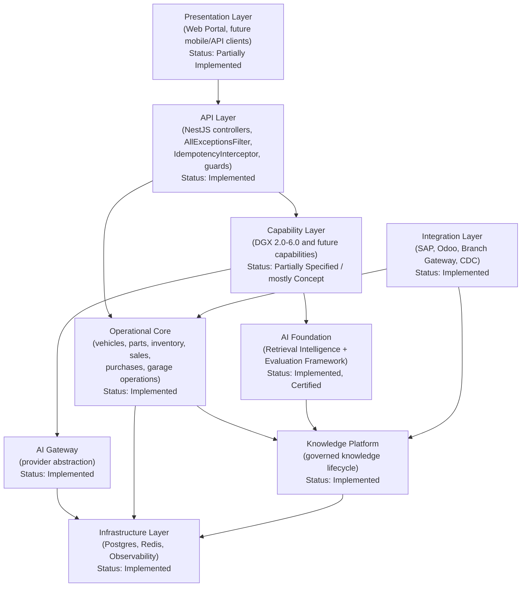
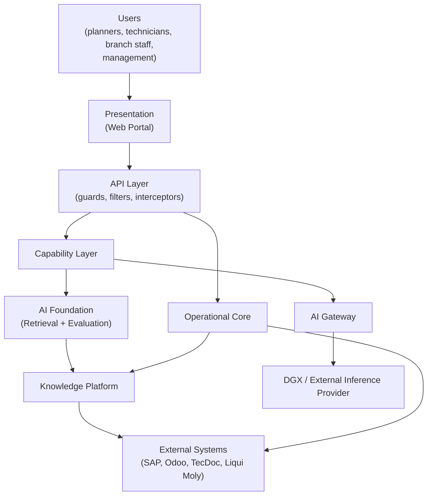
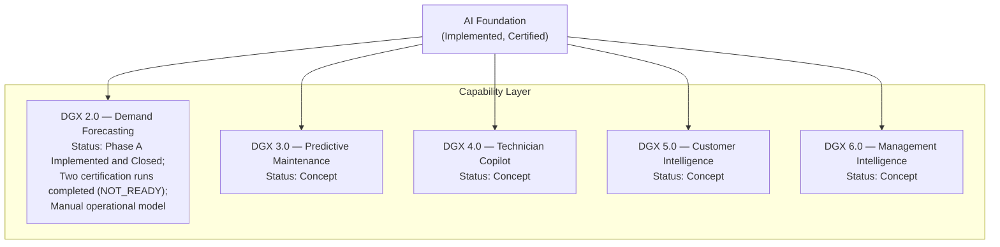
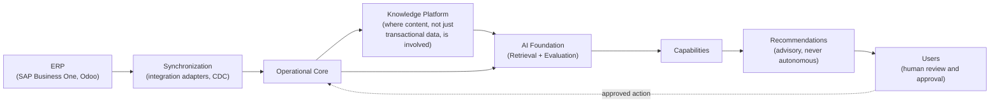
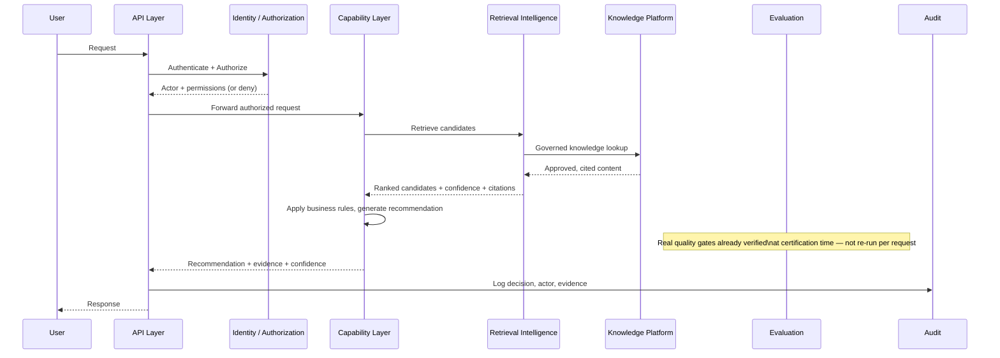
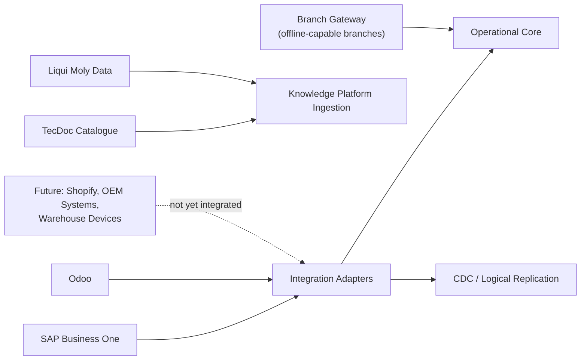
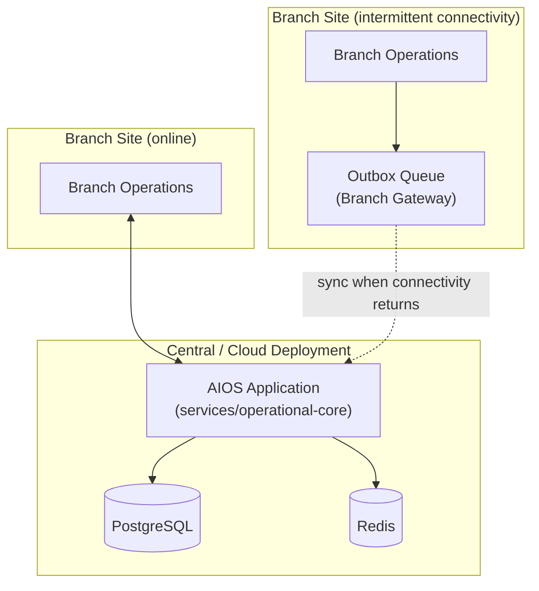

# AIOS Reference Architecture v1.0

### The Canonical Architectural Blueprint of the Molas Solutions Automotive Intelligence Operating System

---

> This document answers exactly one question: **how does the complete AIOS platform fit together?** It is not implementation documentation, service documentation, API documentation, or governance documentation — those live in the code itself and in the documents this one points to. This is the picture an engineer should be able to hold in their head *before* opening a single source file.
>
> This document does not modify, and is strictly subordinate to: [`AIOS_FOUNDATION_ARCHITECTURE_SPECIFICATION_V1.md`](AIOS_FOUNDATION_ARCHITECTURE_SPECIFICATION_V1.md), [`AIOS_CAPABILITY_GOVERNANCE_STANDARD_V1.md`](../governance/AIOS_CAPABILITY_GOVERNANCE_STANDARD_V1.md), [`DGX_2_DEMAND_FORECASTING_SPECIFICATION_V1.md`](../capabilities/DGX_2_DEMAND_FORECASTING_SPECIFICATION_V1.md), [`DGX2_DEMAND_FORECASTING_CERTIFICATION_STANDARD_V1.md`](../certification/DGX2_DEMAND_FORECASTING_CERTIFICATION_STANDARD_V1.md), and [`AIOS_ENTERPRISE_ROADMAP_V1.md`](../strategy/AIOS_ENTERPRISE_ROADMAP_V1.md). Every status label below (**Implemented** / **Partially Implemented** / **Specified** / **Concept** / **Planned**) is used precisely and consistently — never blended, never upgraded without real evidence.

---

## 1. Executive Overview

**AIOS is a layered, single-codebase enterprise platform in which authoritative operational data, governed knowledge, deterministic and hybrid retrieval, evaluation, security, and replaceable AI inference are architecturally separated so that business capabilities can be added, certified, and evolved without ever compromising the correctness or trustworthiness of the layers beneath them.**

---

## 2. Architecture Principles

Every principle below is inherited directly from the Foundation Architecture Specification — this document restates them as the lens the rest of this blueprint is drawn through, never as a new or competing set of rules.

- **Foundation is permanent. Capabilities are replaceable.** The five architectural layers and their contracts do not change with each new feature; capabilities are built, certified, and retired on top of them (`AIOS_CAPABILITY_GOVERNANCE_STANDARD_V1.md` §2).
- **Business before AI.** Every architectural element exists to serve a real business need, never to showcase a technology.
- **Evidence before automation.** No component is trusted with more autonomy than its measured, real track record supports.
- **Human accountability.** No architectural layer or capability ever removes a human's accountability for a real business decision.
- **Offline-first.** Branch-level operation must survive real connectivity loss (§17).
- **Security by default.** Authorization is checked before access to protected data, not bolted on afterward.
- **Verify before retrieval. Retrieve before generation. Measure before release. Preserve evidence after release.** — the Foundation's own four-sentence philosophy, and the ordering principle behind every data flow this document diagrams.

---

## 3. Architecture Layers

| Layer | Responsibility | Status |
|---|---|---|
| Presentation Layer | Real, browser-based client (`services/web-portal/`, Vite/React/TypeScript) with JWT login and MFA. A dedicated native mobile client is not part of this platform today. | **Partially Implemented** |
| API Layer | The NestJS request pipeline: global exception handling, idempotency, correlation-id tracing, request logging, guards. | **Implemented** |
| Operational Core | Authoritative system of record for vehicles, parts, lubricants, customers, suppliers, inventory, sales, purchases, and garage operations (`AIOS_FOUNDATION_ARCHITECTURE_SPECIFICATION_V1.md` §7). | **Implemented** |
| Knowledge Platform | The governed knowledge lifecycle — source registry, versioning, structured facts, review, conflicts, snapshots, graph (`AIOS_FOUNDATION_ARCHITECTURE_SPECIFICATION_V1.md` §8). | **Implemented** |
| AI Gateway | The sole abstraction between AIOS and any inference provider (`AIOS_FOUNDATION_ARCHITECTURE_SPECIFICATION_V1.md` §6). | **Implemented** |
| AI Foundation | Retrieval Intelligence + the Evaluation/Benchmark Framework, together. | **Implemented, Certified** (`AI_FOUNDATION_CERTIFIED`) |
| Capability Layer | Business-facing AI-assisted features consuming the Foundation (`AIOS_FOUNDATION_ARCHITECTURE_SPECIFICATION_V1.md` §5, Layer 5). | **Partially Implemented / Specified / Concept**, per capability — see §6 |
| Integration Layer | SAP Business One and Odoo adapters, Postgres logical replication (CDC), Branch Gateway. | **Implemented** |
| Infrastructure Layer | PostgreSQL, Redis, Prometheus-format metrics via `prom-client`, OpenTelemetry instrumentation. | **Implemented**, with named gaps (§16, §17) |

---

## 4. High-Level Architecture

This is the same request path the Foundation Architecture Specification's system context diagram establishes, redrawn here at the platform-blueprint level of detail: **a request always flows down through Presentation → API → (Operational Core and/or Capability Layer) → Foundation services → external systems, never sideways around a layer.**

---

## 5. Logical Component Model

| Component | Description | Status |
|---|---|---|
| Operational Core | Vehicles, parts, lubricants, customers, suppliers, organizations, branches, warehouses, inventory, sales, purchases, garage operations (`vehicles/`, `parts/`, `inventory/`, `sales/`, `purchases/`, `garage-jobs/`, etc.). | **Implemented** |
| Knowledge Platform | Source registry, versioning, structured facts, review workflow, conflicts, expiry/supersession, snapshots, graph (`knowledge-platform/`). | **Implemented** |
| AI Gateway | Provider abstraction and prompt sanitization (`ai-gateway/ai-gateway.service.ts`, `dgx-client.service.ts`, `prompt-sanitizer.ts`). | **Implemented** |
| Evaluation Engine | The Benchmark Registry, Gold Datasets, quality gates, dashboards (`ai-benchmark/`). | **Implemented, Certified** for retrieval; capability-specific evaluation engines are **Specified** (DGX 2.0) or **Concept** (DGX 3.0-6.0) |
| Identity | JWT/API-key authentication, MFA (`identity/`). | **Implemented**, with a known gap: the global JWT guard enriches but never itself rejects a request (§15) |
| Authorization | Capability-based permissions, branch/warehouse scope (`authorization/`, `common/permissions/`). | **Implemented**, opt-in scope enforcement not yet retrofitted onto every Phase 1-4 service (§15) |
| Branch Gateway | Store-and-forward outbox for offline-capable branch↔HQ sync (`branch-gateway/`). | **Implemented** |
| Sync Engine | Postgres logical replication (CDC) and the Neon-style read-scaling cache (`cdc/`, `neon-cache/`). | **Implemented** |
| Capability Runtime | The pattern by which capabilities execute against the Foundation — not a distinct, separately-named module, but the architectural discipline defined in `AIOS_CAPABILITY_GOVERNANCE_STANDARD_V1.md` §11 (Capability Contracts) applied to modules like `forecasting/`, `ai-assistants/`. | **Implemented as a pattern**; no dedicated capability-isolation runtime (e.g., sandboxing, per-capability resource quotas) exists today |
| Observability | Prometheus-format metrics (`observability/metrics.service.ts`), OpenTelemetry instrumentation, correlation-id tracing, health checks (`api-platform/health.controller.ts`). | **Implemented**, no external APM/Grafana in this environment (§16) |

---

## 6. Capability Placement

Every capability sits at the same architectural depth — directly on top of the Foundation, as a peer to every other capability, never stacked on top of one another (`AIOS_CAPABILITY_GOVERNANCE_STANDARD_V1.md` §18). Their real, current status, per the Capability Governance Standard's own portfolio record and the Enterprise Roadmap's capability table:

| Capability | Status |
|---|---|
| DGX 2.0 — Demand Forecasting | **Phase A Implemented and Closed** (frozen baseline `DGX2-PHASE-A-BASELINE-1.0`, `docs/execution/DGX2_PHASE_A_BASELINE_1_0.md`). Real classical-statistical baseline (`forecasting/`, `inventory-analytics/`, `purchase-recommendations/`, `transfer-recommendations/`, `lost-sales/`, `supplier-analytics/`). **Two real certification runs executed** against `DGX2_DEMAND_FORECASTING_CERTIFICATION_STANDARD_V1.md` (v1.1) — both `NOT_READY`. Operating under the Manual operational model, owned by Business Operations. **Not yet Certified** (Governance Standard §6, Level 4) — a certification run occurring is not sufficient; it must also pass. |
| DGX 3.0 — Predictive Maintenance | **Concept.** Named in the Foundation's transition rule only; no specification exists. |
| DGX 4.0 — Technician Copilot | **Concept.** |
| DGX 5.0 — Customer Intelligence | **Concept.** |
| DGX 6.0 — Management Intelligence | **Concept.** |

---

## 7. Foundation Interaction

Every capability consumes exactly five real Foundation services, and never more directly than through their own published interfaces:

- **Knowledge** — governed, versioned, approved content, via the Knowledge Platform. A capability never reads a raw, unapproved source directly.
- **Retrieval** — ranked, explainable candidates, via the Retrieval Intelligence Platform's pipeline. A capability never implements its own parallel search/ranking logic over the same data.
- **Evaluation** — the Benchmark/Evaluation Framework's pattern (registry, gold datasets, gates) is the template every capability's own certification standard must follow (`AIOS_CAPABILITY_GOVERNANCE_STANDARD_V1.md` §9) — a capability never invents an unrelated evaluation methodology.
- **Provider abstraction** — the AI Gateway is the only path to any inference provider; a capability never holds its own model client.
- **Security** — Identity/Authorization decisions are made once, centrally, and trusted by every layer above; a capability never implements its own parallel authentication or permission model.

**Why capabilities never bypass the Foundation**: a bypass is, by definition, an unverified, unmeasured, unauthorized path to the same data and inference the Foundation already governs — it reintroduces exactly the risks (hallucination, leakage, untraceable behavior) the Foundation was certified specifically to prevent (`AIOS_FOUNDATION_ARCHITECTURE_SPECIFICATION_V1.md` §3). A capability that finds a Foundation contract genuinely insufficient raises the gap through an ADR (§20) — it does not route around it.

---

## 8. Data Flow

Two real, distinct paths feed the Foundation: **transactional operational data** (sales, purchases, inventory movement) flows from Operational Core directly, while **content-based knowledge** (documents, structured facts, catalogues) flows through the Knowledge Platform's governance lifecycle first. Both converge at the Foundation, which is what every capability actually consumes — never the raw ERP or sync data directly.

---

## 9. Request Lifecycle

Every real request that touches governed knowledge follows this shape: authenticate and authorize first, retrieve before reasoning, and log an auditable trail — never generate a response before knowledge has been retrieved and never skip the audit step regardless of how routine the request appears.

---

## 10. Knowledge Architecture

| Stage | Description | Status |
|---|---|---|
| Ingestion | Real documents/data enter via source registry, acquisition, and licensing checks. | **Implemented** |
| Indexing | Parsed content is structured and stored as `KnowledgeItem`/`KnowledgeItemVersion` rows. | **Implemented** |
| Embedding | Vector representations are generated via the AI Gateway for semantic search. | **Implemented** |
| Retrieval | Identifier-first, hybrid (exact + semantic + graph) retrieval, per the Foundation's certified pipeline. | **Implemented, Certified** |
| Ranking | 15-signal explainable ranking engine. | **Implemented, Certified** |
| Evidence | Every result carries citations back to real, specific source versions. | **Implemented** |
| Evaluation | Gold-dataset-based quality gates, run at certification time and on demand. | **Implemented, Certified** |
| Versioning | Append-only `KnowledgeItemVersion`/`KnowledgeSnapshot` history; nothing is edited in place. | **Implemented** |

---

## 11. AI Gateway Architecture

| Concern | Current reality | Status |
|---|---|---|
| Provider abstraction | All inference calls pass through `AiGatewayService`/`DgxClientService`. | **Implemented** |
| Fallback | On provider failure, the Gateway returns an explicit `{ available: false }` state — there is no automatic fallback to a second, alternate provider today. | **Implemented (degrade, not fallback)**; multi-provider fallback is **Planned/Concept**, not built |
| Routing | A single, fixed provider endpoint per call type (`generate`/`embed`/`health`/`models`) — no dynamic routing between multiple providers exists. | **Implemented** for a single provider; multi-provider routing is **Concept** |
| Rate limiting | An in-memory, per-process sliding-window limiter. Explicitly documented as insufficient for a multi-instance deployment. | **Partially Implemented** |
| Prompt orchestration | Prompt sanitization exists (`prompt-sanitizer.ts`); a shared prompt registry exists for versioned prompt templates (`prompt-registry/`). | **Implemented** |
| Future providers | The abstraction is designed to allow a second/replacement provider without touching capability code — no second provider is integrated today. | **Architectural capability exists; no second provider implemented — Planned direction, not committed** |

---

## 12. Capability Runtime

Every capability, regardless of category, executes under the same real discipline:

- **Isolation** — a capability's own code and data are logically separate from other capabilities' (§18 of the Governance Standard's no-cyclic-dependency rule); there is no process-level sandboxing or resource-quota isolation between capabilities today — a real, honest gap, not a claimed feature.
- **Contracts** — every capability defines its inputs, outputs, dependencies, and failure modes explicitly (`AIOS_CAPABILITY_GOVERNANCE_STANDARD_V1.md` §11).
- **Confidence** — every capability output that involves uncertainty states it explicitly (e.g., `RecommendationConfidence.HIGH/MEDIUM/LOW/INSUFFICIENT_DATA`, already real for DGX 2.0).
- **Evidence** — every recommendation traces back to the real data behind it.
- **Audit** — every capability decision is logged.
- **Human review** — every capability's output reaches a human approval step before any real, high-impact action is taken (`AIOS_FOUNDATION_ARCHITECTURE_SPECIFICATION_V1.md` §7, §13).

---

## 13. Integration Architecture

| Integration | Status |
|---|---|
| SAP Business One | **Implemented** (real adapter) |
| Odoo | **Implemented** (real adapter) |
| Branch Gateway | **Implemented** (real, store-and-forward, offline-capable) |
| Postgres logical replication (CDC) | **Implemented** |
| Shopify | **Planned/Concept** — named as a future opportunity in the Enterprise Roadmap, not built |
| Future OEM systems | **Concept** |
| Warehouse devices (barcode/RFID) | **Concept** |

---

## 14. Deployment Architecture

| Deployment concern | Current reality | Status |
|---|---|---|
| Central/cloud application | A single AIOS application instance connected to real Postgres/Redis. | **Implemented** |
| Multi-branch, online | Real, direct connectivity to the central application. | **Implemented** |
| Multi-branch, offline-capable | Real store-and-forward via the Branch Gateway outbox, reconciled when connectivity returns. | **Implemented** |
| Regional / multi-organization | Would require real tenant-resolution middleware and per-tenant isolation not yet built (`AIOS_ENTERPRISE_ROADMAP_V1.md` §2, §13). | **Prepared, not Implemented** |
| Horizontal scaling (multiple app instances) | The AI Gateway's in-memory rate limiter is explicitly documented as incorrect under multiple instances (§11). | **Partially Implemented — a known limiting factor** |

---

## 15. Identity & Security

| Concern | Current reality | Status |
|---|---|---|
| Identity | JWT + refresh rotation + MFA, API keys (`identity/`). | **Implemented** |
| Authorization | Capability-based permissions (`PermissionsGuard`), used by 71+ controllers. | **Implemented** |
| Legacy authorization | A pre-permissions-model `RolesGuard`, trusting an `x-user-role` header, still guards a small number of routes (`parts`, `vehicles`, `integration` controllers). | **Partially Implemented — a known, real gap, not a design intent** |
| Global authentication enforcement | `JwtAuthContextGuard` enriches the request actor from a verified credential but never itself rejects an unauthenticated request — real enforcement depends on each route separately applying a rejecting guard. | **Partially Implemented — a known, real gap** |
| Branch/warehouse scope | Opt-in via `@RequireBranchScope()`; not retrofitted onto every Phase 1-4 service. | **Partially Implemented** |
| Secrets | Environment-based configuration with startup validation (`joi`-based env validation). | **Implemented** |
| Certificates | Self-signed TLS in this environment. | **Implemented for development; a CA-issued certificate is required before broad production exposure — Planned** |
| Audit | Immutable audit log, with a dedicated integration test for immutability. | **Implemented** |
| Branch isolation | Real `organizationId`/`branchId` fields exist on every relevant model, plus a real assertion helper (`assertBranchBelongsToOrganization()`); this deployment remains genuinely single-organization. | **Implemented for branch scoping; Prepared, not Implemented, for multi-organization isolation** |

---

## 16. Observability

| Concern | Current reality | Status |
|---|---|---|
| Logs | Request logging middleware, structured logging throughout. | **Implemented** |
| Metrics | Prometheus-format metrics via `prom-client` (`observability/metrics.service.ts`), including retrieval, identifier-accuracy, and certification-progress gauges. | **Implemented** |
| Tracing | Correlation-ID middleware; a full OpenTelemetry SDK with auto-instrumentation is present in the dependency tree. | **Implemented** |
| Health | A dedicated health-check endpoint (`api-platform/health.controller.ts`). | **Implemented** |
| Capability metrics | Defined as a requirement in the Capability Governance Standard (§16); real, running dashboards exist only for the Foundation today. | **Specified, not yet Implemented per-capability** |
| Business metrics | Defined for DGX 2.0 in its Certification Standard (§7); not yet measured, since no certification run has occurred. | **Specified, not yet measured** |
| Certification metrics | Real, live Certification Dashboard for the AI Foundation (`ai-benchmark/reports/certification-dashboard.ts`). | **Implemented** |
| External APM/visualization | No Grafana or equivalent exists in this environment; dashboards are self-hosted static HTML generated from real, live-queried data. | **Implemented as a deliberate substitute; external APM is a named gap** |

---

## 17. Resilience

| Concern | Current reality | Status |
|---|---|---|
| Offline-first | Real, store-and-forward Branch Gateway outbox. | **Implemented** |
| Retry | The DGX client uses bounded timeouts per call type but no retry-with-backoff logic. | **Not Implemented for AI Gateway calls**; standard framework-level retry does not apply here by design |
| Dead-letter queues | Background work (branch sync, notifications) uses a hand-rolled Redis list as a queue, with no dead-letter handling or visibility timeout. | **Not Implemented — a known, real gap** |
| Circuit breakers | No circuit-breaker pattern wraps AI Gateway calls; each call is independently bounded by its own timeout. | **Not Implemented — a known, real gap** |
| Caching | Redis-backed cache in front of Postgres for catalogue lookups, with a short TTL. | **Implemented** |
| Graceful degradation | On AI provider failure, the caller receives an explicit unavailable state, never a fabricated response (`AIOS_FOUNDATION_ARCHITECTURE_SPECIFICATION_V1.md` §13). | **Implemented** |
| Disaster recovery | A real backup module (`backup/`) exists using `pg_dump`/restore; recurring execution is a manually-run script, not an in-process scheduled job. | **Partially Implemented** |

---

## 18. Scalability

| Scope | Status |
|---|---|
| Single organization | **Implemented** — the current, real deployment shape. |
| Prepared multi-tenancy | **Prepared, not Implemented.** Real primitives exist (`OrganizationConfiguration`, `TenantContextService.assertBranchBelongsToOrganization()`, `organizationId`/`branchId` on every relevant model) — but there is no tenant-resolution middleware, no per-tenant rate limiting, and no per-tenant database routing. This deployment remains genuinely single-organization (`docs/architecture/tenant-readiness.md`). |
| Regional deployment | **Future.** Depends on the multi-tenancy work above being completed first (`AIOS_ENTERPRISE_ROADMAP_V1.md` §4, Stage 3-4). |
| Future expansion (new countries/industries) | **Future/Concept.** Not scoped or specified today. |

No statement in this document should be read as implying multi-tenant, regional, or multi-industry operation is currently available — it is explicitly **Prepared or Future**, never **Implemented**.

---

## 19. Technology Stack

This section separates **architecture contracts** (permanent, technology-neutral) from **implementation choices** (real, current, replaceable — per `AIOS_FOUNDATION_ARCHITECTURE_SPECIFICATION_V1.md` §15).

| Architecture contract | Current implementation choice |
|---|---|
| A typed, modular application runtime | NestJS 10 |
| A relational system of record with transactional guarantees | PostgreSQL, via Prisma 5 |
| A fast, ephemeral cache/coordination store | Redis, via `ioredis` |
| An inference provider reachable only through a gateway abstraction | DGX, via the AI Gateway |
| A metrics export format | Prometheus format, via `prom-client` |
| A distributed tracing standard | OpenTelemetry |
| A browser-based presentation client | Vite + React + TypeScript (Web Portal) |

The left column is permanent; the right column may change at any time, subject to the Foundation's own replaceable-technology principle and the ADR requirement in §20.

---

## 20. Architecture Decision Records

ADRs are not redefined here. Per `AIOS_FOUNDATION_ARCHITECTURE_SPECIFICATION_V1.md` §20 and `AIOS_CAPABILITY_GOVERNANCE_STANDARD_V1.md` §13, an ADR is mandatory before any change to a Permanent Contract, Architectural Invariant, or the triggers those documents name (provider replacement, new capability, breaking change, schema change touching authoritative data, automation-level increase, and others). This reference architecture is itself subject to the same rule: a material change to any diagram or component status in this document requires an ADR, exactly as a change to the Foundation Specification would. **Honest, current gap** (restated from the Governance Standard, since it is directly relevant to how this blueprint evolves): no formally numbered ADR directory exists in this repository yet — the template and triggers are real and defined; the operating habit is not yet established.

---

## 21. Reference Deployment Scenarios

| Scenario | Description | Status |
|---|---|---|
| Development | A local or sandboxed instance, real Postgres/Redis, no external DGX dependency required for most work. | **Implemented / in active use** |
| Testing | Real, automated unit and integration test suites (146 suites, 862 tests as of the AI Foundation's certification), run against real infrastructure, never mocked business-critical paths. | **Implemented** |
| Pilot | A defined, bounded real-user scope for a specific capability, per the Governance Standard's lifecycle (§5) — realized today only conceptually; DGX 2.0 has not yet reached Pilot. | **Specified as a process; not yet exercised for any capability** |
| Production | Full, real Operational Core and Foundation usage today; no capability beyond the Foundation itself has reached certified Production status. | **Implemented for the Foundation and Operational Core; not yet applicable to any capability** |
| Enterprise | Multi-branch, multi-warehouse, single-organization operation at real scale. | **Implemented** for the current single-organization scope; **Future** for the multi-organization "Enterprise" tier described in the Roadmap |

---

## 22. Future Expansion Points

**The following are architectural extension points — places the architecture is deliberately designed to accommodate future growth — not commitments or scheduled work.**

- **New capabilities** — any new Layer 5 addition, following the Capability Governance Standard's lifecycle from Idea onward.
- **New AI providers** — accommodated by the AI Gateway's abstraction without requiring capability-layer changes.
- **New ERPs** — accommodated by the Integration Layer's adapter pattern (`integration/adapters/`).
- **New countries** — would require real localization work; `OrganizationConfiguration` already carries locale/timezone/currency fields, though nothing in the API layer yet consumes them.
- **New industries** — would require a genuinely new capability portfolio and, likely, new Knowledge Platform source types; the layered architecture does not structurally prevent this, but no such work is scoped today.

---

## 23. Architecture Anti-patterns

1. Bypassing the Foundation from a capability.
2. Capabilities communicating directly instead of through the Foundation.
3. Embedding real business logic (e.g., safety-stock rules) inside an AI prompt instead of deterministic code.
4. Creating a hidden database or data store outside the governed schema.
5. Hard-coding a specific AI provider into capability code instead of using the AI Gateway.
6. Skipping evaluation/certification before a capability reaches Production.
7. Ignoring evidence — presenting a conclusion without the real data behind it.
8. Duplicating an integration adapter that already exists for the same external system.
9. Breaking a public contract without an ADR and a coordinated migration.
10. A "Shadow AI" service — any component calling a model provider outside the AI Gateway's visibility.
11. Treating a sampled evaluation result as full certification evidence.
12. Allowing a capability to write directly to an external system of record (ERP) without human approval.
13. Allowing a capability to become a system of record for data Operational Core or the Knowledge Platform already owns.
14. Silent, unreviewed threshold or gate changes to appear "more certified."
15. Introducing a new architectural layer instead of placing new work correctly within the existing five.
16. Confusing a Concept-stage capability with a Specified or Implemented one in any document or dashboard.
17. Building a capability-specific authentication or authorization mechanism instead of using Identity/Authorization.
18. Assuming multi-tenant isolation exists because the readiness primitives exist.
19. Adding a new external integration without going through the adapter pattern.
20. Presenting a static, self-hosted dashboard's real numbers as if a full external APM/Grafana pipeline exists, when it does not.
21. Allowing a capability's maturity claim to persist after a real regression, without triggering re-certification.
22. Introducing retry/circuit-breaker logic inconsistently, module by module, instead of as a deliberate, governed architectural decision.

---

## 24. Architecture Glossary

- **Layer** — one of the five permanent architectural tiers defined in the Foundation Specification (§3 of this document restates them).
- **Component** — a real, named module implementing part of a layer's responsibility (§5).
- **Capability** — a business-facing feature in the Capability Layer, defined fully in the Capability Governance Standard §3.
- **Foundation** — the combined Retrieval Intelligence, Knowledge Platform, and Evaluation Framework, `AI_FOUNDATION_CERTIFIED`.
- **AI Gateway** — the sole provider-abstraction component.
- **Contract** — a permanent, documented promise about behavior that outlives any specific implementation.
- **ADR** — Architecture Decision Record, per §20.
- **Status label** — one of **Implemented**, **Partially Implemented**, **Specified**, **Concept**, or **Planned**, used precisely throughout this document.

---

## 25. Architect's Commitment

**Protect the Foundation.**

**Respect governance.**

**Keep architecture understandable.**

**Prefer evolution over rewrites.**

**Preserve contracts.**

Every architectural decision made under this blueprint is expected to leave the platform's five layers exactly as separable, and its permanent contracts exactly as intact, as they were found — growth is expected; erosion of the boundaries that make growth safe is not.

---

## 26. Closing Blueprint

**AIOS is not defined by the technologies it uses.**

**It is defined by the architectural contracts it preserves.**

Every diagram in this document can be redrawn with a different database, a different framework, or a different AI provider in one of its boxes, and the blueprint would still be true. That is the test of whether this architecture has done its job.
