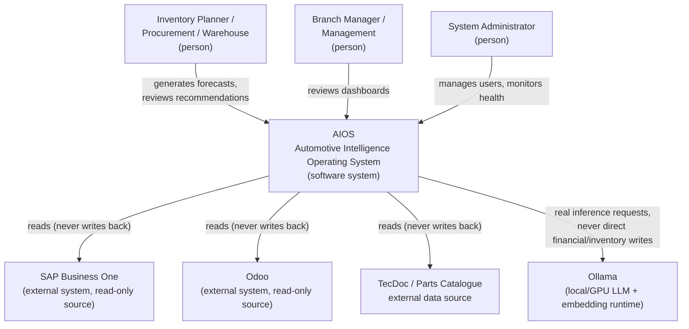

# C4 Level 1 — System Context

Shows AIOS as a single system in its real operating environment: who and what it talks to, at the coarsest possible zoom level.

## Notes

- **No external system is ever written to.** SAP, Odoo, and the TecDoc/parts-catalogue sources are read-only inputs, staged and reconciled inside AIOS — this is a Foundation-level, non-negotiable invariant (`AIOS_FOUNDATION_ARCHITECTURE_SPECIFICATION_V1.md`).
- **Ollama is the only AI inference boundary**, always reached through the DGX AI Platform container (see [Level 2](level2-container.md)) — never called directly by any other part of the system.
- Human actors interact with AIOS exclusively through the Web Portal or direct, authenticated API calls (Swagger/`x-api-key`/Bearer JWT) — there is no unauthenticated entry point.
