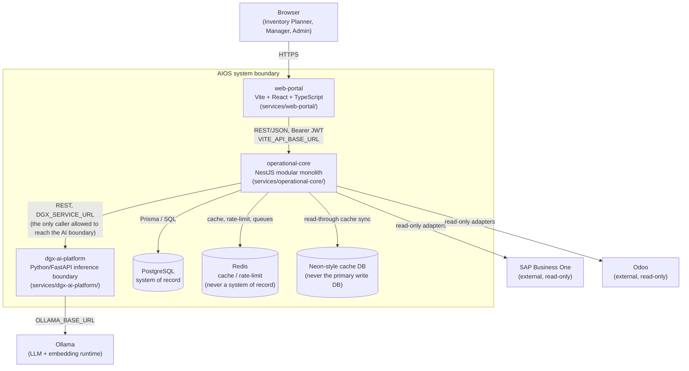

# C4 Level 2 — Container Diagram

Zooms into AIOS itself: the real, independently-deployable containers (services/applications/data stores) and the real protocols between them.

## Notes

- **`operational-core` is the sole system of record.** Every business transaction, every capability layer (forecasting, recommendations, knowledge platform, retrieval intelligence), and every enterprise-platform concern (identity, authorization, API platform, branch gateway, notifications, backup/DR, observability) lives inside this one modular monolith — see [Level 3 — Operational Core](level3-operational-core.md).
- **`dgx-ai-platform` has no database driver in its dependency tree** — it is a pure inference boundary in front of Ollama, reachable only from `operational-core`, never directly from the Web Portal or any external system.
- **Redis and the Neon-style cache database are both explicitly non-authoritative** — a Foundation-level invariant, not an implementation detail (see [Non-negotiables](../../../README.md#non-negotiables-unchanged-since-phase-1)).
- Real, current runtime ports for a given environment (which may differ from repository defaults) are documented in the root [README's Runtime Topology](../../../README.md#runtime-topology) section, not here — this diagram describes structure, not a specific host's current port assignments.
