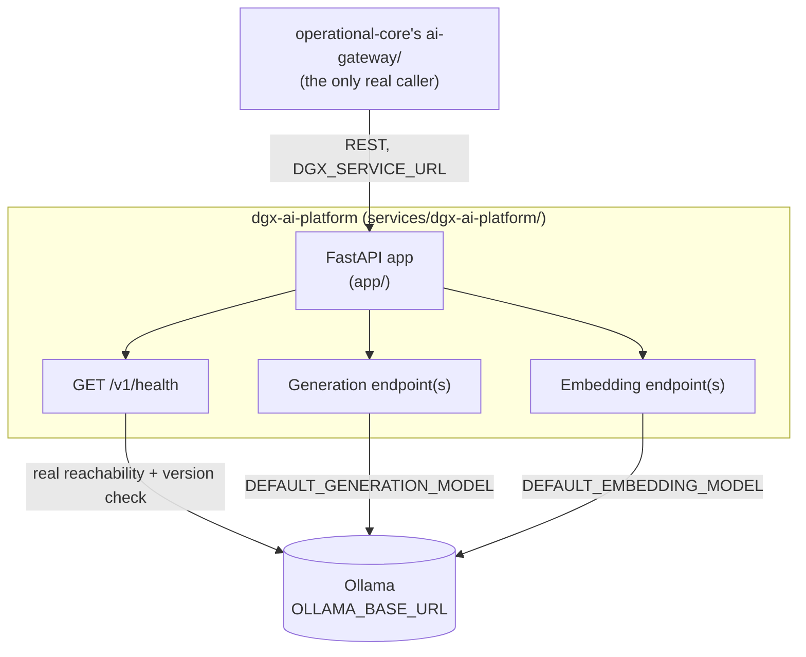

# C4 Level 3 — Component Diagram: `dgx-ai-platform`

Zooms into the isolated Python/FastAPI inference boundary — the only container allowed to call an LLM or embedding model.

## Notes

- **No database driver exists anywhere in this container's dependency tree** (`requirements.txt`: `fastapi`, `uvicorn`, `httpx`, `pydantic` — no ORM, no DB client) — this is a structural guarantee, not a convention, that this boundary cannot become a second system of record.
- **GPU acceleration is automatic on real GPU hardware** (e.g. a real DGX Spark) — Ollama detects CUDA without any code change here; the container itself runs identically in CPU-only or GPU-accelerated environments, only its measured latency differs.
- `GET /v1/health` reports real, live reachability and version information for the underlying Ollama instance — it is not a static "ok" response.
