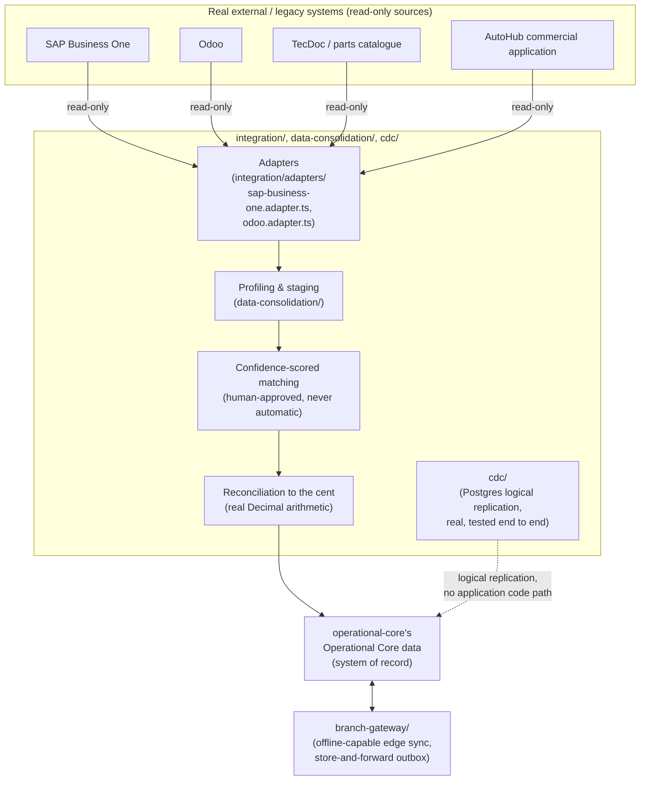

# C4 Level 3 — Component Diagram: Integration Layer

Zooms into how real external/legacy systems enter AIOS — always read-only, always staged and validated, never written back to.

## Notes

- **No automatic merge of an uncertain match ever occurs** — `Matching` always proposes; a human always approves before `Reconciliation` commits data into the Operational Core. This is a Foundation-level, non-negotiable invariant.
- **External source systems are never written to** — every arrow above is one-directional, into AIOS, never back out to SAP/Odoo/TecDoc/AutoHub.
- **Branch Gateway is the offline-capable edge integration path** — a real, tested store-and-forward outbox for branches that may lose connectivity, distinct from the read-only external-system adapters above it.
