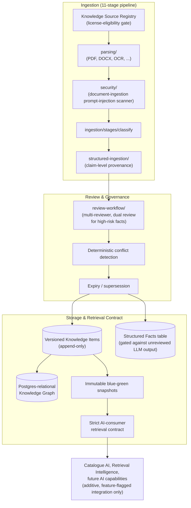

# C4 Level 3 — Component Diagram: Knowledge Platform (`knowledge-platform/`)

Zooms into the governed knowledge layer every AI capability (Catalogue AI, Demand Forecasting, and future capabilities) consumes — built in DGX Prototype 1.7, populated for real in 1.7.1.

## Notes

- **No unreviewed LLM output ever reaches `StructuredFacts`** — the gate between `StructuredExtraction` and `ReviewWorkflow` is real and mandatory, not advisory.
- **Every consuming capability integrates additively** — the Catalogue AI integration point, and any future capability's integration, extends this platform without changing its own external behavior; this is the same pattern later reused for the Retrieval Intelligence Platform's circular-module wiring.
- Snapshots are blue-green and immutable — a knowledge update is a new snapshot, never an in-place edit to a previously-published one.
