# C4 Level 3 — Component Diagram: `operational-core`

Zooms into the single largest container — the NestJS modular monolith — grouping its real `src/` modules into the logical component groups the Foundation Architecture Specification defines them as.

```mermaid
flowchart TB
    subgraph Foundation["Foundation Data (Layers 1-2)"]
        Vehicles["vehicles/, parts/\nmaster data"]
        Commercial["organizations, inventory,\npurchasing, sales\n(commercial foundation)"]
        Garage["garage-jobs/, inspections/,\ndiagnostics/, estimates/,\nvehicle-lifecycle/, twin-intelligence/"]
    end

    subgraph Enterprise["Enterprise Platform (Layer 3)"]
        Identity["identity/, authorization/"]
        ApiPlatform["api-platform/\n(Swagger, SDKs, idempotency)"]
        Integration["integration/, data-consolidation/,\ncdc/\n(see Level 3 — Integration Layer)"]
        BranchGateway["branch-gateway/\n(offline-capable edge sync)"]
        Notifications["notification-service/,\nnotifications/"]
        Ops["backup/, observability/,\nsecurity/"]
    end

    subgraph AIFoundation["AI Foundation (Layer 4, certified)"]
        Retrieval["retrieval-intelligence/"]
        Knowledge["knowledge-platform/\n(see Level 3 — Knowledge Platform)"]
        CatalogueAI["catalogue-ai/"]
        AiBenchmark["ai-benchmark/, ai-evaluation/"]
        AiGateway["ai-gateway/\n(the only path to dgx-ai-platform)"]
    end

    subgraph Capability["Capability Layer (Layer 5)"]
        Forecasting["forecasting/, inventory-analytics/"]
        PurchaseRecs["purchase-recommendations/"]
        TransferRecs["transfer-recommendations/"]
        LostSales["lost-sales/"]
        SupplierAnalytics["supplier-analytics/"]
        Dgx2Cert["dgx2-certification/"]
        AiAssistants["ai-assistants/"]
    end

    Prisma[("PrismaService\n(single, shared Postgres client)")]

    Commercial --> Prisma
    Garage --> Prisma
    Vehicles --> Prisma
    Forecasting --> Prisma
    Forecasting --> AiGateway
    PurchaseRecs --> Commercial
    TransferRecs --> Commercial
    LostSales --> Commercial
    SupplierAnalytics --> Commercial
    Dgx2Cert --> Forecasting
    Dgx2Cert --> PurchaseRecs
    CatalogueAI --> Retrieval
    Knowledge --> Retrieval
    AiAssistants --> AiGateway
    AiGateway --> Ollama["dgx-ai-platform\n(external container, Level 2)"]
    Identity --> Prisma
    ApiPlatform --> Identity
```

## Notes

- **Every arrow into `Prisma` is a real database access** — there is no second, parallel data-access path; `PrismaService` is the single shared client every module uses.
- **`ai-gateway/` is the only module allowed to call the `dgx-ai-platform` container** — a Foundation invariant (never bypassed by a capability module calling Ollama directly).
- **The Capability Layer modules (`forecasting/`, `purchase-recommendations/`, etc.) never call each other's internals** — any real information flow between capabilities happens through shared Foundation data (`Commercial`, `Prisma`), consistent with the Capability Governance Standard's no-cyclic-dependency rule.
- `dgx2-certification/` is a certification-evidence-only module (dataset validation, gate evaluators, scorecard) — it reads real data from the Capability Layer modules above it but contains no forecasting logic itself.
