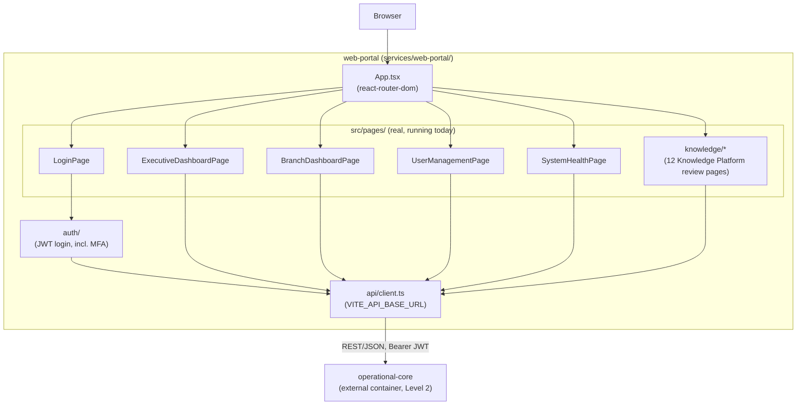

# C4 Level 3 — Component Diagram: `web-portal`

Zooms into the real, currently-running Vite + React + TypeScript Web Management Portal.

## Notes

- **This is the complete, real page inventory as of this writing** — no dedicated page exists yet for DGX 2.0 Forecasting, Purchase Recommendations, Transfer Recommendations, or DGX2 certification/audit evidence; those capabilities are reachable only through their real APIs (Swagger, `/api-docs`) today. Do not add a box to this diagram for a page that does not exist in `src/pages/`.
- `SystemHealthPage` calls the real backend `GET /health` endpoint directly — it is not a static status page.
- All routes except `/login` require an authenticated session (see `App.tsx`'s router structure).
