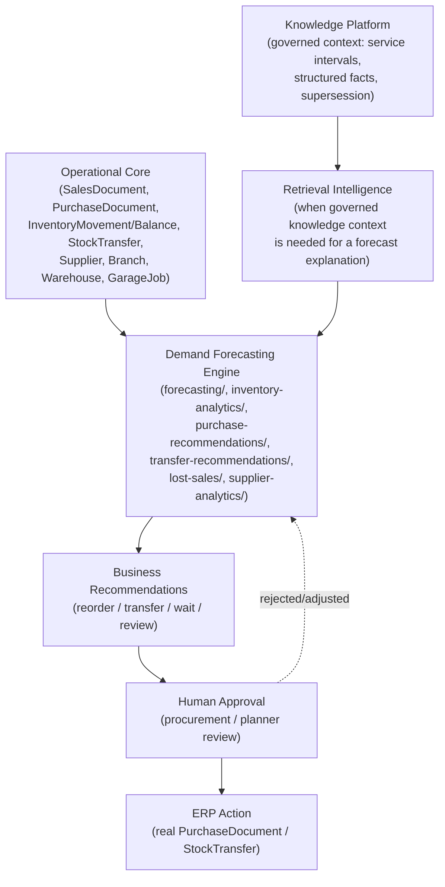
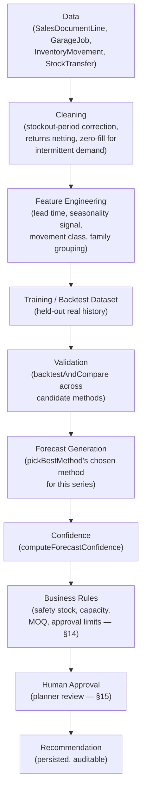
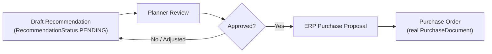

# DGX 2.0 — Demand Forecasting Capability Specification v1.0

### The Permanent Engineering Specification Governing Demand Forecasting Inside the Molas Solutions Automotive Intelligence Operating System

---

## 1. Document Control

| Field | Value |
|---|---|
| Document name | DGX 2.0 — Demand Forecasting Capability Specification |
| Version | 1.0 |
| Status | APPROVED CAPABILITY BASELINE |
| Owner | AIOS Architecture (Molas Solutions Engineering) |
| Audience | Engineers building or extending forecasting/recommendation logic; procurement, warehouse, and branch stakeholders; technical managers evaluating forecasting-related feature requests |
| Dependencies | This document assumes and requires the reader has already read [`docs/architecture/AIOS_FOUNDATION_ARCHITECTURE_SPECIFICATION_V1.md`](../architecture/AIOS_FOUNDATION_ARCHITECTURE_SPECIFICATION_V1.md). Every rule in that document applies here without exception. |
| Foundation requirement | The AI Foundation must be `AI_FOUNDATION_CERTIFIED` for this capability to operate (see `docs/ai-foundation-certification/final-report.md`). This document does not modify, extend, or re-open that certification. |
| Certification dependency | DGX 2.0 requires its **own** capability certification (§25), separate from and additional to AI Foundation certification. As of this document's writing, that capability certification has not yet been performed. |
| Review cycle | Reviewed at every DGX 2.0 capability certification cycle, and at minimum annually. |
| Change-control policy | Changes to any Permanent Capability Contract (§22) require a formal Architecture Decision Record, per the Foundation Specification's ADR policy. |

**This document is not a sprint report, a prototype proposal, a feature request, or an implementation note.** It is the permanent standard that governs every past, present, and future Demand Forecasting implementation in AIOS. Where real, already-implemented functionality exists in the repository, this document says so explicitly and cites it. Where a section describes future or conceptual work, this document says that explicitly too. The two are never to be confused.

> **Status update (non-invasive, added without altering any content above or below):** the "Certification dependency" row above was accurate as of this document's original writing. Since then, DGX 2.0 Phase A has completed two real certification runs under `DGX2_DEMAND_FORECASTING_CERTIFICATION_STANDARD_V1.md` (amended to v1.1) — both returned `NOT_READY` — and Phase A implementation is now closed. For the current, authoritative status, see [`docs/execution/DGX2_PHASE_A_BASELINE_1_0.md`](../execution/DGX2_PHASE_A_BASELINE_1_0.md). This specification's own rules and content remain unchanged and in force.

---

## 2. Read This Before Building Forecasting

**Forecasting is uncertain.** No model, classical or advanced, can know the future. It can only extrapolate patterns from imperfect, incomplete, historical data under the assumption that recent conditions will resemble future ones — an assumption that is sometimes right and sometimes wrong, and AIOS must never pretend otherwise.

**Inventory data is imperfect.** Sales history has gaps. Lead times vary. Suppliers are sometimes late, sometimes early, sometimes wrong. Returns, transfers, and stockouts distort what "demand" even means for a given period. A forecasting capability that assumes clean data will confidently produce wrong numbers.

**Business conditions change.** A supplier goes out of stock. A vehicle model is discontinued. A branch opens or closes. A workshop takes on a new fleet contract. No historical pattern accounts for what has not happened yet.

**AIOS never hides uncertainty.** This is not a forecasting-specific rule — it is the Foundation's own failure philosophy (`AIOS_FOUNDATION_ARCHITECTURE_SPECIFICATION_V1.md` §13: *"Failure must reduce capability, not invent certainty"*) applied to a domain where uncertainty is the default condition, not the exception.

> **Forecasts are probabilities. Not promises.**

Every number this capability produces is a statistically-derived estimate with a stated confidence, evidence, and reasoning — never a guarantee, and never presented to a human as if it were one.

---

## 3. Business Objectives

| Objective | Why it matters | Business KPI | Measurement method |
|---|---|---|---|
| Reduce stockouts | A stockout on a fast-moving part directly causes a lost sale or a delayed repair. | Stockout rate (% of demand periods with zero available stock on a normally-stocked item) | Computed from real `InventoryBalance`/`InventoryMovement` history vs. real demand. |
| Improve service level | The rate at which real demand is met from stock without delay is the most direct measure of whether the business can serve its customers. | Fill rate (% of confirmed demand met immediately from available stock) | Computed from `SalesDocumentLine` fulfillment vs. requested quantity and date. |
| Reduce emergency purchasing | Rush orders carry premium freight cost and weaker supplier terms. | Emergency purchase rate (% of `PurchaseDocument` rows flagged as expedited/rush) | Counted directly from real purchase document data, once such a flag exists (§7 honest gap). |
| Improve inventory turnover | Capital tied up in inventory that does not move is capital unavailable for the business elsewhere. | Inventory turnover ratio (COGS / average inventory value) | Computed from real `InventoryBalance` and sales-cost data. |
| Lower inventory carrying cost | Excess stock incurs storage, obsolescence, and financing cost. | Carrying cost as % of inventory value | Computed from real inventory valuation and a business-supplied carrying-cost rate. |
| Improve reorder timing | Ordering too early ties up capital; ordering too late causes stockouts. | Reorder point accuracy (how often a real reorder recommendation preceded a real stockout vs. how often it preceded excess stock) | Backtested against real historical `PurchaseRecommendation`/`InventoryMovement` data. |
| Support branch balancing | Demand is not uniform across branches; moving stock internally can avoid both a stockout at one branch and excess at another. | Transfer recommendation acceptance rate and post-transfer stockout avoidance | Computed from real `StockTransfer` outcomes vs. `TransferRecommendation` (see `transfer-recommendations/`). |
| Support procurement planning | Procurement needs a forward view, not just a reorder alarm, to negotiate and schedule effectively. | Forecast horizon coverage (how many real SKUs have an active, current forecast) | Counted from real `ForecastRun` rows. |
| Support supplier negotiations | Aggregate, evidence-based demand projections strengthen the business's negotiating position on price and terms. | Supplier reliability and lead-time-accuracy trend | Computed from real `supplier-analytics/` metrics. |

---

## 4. Business Scope

### In scope

- Inventory demand forecasting (per part, per lubricant).
- Branch-level and warehouse-level demand.
- Seasonality effects on demand.
- Supplier lead-time behavior as a forecast input.
- Inter-branch/inter-warehouse transfer recommendations.
- Procurement planning support (reorder timing and quantity recommendations).
- Consumption forecasting for garage-operations-driven demand (parts and lubricants consumed by real `GarageJob` work, not only counter sales).

### Explicitly out of scope

- **Price optimization** — pricing strategy is a separate business decision, not a forecasting concern.
- **Marketing forecasting** — campaign response modeling is not part of this capability.
- **Financial forecasting** — revenue/P&L projection belongs to finance, not inventory demand.
- **Customer churn prediction** — a distinct capability (potential future DGX 5.0, Customer Intelligence), not demand forecasting.
- **Predictive maintenance** — a distinct capability (DGX 3.0), governed by its own future specification.
- **Technician recommendations** — a distinct capability (DGX 4.0, Technician Copilot), governed by its own future specification.

A feature request that touches any out-of-scope item above does not belong in this capability, regardless of how related it may seem. It requires its own specification and its own certification.

---

## 5. Business Users

| Role | May see |
|---|---|
| Procurement / Purchasing | Full forecast detail, reorder recommendations, supplier lead-time and reliability metrics, cost-relevant data for items within their authorized branch/warehouse scope. |
| Warehouse | Forecasts and transfer recommendations for their own warehouse; stock-level and reorder-point detail for items they manage. |
| Branch managers | Forecast and recommendation summaries for their own branch; no cross-branch cost or supplier-negotiation detail unless separately authorized. |
| Inventory planners | Full forecast detail, model backtest results, confidence and evidence, across the scope they are authorized for. |
| Management | Aggregate business-value metrics (§16) and trend dashboards; not necessarily line-item forecast detail. |
| Operations | Recommendation acceptance/override trends and operational-safety gate status (§17), not raw forecast internals. |

Every view above is subject to the Foundation's existing branch/warehouse/tenant scope model (`AIOS_FOUNDATION_ARCHITECTURE_SPECIFICATION_V1.md` §12) — this capability introduces no new authorization mechanism and does not weaken the existing one. Cost and supplier-commercial-term visibility must be scoped at least as strictly as the underlying `Supplier`/`PurchaseDocument` data already is.

---

## 6. System Context

Demand Forecasting **consumes** Operational Core data and, where relevant, governed knowledge through the Retrieval Intelligence Platform — it never bypasses either. It never writes directly to `PurchaseDocument`/`StockTransfer`; every ERP action in the diagram above happens only after human approval (§15).

---

## 7. Authoritative Data Sources

| Source | Real model(s) | Classification |
|---|---|---|
| Sales history | `SalesDocument`, `SalesDocumentLine` | Authoritative — Operational Core system of record. |
| Purchases | `PurchaseDocument`, `PurchaseDocumentLine` | Authoritative — Operational Core system of record. |
| Inventory position | `InventoryBalance`, `InventoryMovement`, `StockSnapshot` | Authoritative — Operational Core system of record. |
| Stock reservations | `StockReservation` | Authoritative. |
| Inventory adjustments | `InventoryAdjustment` | Authoritative. |
| Transfers | `StockTransfer`, `StockTransferLine` | Authoritative. |
| Suppliers | `Supplier` | Authoritative. |
| Branches / Warehouses | `Branch`, `Warehouse` | Authoritative. |
| Garage-driven consumption | `GarageJob` (and its parts/labour usage) | Authoritative — real workshop demand distinct from counter sales. |
| Lost-sale signal | `LostSaleCandidate`, `LostSaleEvidence` | Derived — inferred from real, inconclusive stockout/demand patterns, not directly observed. Confirmed real module: `lost-sales/`. |
| Item classification (ABC/XYZ, movement class) | `InventoryItemMetric` (computed `AbcClass`/`XyzClass`/`MovementClass`) | Derived — computed from authoritative movement history by `inventory-analytics/`. |
| Forecast output | `ForecastRun` | Derived — the capability's own output, never a data source for a *different* forecast run. |
| Purchase/transfer recommendations | `PurchaseRecommendation`, `TransferRecommendation` (exact model names per `prisma/schema.prisma`) | Derived — the capability's own advisory output. |
| Supplier reliability metrics | Computed by `supplier-analytics/` from real `PurchaseDocument`/`PurchaseDocumentLine` receipt timing | Derived. |
| Vehicle/lubricant grouping | `Part.category`, `Vehicle` brand/model/variant, `LubricantProduct` fields | Authoritative, but **not** a dedicated category-hierarchy table today — an honest current-implementation detail, not a permanent constraint (§21). |
| External source systems (SAP, Odoo) | Ingested via `data-consolidation/`/`integration/` adapters | External — authoritative only after real validation and import; never trusted directly by this capability. |
| Governed technical knowledge (e.g. service intervals affecting consumption) | Knowledge Platform (`KnowledgeItem`/`StructuredFact`), retrieved via Retrieval Intelligence | Trusted, but distinct from operational transaction data — used for forecast *context and explanation*, never as a demand-quantity input on its own. |

Every "Derived" row above is computed from one or more "Authoritative" rows and must remain traceable back to them — this is the same provenance discipline the Foundation Specification requires of governed knowledge, applied here to derived business analytics.

---

## 8. Forecasting Dimensions

| Dimension | Granularity | Why |
|---|---|---|
| Item | Part / Lubricant product | The unit procurement and stocking decisions are actually made at. |
| Location | Warehouse, then rolled up to Branch | Stock is physically held at a warehouse; branch-level views are an aggregation for management and transfer-balancing purposes. |
| Supplier | Per supplier relationship for a given item | Lead time and reliability are supplier-specific, not item-specific alone. |
| Family grouping | Vehicle family / lubricant family (via existing `Part.category`/`LubricantProduct` fields, §7) | Supports forecasting for new or low-history items by reference to a comparable family, and supports category-level business review. |
| Time | Daily granularity for the underlying series (matching the existing `forecast-math.ts` dense daily series), rolled up to weekly/monthly for review and to a rolling horizon for procurement planning | Daily granularity avoids masking intermittent demand (see `computeDemandStats()` and Croston's-method rationale in `inventory-analytics/metrics-math.ts` and `forecast-math.ts`); rollups exist because procurement decisions are rarely made at daily resolution. |

---

## 9. Forecast Drivers

| Driver | Data source | Confidence | Update frequency | Business importance |
|---|---|---|---|---|
| Historical demand | `SalesDocumentLine` + `GarageJob` consumption | High (real transaction data) | Continuous | Primary input to every current method. |
| Lead time | `PurchaseDocument`/`PurchaseDocumentLine` timing (order date vs. real receipt date) | Medium — real but variable | Per purchase cycle | Directly determines safety stock and reorder timing (see `PurchaseRecommendationInputs.supplierLeadTimeDays`). |
| Supplier reliability | Computed by `supplier-analytics/` from real receipt-timing variance | Medium | Per purchase cycle | Feeds confidence in lead-time-based recommendations. |
| Seasonality | Derived from real multi-period history (where sufficient history exists) | Medium, and **only available where real historical depth supports it** | Periodic re-evaluation | Prevents systematic under/over-forecasting around known seasonal patterns (e.g., service-season peaks). |
| Transfers | `StockTransfer`/`StockTransferLine` | High (real transaction data) | Continuous | Distinguishes true external demand from internal stock movement. |
| Promotions | Not currently modeled as a distinct real signal | Unknown / not yet available | N/A | Honest current gap (§21) — a real promotion calendar would need to exist as an authoritative source before this can be a driver. |
| Branch growth | Derived from real, longer-horizon `SalesDocument`/`Branch` history | Low-Medium, depends on data depth | Periodic | Relevant for newer or expanding branches; low confidence with short history. |
| Stock availability | `InventoryBalance`/`InventoryMovement` | High | Continuous | Distorted demand history (stockout periods look like low demand) must be corrected for, not taken at face value. |
| Returns | Tracked via `InventoryMovement`/`InventoryAdjustment` (no separate "Return" model exists today, §21) | Medium | Continuous | Net demand must account for real returns, not gross outbound movement alone. |
| Vehicle population | `Vehicle` records already in Operational Core | Medium — depends on real registration/servicing data completeness | Continuous | A larger real serviced-vehicle population for a given family is a real signal for parts/lubricant demand. |
| Workshop usage | `GarageJob` real consumption | High (real transaction data) | Continuous | Captures demand the counter-sales-only view would miss entirely. |
| Weather | Not currently modeled | Unknown / not yet available | N/A | Deferred (§24) — plausible for lubricant/seasonal-item demand, but no real weather-data source is integrated today. |
| Economic indicators | Not currently modeled | Unknown / not yet available | N/A | Deferred (§24) — a future driver, not a current one. |

---

## 10. Forecast Models

**This section is conceptual. No new algorithm is implemented by this document.**

| Model family | When suitable | Advantages | Weaknesses | Data requirements | Interpretability | Operational cost |
|---|---|---|---|---|---|---|
| Naive / Seasonal Naive | Very short history, or as a real backtest baseline | Trivial to compute, fully explainable | Ignores trend/pattern | Minimal | Perfect | Negligible |
| Moving Average | Stable, low-variance demand | Simple, robust to noise | Lags behind real trend changes | Low | Very high | Negligible |
| Exponential Smoothing | Demand with trend and/or seasonality | Captures trend/seasonality with few parameters | Sensitive to parameter choice | Low-Medium | High | Low |
| Croston's Method | Intermittent, sparse (many zero-demand days) demand — common for slow-moving automotive parts | Designed specifically for this real, common pattern (already implemented, `ForecastMethod.CROSTON`) | Not suited to dense, regular demand | Low-Medium | High | Low |
| Prophet (or similar decomposable time-series models) | Demand with multiple seasonal cycles and known real calendar effects | Handles holidays/seasonality changes well, still reasonably interpretable | Heavier dependency, more tuning surface | Medium-High (needs longer real history) | Medium | Medium |
| Gradient Boosting (e.g. LightGBM/XGBoost-style models) | Demand influenced by many real, structured drivers (§9) at once | Can combine many drivers, strong accuracy with enough data | Requires careful feature engineering; easy to overfit with limited automotive-parts history | High | Medium (feature importance available, but less transparent than classical methods) | Medium-High |
| Temporal Fusion Transformer (or similar deep sequence models) | Very large-scale, high-history, multi-series forecasting with many real drivers | Can model complex, long-range patterns across many series simultaneously | High data and compute requirements; weakest interpretability of the candidates listed; real risk of being uninterpretable "black box" output, which conflicts directly with §12's confidence philosophy unless paired with a real explanation layer | Very high | Low, without additional explainability tooling | High |
| Hybrid ensemble (classical + ML, backtested selection) | The general case — no single method is universally best across thousands of real, heterogeneous SKUs | Lets the real, measured backtest decide per series, exactly as `pickBestMethod()` already does for the classical methods today | More operationally complex to maintain and evaluate | Varies per constituent model | Varies per constituent model | Varies |

### How AIOS should evaluate models — not select one now

The already-implemented baseline (`forecasting/forecast-math.ts`) establishes the correct evaluation discipline: **backtest every candidate method against real, held-out history, using multiple real error metrics (not one alone, since MAPE alone misleads on intermittent demand — see the real `wape`/`mase` fields already present on `ForecastRun`), and let the measured result choose the method per series** (`pickBestMethod()`), never a single, globally-preferred algorithm chosen because it "sounds more sophisticated." Any future model family (Prophet, gradient boosting, deep sequence models) must be added to this same backtest-and-compare framework, competing on real, measured error against the classical methods already in place — never swapped in as a wholesale replacement without that comparison.

---

## 11. Forecast Pipeline

### Stage explanations

- **Data**: real transactional history only — never a synthetic or estimated series presented as historical fact.
- **Cleaning**: corrects for known real distortions (a zero-sales day during a real stockout is not the same as zero real demand) — this correction must itself be evidence-based (derived from real `InventoryBalance` history), never an arbitrary smoothing.
- **Feature Engineering**: derives the real drivers in §9 into a usable form for the chosen method.
- **Training/Backtest Dataset**: a genuinely held-out slice of real history, so measured accuracy reflects real forecasting performance, not curve-fitting.
- **Validation**: every candidate method is backtested and compared on real, multiple error metrics (§16) — this is the same principle as the AI Foundation's evaluation-before-generation philosophy, applied to forecasting.
- **Forecast Generation**: the method selected by real, measured backtest performance for *this* series produces the forecast — never a fixed, hardcoded method for all series.
- **Confidence**: every forecast carries an explicit confidence level (§12) — never presented without one.
- **Business Rules**: deterministic, non-negotiable constraints (§14) are applied after the forecast, and always override it.
- **Human Approval**: no recommendation reaches an ERP action without a human decision (§15).

---

## 12. Confidence Philosophy

Forecasts must expose uncertainty. AIOS never hides it.

| Confidence level | Meaning | Real, existing basis |
|---|---|---|
| **High** | Real, sufficient history; low real backtest error; stable real demand pattern. | `RecommendationConfidence.HIGH` (already defined in `prisma/schema.prisma`). |
| **Medium** | Real history exists but is shorter, noisier, or the item shows intermittent/variable demand. | `RecommendationConfidence.MEDIUM`. |
| **Low** | Real history is thin, highly variable, or recent real business conditions have changed materially. | `RecommendationConfidence.LOW`. |
| **Unknown / Insufficient Data** | Not enough real history exists to produce a meaningful forecast at all. | `RecommendationConfidence.INSUFFICIENT_DATA` — already a real, distinct enum value, not merely "Low" with different wording. |

### When AIOS should abstain

When confidence is `INSUFFICIENT_DATA`, the capability must **not** manufacture a plausible-sounding number. It must report the real gap explicitly (e.g., "insufficient history for this item — a family-level or manual estimate is required"), matching the Foundation's failure philosophy (`AIOS_FOUNDATION_ARCHITECTURE_SPECIFICATION_V1.md` §13: *"Failure must reduce capability, not invent certainty"*) applied directly to a new-item or thin-history forecasting scenario.

---

## 13. Recommendation Engine

The already-implemented action set (`PurchaseRecommendationAction`, `prisma/schema.prisma`) is real and directly reusable — this specification governs how it must always be presented, not a new action taxonomy:

- `BUY_NOW`
- `BUY_SOON`
- `MONITOR`
- `TRANSFER`
- `DO_NOT_BUY`
- `PURCHASE_ON_CONFIRMED_ORDER`
- `CLEAR_EXISTING_STOCK`
- `REVIEW_DATA` (an explicit "the data itself needs human attention" action — not a forecast at all, and an important, already-real example of the abstain principle in §12).

### Every recommendation must contain

- **Evidence**: the real inputs that produced it (e.g., `availableStock`, `avgDailyDemand`, `supplierLeadTimeDays`, `movementClass` — the same real fields already defined in `PurchaseRecommendationInputs`/`PurchaseRecommendationEvidence`).
- **Confidence**: one of the levels in §12, never omitted.
- **Reasoning**: which business rule or forecast signal drove the specific action (e.g., "available stock below safety stock, high-confidence demand, no transfer candidate found").
- **Human-readable explanation**: written for a procurement officer, not a data scientist.
- **Source references**: the specific `ForecastRun`/`InventoryItemMetric`/`SupplierMetric` rows behind the recommendation, so it is auditable back to real data — the same provenance discipline the Foundation requires of knowledge-based answers (`AIOS_FOUNDATION_ARCHITECTURE_SPECIFICATION_V1.md` §8), applied here to a recommendation instead of a citation.

---

## 14. Business Rules

Deterministic rules, evaluated after the forecast, that **always override** any forecast or model output:

1. Never recommend ordering below the item's real safety stock threshold.
2. Never exceed the destination warehouse's real physical/logical capacity.
3. Respect the supplier's real minimum order quantity and package quantity (`PurchaseRecommendationInputs.minimumOrderQuantity`/`packageQuantity` — already real fields).
4. Respect real procurement approval limits (tie into the existing Authorization model, `AIOS_FOUNDATION_ARCHITECTURE_SPECIFICATION_V1.md` §12).
5. Do not recommend a supplier that is not currently available/active.
6. Do not recommend a transfer that would drop the source location below its own real safety stock (already the exact principle `transfer-recommendation-math.ts`'s `sourceSafetyStockImpact` implements).

> **Business rules always override AI.** A forecast or model recommendation that conflicts with a deterministic business rule is never surfaced as the final recommendation — the rule wins, unconditionally.

---

## 15. Human Approval Workflow

**AI never generates a Purchase Order directly.** Every recommendation begins and remains in a `PENDING`-equivalent state (the real `RecommendationStatus` enum already models this) until a human planner reviews, approves, rejects, or adjusts it. Only an approved recommendation may become the basis for a real `PurchaseDocument`/`StockTransfer` — and that creation is itself a normal, validated Operational Core action, not a capability-layer write-back (`AIOS_FOUNDATION_ARCHITECTURE_SPECIFICATION_V1.md` §7).

---

## 16. Evaluation Framework

| Metric | What it measures | Why it matters |
|---|---|---|
| MAPE (Mean Absolute Percentage Error) | Average forecast error as a percentage | Familiar, intuitive, but misleading alone on intermittent/zero-demand series — already why `ForecastRun` also stores WAPE/MASE. |
| WAPE (Weighted Absolute Percentage Error) | Error weighted by real demand volume | Corrects MAPE's distortion on low-volume/intermittent items. |
| Bias | Systematic over- or under-forecasting direction | A model that is "accurate on average" but consistently over-forecasts still causes real excess stock. |
| Fill Rate | % of real demand met immediately from stock | Directly reflects service level, the customer-facing consequence of forecasting quality. |
| Service Level | Probability of not stocking out during a real replenishment cycle | The safety-stock-facing counterpart to fill rate. |
| Stockout Reduction | Real, measured reduction in stockout incidents vs. a pre-forecasting baseline | Ties the capability directly to the business objective in §3. |
| Inventory Turnover | COGS / average real inventory value | Ties the capability to capital efficiency, not just service level. |
| Emergency Purchase Reduction | Real reduction in expedited/rush purchase incidents | Ties the capability to real cost avoidance. |
| Recommendation Acceptance Rate | % of real recommendations a human planner accepted as-is | A direct measure of whether the recommendation is actually useful, not just statistically accurate. |
| Recommendation Override Rate | % of real recommendations a human planner rejected or materially adjusted | A high override rate is a real signal to investigate — either the model or the business rules are missing something real. |
| Business Value | Realized, measured outcome (e.g., real reduction in carrying cost, real reduction in lost sales) | The ultimate justification for the capability's existence — see §3's objectives. |

---

## 17. Capability Quality Gates

Mandatory release gates for any Demand Forecasting change, mirroring the Foundation's own quality-gate discipline (`AIOS_FOUNDATION_ARCHITECTURE_SPECIFICATION_V1.md` §10-§11) applied to this capability:

1. **Forecast accuracy threshold** — a real, measured, backtested error rate (WAPE/MASE, not MAPE alone) below an agreed business threshold, on real held-out history.
2. **Recommendation explainability** — every recommendation carries evidence, confidence, and reasoning (§13); none may ship without this.
3. **Human approval enforced** — no path exists from a recommendation to an ERP action without human review (§15).
4. **No unsafe automation** — business rules (§14) are verified to override every forecast/model output in a real test, not merely by convention.
5. **Audit logs** — every forecast run and every recommendation decision (draft, approved, rejected, adjusted) is persisted and traceable.
6. **Performance** — forecast generation completes within an agreed real latency budget for the real SKU/location volume in scope.
7. **Latency** — recommendation retrieval for a planner's real working view meets an agreed real response-time budget.
8. **Permission compliance** — every view in §5 is verified against the real, existing authorization model; no new bypass is introduced.

No Demand Forecasting release may ship having failed any gate above, without an explicit, documented, time-bound exception approved at the same level an AI Foundation gate exception would require.

---

## 18. Failure Philosophy

Extending the Foundation's failure table (`AIOS_FOUNDATION_ARCHITECTURE_SPECIFICATION_V1.md` §13) to forecasting-specific conditions:

| Condition | Expected behavior |
|---|---|
| No sales history for an item | Report `INSUFFICIENT_DATA` confidence explicitly; fall back to a family-level estimate only if the family grouping itself is real and evidenced, never invented. |
| Supplier data missing | Recommend without a lead-time-based safety-stock adjustment, and say so explicitly in the reasoning — never assume a default lead time silently. |
| Incomplete inventory data | Abstain or flag `REVIEW_DATA` rather than forecast against known-incomplete real stock data. |
| Seasonality unavailable (insufficient history depth) | Use a non-seasonal method and disclose that seasonality could not be evaluated. |
| Forecast model unavailable (a specific method fails to run) | Fall back to a simpler, already-validated method (e.g., naive) rather than fail the entire recommendation silently. |
| DGX unavailable | Only relevant to a future Phase C hybrid-AI component (§24); the classical baseline (`forecast-math.ts`) requires no AI provider at all and is unaffected by a DGX outage — a real, current architectural strength worth preserving deliberately. |
| Knowledge unavailable (Retrieval Intelligence degraded) | Forecast quantities are unaffected (they depend on Operational Core data, not governed knowledge); only forecast *explanations* that reference governed context (e.g., a service-interval fact) degrade to omitting that context, explicitly. |

---

## 19. Security

- **Permissions**: every forecasting/recommendation route is subject to the existing `PermissionsGuard`/capability model — no new authorization mechanism is introduced.
- **Branch scope**: forecast and recommendation visibility respects real branch scope, per §5 and the Foundation's scope model.
- **Warehouse scope**: transfer recommendations respect real warehouse-level authorization.
- **Supplier visibility**: supplier commercial terms and reliability metrics are scoped at least as strictly as the underlying `Supplier`/`PurchaseDocument` data.
- **Cost visibility**: cost-relevant fields (unit cost, carrying cost) are restricted to roles that already have real authorization to see cost data elsewhere in AIOS — this capability introduces no new cost-exposure path.
- **Audit logs**: every recommendation's full lifecycle (draft → reviewed → approved/rejected/adjusted → resulting ERP action) is recorded in the existing audit model.

---

## 20. Observability

- **Forecast history** — every `ForecastRun` (method, metrics, chosen-as-best flag, evidence) is queryable historically, not just as a "latest value."
- **Recommendation history** — every recommendation's full status lifecycle is queryable.
- **Accuracy trends** — real, measured error metrics (§16) over time, per item/family, not just a single current snapshot.
- **Model version** — which method/version produced a given forecast is always recorded (already implicit in `ForecastRun.method`).
- **Data version** — which real data window (`ForecastRun.windowDays`, `generatedAt`) a forecast was computed against.
- **Confidence drift** — real, tracked change in confidence levels over time for a given item, as a signal that something about its demand pattern has changed.
- **Business KPI dashboard** — the metrics in §16, presented the same way the AI Foundation's Certification Dashboard presents retrieval metrics: real, live-queried, self-hosted (no Grafana in this environment, per the Foundation Specification's own honest observability note).

---

## 21. Technology Independence

**Forecasting is a capability. Not a model.**

The specific forecasting algorithm used for a given series — naive, exponential smoothing, Croston, a future gradient-boosting or deep-learning model — may change at any time, for any series, based on real backtested evidence. **The capability contract must not change**: every forecast still carries confidence, evidence, and a human-readable explanation; every recommendation still passes through business rules and human approval; every model change is still evaluated by the same backtest-and-compare discipline (§10, §17).

This mirrors the Foundation Specification's own principle (§15, "Technology Is Replaceable; Contracts Are Permanent") applied one layer up: DGX 2.0 may itself someday depend on the AI Gateway for an advanced pattern-recognition component (§24, Phase C) — and if so, that dependency is subject to every AI Gateway/provider-abstraction rule the Foundation already defines. The classical baseline in place today requires no AI provider at all.

---

## 22. Capability Contracts

Permanent rules for Demand Forecasting, non-negotiable without a formal ADR:

1. Recommendations are advisory — never automatically executed.
2. Forecasts are reproducible — the same real data and method version must produce the same result.
3. Confidence must be visible on every forecast and recommendation, never omitted.
4. Human approval is mandatory before any ERP action.
5. Evidence is preserved — every recommendation is traceable back to the real data that produced it.
6. No direct ERP write from a forecast or recommendation — only from an approved, human-reviewed action.
7. Business rules override AI/model output, unconditionally.
8. This capability never becomes a system of record for operational data — Operational Core remains authoritative (Foundation §7).
9. This capability never calls DGX or any AI provider directly — any future AI-assisted component goes through the AI Gateway (Foundation §6).
10. Capability certification (§25) is required before broad reliance on any new model or method — Foundation certification alone is not sufficient (Foundation invariant 20).

---

## 23. Anti-patterns

1. **Blind AI ordering** — executing a purchase directly from a forecast with no human approval.
2. **Ignoring lead time** — recommending a reorder quantity/timing without accounting for real supplier lead time.
3. **Ignoring current stock** — forecasting demand without netting against real available stock, reservations, and incoming quantity.
4. **No confidence exposed** — presenting a forecast number with no stated confidence level.
5. **No audit trail** — a recommendation with no traceable evidence or decision history.
6. **Forecast without real history** — producing a specific quantity for an item with `INSUFFICIENT_DATA` instead of honestly abstaining.
7. **Auto-purchasing** — any code path that creates a real `PurchaseDocument` without a human approval step.
8. **Hardcoded recommendations** — a fixed action or quantity that ignores the real, current inputs.
9. **Single-model dogma** — always using one algorithm regardless of real backtested performance for a given series.
10. **MAPE-only evaluation** — judging forecast quality by MAPE alone on intermittent-demand items, ignoring WAPE/MASE.
11. **Ignoring business rules under pressure** — allowing an "important" or "urgent" recommendation to bypass safety-stock or capacity rules.
12. **Silent seasonality assumption** — applying a seasonal adjustment without real, sufficient historical depth to support it.
13. **Treating a transfer recommendation as free** — ignoring real transfer lead time and cost, and the source location's own safety stock.
14. **Duplicating Operational Core data** — this capability maintaining its own separate copy of inventory/sales data instead of reading the real system of record.
15. **Calling DGX directly from a forecasting service** — bypassing the AI Gateway (Foundation invariant 2).
16. **Presenting a model's internal score as a business explanation** — a raw ML confidence score is not the same as a human-readable reasoning statement (§13).
17. **Skipping backtesting for a new method** — introducing a new algorithm into production without the real, measured comparison discipline in §10/§17.
18. **Ignoring recommendation override rate** — treating a high override rate as a planner problem rather than a real signal to investigate the model or rules.
19. **Conflating garage consumption with counter sales** — forecasting only from `SalesDocumentLine` while ignoring real `GarageJob` consumption, understating true demand.
20. **Claiming capability certification because the AI Foundation is certified** — the two are separate (§25, Foundation invariant 20).

---

## 24. Implementation Roadmap

**This roadmap is clearly separated from what is already implemented. Do not read any phase below as "in progress" unless explicitly marked as already real.**

### Phase A — Baseline (already implemented, real, in the repository today)

- Classical statistical forecasting (`forecasting/forecast-math.ts`: naive, moving average, exponential smoothing, seasonal naive, Croston's method), with real backtesting and best-method selection (`backtestAndCompare`, `pickBestMethod`), persisted as real `ForecastRun` rows with `mape`/`rmse`/`mae`/`bias`/`wape`/`mase`/`confidence`.
- Real ABC/XYZ/movement classification (`inventory-analytics/`).
- Real purchase recommendations with deterministic business-rule evidence (`purchase-recommendations/`, `ai-purchasing-signals.service.ts`).
- Real transfer recommendations respecting source safety stock (`transfer-recommendations/`).
- Real lost-sales detection (`lost-sales/`).
- Real supplier reliability analytics (`supplier-analytics/`).
- This phase requires **no AI provider at all** — it is pure, DB-free statistical computation orchestrated over real operational data.

### Phase B — Advanced Forecast (future roadmap, not implemented)

- Adding decomposable time-series models (e.g., Prophet-family) and/or gradient-boosting models to the real backtest-and-compare framework already established in Phase A.
- Deeper seasonality and family-level borrowing for new/thin-history items, still fully explainable.

### Phase C — Hybrid AI (future roadmap, not implemented)

- Optional use of the AI Gateway for pattern-recognition assistance (e.g., surfacing a real, structured explanation of an unusual demand shift) — strictly additive to, never a replacement for, the deterministic forecast and business-rule layers.
- Any such component is subject to every rule in the Foundation Specification's §6 (Role of DGX) and §17 (Rules for New Capability Layers) without exception.

### Phase D — Continuous Learning (future roadmap, not implemented)

- Systematic, scheduled re-evaluation of method choice per series as new real history accumulates, and structured incorporation of recommendation-acceptance/override outcomes (§16) as a real feedback signal into future backtesting — never as an unreviewed, automatic model-behavior change.

---

## 25. Capability Certification

**Demand Forecasting requires its own certification. Foundation certification is not sufficient.** `AI_FOUNDATION_CERTIFIED` certifies that the Retrieval Intelligence Platform meets its own gates (`docs/ai-foundation-certification/final-report.md`) — it says nothing about whether this capability's forecasts are accurate, whether its recommendations are trusted by planners, or whether it is operationally safe. Those must be independently, honestly measured.

### Future certification categories (not yet evaluated)

| Category | What it measures |
|---|---|
| Forecast Quality | Real, backtested accuracy (WAPE/MASE/bias) across a representative real item population, against agreed thresholds. |
| Business Value | Real, measured movement in the KPIs from §3 (stockout rate, turnover, emergency purchases) attributable to this capability. |
| Operational Safety | Zero real cases of a business rule (§14) being bypassed; zero real unapproved ERP actions. |
| Recommendation Quality | Real acceptance/override rates and reasoning-quality review by real planners. |
| Human Trust | Structured, real feedback from procurement/warehouse/branch users on whether recommendations are actually useful and understandable. |

Until a real certification cycle against these categories is performed and documented (following the same evidence-based, executed-step discipline as `scripts/verify-ai-foundation-certification.ts`), this capability's readiness status is **NOT YET CERTIFIED**, regardless of how much of Phase A is already real and working.

> **Historical note**: this section describes the certification categories as originally specified. Two real certification cycles have since been executed against these categories (via `DGX2_DEMAND_FORECASTING_CERTIFICATION_STANDARD_V1.md`) — both returned verdict `NOT_READY`, which remains distinct from "not yet evaluated." See [`docs/execution/DGX2_PHASE_A_BASELINE_1_0.md`](../execution/DGX2_PHASE_A_BASELINE_1_0.md) for the current, authoritative record.

---

## 26. Engineering Commitment

**We forecast to assist. Not to replace judgment.**

**We expose uncertainty. Not false certainty.**

**We optimise business outcomes. Not benchmark numbers.**

**We preserve trust before automation.**

A forecast that a planner cannot understand, question, or override is not a feature — it is a liability. Every line of code written under this specification exists to make a human decision better-informed, never to make the human unnecessary.
