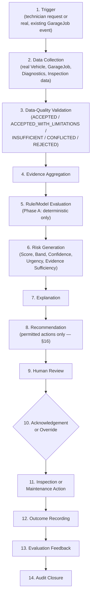

# DGX 3.0 — Predictive Maintenance Capability Specification v1.0

### The Foundational Specification Governing Predictive Maintenance Inside the Molas Solutions Automotive Intelligence Operating System

---

## Document Control

| Field | Value |
|---|---|
| Document | DGX 3.0 Predictive Maintenance Specification v1.0 |
| Capability | DGX 3.0 — Predictive Maintenance |
| Current lifecycle stage | Specification Draft |
| Target lifecycle stage after approval | Specified (Capability Governance Standard §6, Level 1) — **conditional on formal review approval; not yet reached; this document alone does not advance the lifecycle stage** |
| Program chapter | Chapter 3 |
| Status | **DRAFT — NOT AUTHORIZED FOR IMPLEMENTATION** |
| Architecture authority | AIOS Architecture |
| Business authority | Not yet assigned — no approved owner exists in any reviewed document |
| Engineering authority | Not yet assigned — no approved owner exists in any reviewed document |
| Certification authority | Independent from Engineering, per `AIOS_CAPABILITY_GOVERNANCE_STANDARD_V1.md` §15 |
| Effective date | 2026-07-29 |
| Supersedes | None |
| Authoritative dependencies | [`AIOS_FOUNDATION_ARCHITECTURE_SPECIFICATION_V1.md`](../architecture/AIOS_FOUNDATION_ARCHITECTURE_SPECIFICATION_V1.md), [`AIOS_REFERENCE_ARCHITECTURE_V1.md`](../architecture/AIOS_REFERENCE_ARCHITECTURE_V1.md), [`AIOS_CAPABILITY_GOVERNANCE_STANDARD_V1.md`](../governance/AIOS_CAPABILITY_GOVERNANCE_STANDARD_V1.md), [`AIOS_ENTERPRISE_ROADMAP_V1.md`](../strategy/AIOS_ENTERPRISE_ROADMAP_V1.md); [`DGX_2_DEMAND_FORECASTING_SPECIFICATION_V1.md`](DGX_2_DEMAND_FORECASTING_SPECIFICATION_V1.md), [`DGX2_DEMAND_FORECASTING_CERTIFICATION_STANDARD_V1.md`](../certification/DGX2_DEMAND_FORECASTING_CERTIFICATION_STANDARD_V1.md), [`DGX2_CERTIFICATION_STANDARD_AMENDMENT_V1_1.md`](../certification/DGX2_CERTIFICATION_STANDARD_AMENDMENT_V1_1.md), and [`DGX2_PHASE_A_BASELINE_1_0.md`](../execution/DGX2_PHASE_A_BASELINE_1_0.md) as the sibling-capability governance precedent this document follows in structure and discipline — none of these is a technical dependency of DGX 3.0. |

**This document is a specification, not an implementation plan, a pilot proposal, or a production authorization.** No application source code, database schema, migration, API, or dataset may be created, modified, or implied as already existing beyond what this document explicitly cites as real and verified. Every claim about existing repository content in this document was checked directly against the repository at the effective date above; every forward-looking statement is labeled `ASSUMPTION`, `TO_BE_DEFINED_DURING_CERTIFICATION_DESIGN`, or `TO_BE_APPROVED_IN_CERTIFICATION_STANDARD` where a real answer does not yet exist.

---

## 1. Executive Summary

DGX 3.0 Predictive Maintenance is a proposed AIOS capability that would evaluate approved vehicle, workshop, diagnostic, and maintenance evidence to estimate the risk, urgency, and explainable basis of a future maintenance need — before a vehicle actually breaks down — and present that estimate to a human reviewer as a recommendation, never as an automated action.

> **Recorded finding**: Existing `vehicle-lifecycle` and `twin-intelligence` functionality may provide a Phase A foundation, but its ownership and relationship to DGX 3.0 remain unresolved pending `DGX3-ADR-0001`. No architectural conclusion about adoption, wrapping, migration, ownership, or replacement of that existing code is made or implied by this specification.

**Why it exists**: AIOS already runs a real workshop and inventory operation (Operational Core) and has a certified AI Foundation (retrieval, knowledge, evaluation). DGX 2.0 closed the loop on inventory demand; DGX 3.0 is the next named capability layer in the Foundation's own transition rule, intended to close the analogous loop on vehicle/component maintenance risk — turning workshop history that already exists (job cards, diagnostic sessions, repeat-repair flags) into forward-looking, evidence-cited risk signals a technician or service advisor can act on.

**What business problem it solves**: today, maintenance in this environment is observed reactively — a vehicle is serviced after a complaint or a failure, not meaningfully before one, beyond whatever a technician's own memory or a paper service book provides. DGX 3.0's premise is that real, already-captured data (mileage at check-in, diagnostic codes, repeat visits, complaints) already contains early-warning signal that is not currently surfaced as a structured, explainable risk estimate.

**Who uses it**: Technicians, Workshop Supervisors, Service Advisors, Fleet Managers, Maintenance/Parts Planners, Branch Managers, and Management Reviewers — see §5.

**What it does not do**: DGX 3.0 does not diagnose a fault, does not replace a technician's judgment, does not authorize a repair, does not interact conversationally with a user (that is DGX 4.0's named, separate scope), does not control any vehicle system, and does not determine warranty or legal liability. It produces a risk estimate and a recommendation for a human to review — nothing more.

**Why predictive maintenance is different from diagnostic assistance**: diagnostics (already real in this repository — `diagnostics/`) answers "what is wrong with this vehicle right now, given an active complaint." Predictive maintenance answers a different question: "given everything approved and known about this vehicle, what is the risk that something will need attention before its next expected visit, and how confident is that estimate." The two are related — diagnostic history is real evidence predictive maintenance consumes — but they are not the same capability and must not be silently merged (see §4).

**Why it must be evidence-gated**: a maintenance risk estimate that is wrong in either direction has a real cost — a false negative can mean an avoidable breakdown or a safety incident; a false positive erodes technician and customer trust and wastes workshop capacity. Every prediction this capability produces must be traceable to specific, real evidence, and must honestly report when evidence is insufficient (see §11, §14) rather than manufacture a confident-sounding number.

**Why human accountability remains mandatory**: per the Foundation's own invariant that DGX is an "Intelligence Layer" that recommends, predicts, and explains but never executes a transaction directly (`AIOS_FOUNDATION_ARCHITECTURE_SPECIFICATION_V1.md`, restated in the root README's Non-negotiables), no DGX 3.0 output may become a repair decision, a parts order, a warranty determination, or a customer charge without a named human's review and acknowledgment (see §16, §28).

This specification deliberately avoids claims of the following kind, none of which are made anywhere in this document: predicting every failure, preventing all breakdowns, fully autonomous maintenance, guaranteed diagnosis, zero downtime, or an intelligent-mechanic replacement.

---

## 2. Business Problem

**Observed current problems** (confirmed real, from repository evidence):
- Repeat workshop visits for the same or a related issue are already a tracked, real concern — `vehicle-lifecycle/repeat-repair-math.ts` exists specifically to detect them deterministically (same complaint, same DTC, same part, same system category), and `GarageJob.repeatRepairFlags` is a real, persisted relation. The existence of this code is itself evidence that repeat repairs are a known, real operational problem today.
- Maintenance risk is currently assessed only via a simple, deterministic, evidence-count-based scoring system (`twin-intelligence-math.ts`'s `computeMaintenanceRiskScore`/`computeSystemRisks`) — real, but limited to counting same-system events in a fixed trailing 365-day window with a linear scoring formula; it does not model time-to-event, does not use mileage as an input signal, and has no formal calibration or certification.
- Diagnostic trouble codes are captured with structure (`DiagnosticCode.code`/`source`/`freezeFrame`) but, per that service's own code comment, are stored with "no AI interpretation of DTCs" — a real, current, explicitly acknowledged gap.

**Potential future problems** (plausible, not yet confirmed by real measured evidence in this repository):
- Missed maintenance intervals and unnecessary part replacement are named as concerns in the mission context and are consistent with the kind of workshop operation AIOS supports, but no real, measured baseline for either exists in this repository today.
- Poor visibility of fleet-level or cross-vehicle risk — plausible given no fleet-aggregation view currently exists (see §42), but not measured.

**Assumed problems requiring validation** (`ASSUMPTION`):
- That vehicles are, in fact, serviced primarily reactively rather than on a real, tracked preventive schedule today — plausible given no `MaintenanceInterval`/`MaintenanceSchedule` entity exists in the schema, but not confirmed by any business-side measurement in this repository.
- That inconsistent technician judgment is a material, quantified problem — asserted in the mission context, not measured here.

None of the above is presented as a confirmed fact where it is not.

---

## 3. Business Objectives

| Objective | Metric | Baseline requirement | Target-setting authority | Data source | Measurement frequency | Accountable owner |
|---|---|---|---|---|---|---|
| Reduce avoidable unplanned breakdowns | Real rate of unplanned breakdown incidents per vehicle-year | A real, measured baseline must exist before any target is set (Governance Standard §17) | Business Owner (not yet assigned) | `GarageJob` (unplanned vs. scheduled), future `FailureEvent` (§9) | `TO_BE_DEFINED_DURING_CERTIFICATION_DESIGN` |
| Improve early detection of maintenance needs | Real lead time between a risk flag and the confirmed need | No baseline exists (no risk-flag lead-time is currently measured) | Business Owner (not yet assigned) | Future `RiskAssessment` + `Outcome` (§9) | `TO_BE_DEFINED_DURING_CERTIFICATION_DESIGN` |
| Reduce repeat repairs | Real repeat-repair rate | `RepeatRepairFlag` exists and is real evidence; no aggregate rate is currently reported | Business Owner (not yet assigned) | `GarageJob.repeatRepairFlags` | `TO_BE_DEFINED_DURING_CERTIFICATION_DESIGN` |
| Improve maintenance scheduling / workshop planning | Real technician/bay utilization against predicted risk queue | No baseline | Operational Owner (not yet assigned) | `GarageJob`, future workshop-priority queue (§42) | `TO_BE_DEFINED_DURING_CERTIFICATION_DESIGN` |
| Improve parts readiness for predicted maintenance | Real stockout rate for parts tied to a high-risk prediction | No baseline; DGX 2.0's own inventory metrics are a real, related but distinct measurement (see §45 — DGX 2.0 is beneficial, not a dependency) | Business Owner (not yet assigned) | `InventoryItemMetric` (DGX 2.0's own real model), future `RiskAssessment` | `TO_BE_DEFINED_DURING_CERTIFICATION_DESIGN` |
| Improve technician decision confidence | Real technician acceptance/override rate of DGX 3.0 recommendations | No prior recommendation exists to baseline against | Business Owner (not yet assigned) | Future `RecommendationDecision` (§9) | `TO_BE_DEFINED_DURING_CERTIFICATION_DESIGN` |
| Improve customer communication about maintenance risk | Real customer-facing communication accuracy/timeliness | No baseline; customer communication is explicitly out of scope for DGX 3.0 to originate directly (§4, §8) | Business Owner (not yet assigned) | N/A until a consuming capability is specified | `TO_BE_DEFINED_DURING_CERTIFICATION_DESIGN` |
| Create traceable maintenance-risk evidence | Real audit-completeness rate for every risk assessment produced | None required — this is a design requirement of the capability itself, not a business KPI with a numeric target | Certification Authority | Future audit trail (§29) | Every assessment, continuously |

No target percentage is asserted anywhere in this table. Every numeric target is `TO_BE_DEFINED_DURING_CERTIFICATION_DESIGN`, consistent with DGX 2.0's own certification-design precedent of never asserting a threshold without approved evidence.

---

## 4. Capability Definition

**DGX 3.0 Predictive Maintenance is a governed AIOS capability that evaluates approved vehicle, workshop, diagnostic, usage, environmental, maintenance, and component evidence to estimate the probability, urgency, and explainable risk of a future maintenance need or component failure, while preserving human review and operational accountability.**

### Distinctions (mandatory — DGX 3.0 must not silently absorb any of these)

| Domain | Relationship to DGX 3.0 | Real status in this repository |
|---|---|---|
| **Preventive Maintenance** | A maintenance *policy* (service on a fixed schedule); DGX 3.0 may inform when a preventive schedule should be adjusted, but does not itself define the manufacturer schedule. | No `MaintenanceInterval`/`MaintenanceSchedule` entity exists today (§9 gap). |
| **Condition-Based Maintenance** | A closely related philosophy (act on observed condition, not a fixed calendar); DGX 3.0's risk scoring is a form of this, but "condition-based maintenance" as an industry term also implies real sensor/condition-monitoring data DGX 3.0 does not have access to (§10). | No condition-monitoring/telematics source exists (`ASSUMPTION` gap confirmed by direct repository search — zero matches for "telematics" anywhere in `src/`). |
| **Diagnostics** | A real, separate, already-implemented capability (`diagnostics/`) that answers "what is wrong right now, given an active complaint or session." DGX 3.0 *consumes* diagnostic history as evidence; it does not perform diagnosis itself. | Real — `DiagnosticSession`, `DiagnosticCode`, `Symptom`, `SuspectedCause` all exist today. |
| **Fault-code interpretation** | Diagnostics' own explicit, current gap ("no AI interpretation of DTCs in Phase 3" — the module's own code comment). DGX 3.0 may use a DTC's mere *presence/recurrence* as a risk-scoring input, but interpreting what a specific code *means* is not part of this specification. | Real, current, honestly-acknowledged gap in the existing `diagnostics/` module. |
| **Maintenance scheduling** | An operational workflow (booking a bay, a technician, a time slot); DGX 3.0 may recommend that scheduling occur, never perform the scheduling itself. | No scheduling module exists for this purpose today. |
| **Technician Copilot (DGX 4.0)** | A separate, future, named capability (conversational assistance for technicians). DGX 3.0's outputs are a planned future input to DGX 4.0 (§45), but DGX 4.0 is not implemented, not specified, and out of scope here (§8). | Concept only, per the Enterprise Roadmap. |
| **Warranty decisioning** | DGX 3.0 may surface evidence relevant to a warranty question (e.g., a recurring issue within a warranty-eligible mileage/date window), but never determines warranty eligibility or liability itself (§8, §40). | No `Warranty` entity exists in the schema today (confirmed by direct search) — a real, current gap; `GarageJob.isWarranty` is a real, existing boolean flag, not a full warranty-management model. |
| **Parts recommendation** | DGX 2.0's `purchase-recommendations/`/`transfer-recommendations/` already own real, deterministic parts-recommendation logic. DGX 3.0 may contribute a maintenance-risk *signal* that a future parts-planning workflow could consume, but does not itself recommend a specific part order. | Real, existing, DGX-2.0-owned capability — beneficial to DGX 3.0, never an internal dependency (§45). |
| **Customer communication** | Out of scope for DGX 3.0 to originate directly (§8) — any customer-facing communication is a separate, future capability's concern (plausibly DGX 5.0 Customer Intelligence). | Concept only. |

---

## 5. Users and Accountability

| Role | Allowed actions | Decisions they may make | Decisions they may NOT delegate to the system | Evidence they must review | Acknowledgement requirement | Escalation authority | Audit responsibility |
|---|---|---|---|---|---|---|---|
| **Technician** | View vehicle/component risk; record inspection/repair outcomes; provide feedback | Whether to act on a recommendation during a real job | Whether a repair was actually necessary or safe to defer | Evidence panel for the specific vehicle/component | Must acknowledge or override any recommendation before closing a related job | Workshop Supervisor | Own outcome entries |
| **Workshop Supervisor** | View workshop priority queue; reassign; escalate | Workshop-level prioritization of which flagged vehicles get attention first | Whether a specific technician's override was "correct" without review | Aggregate risk queue + individual evidence on escalation | Must review disagreement/override patterns | Service Advisor / Branch Manager | Escalation decisions |
| **Service Advisor** | View vehicle risk; communicate findings to customer (through an existing, separate customer-communication channel, not DGX 3.0 itself) | Whether/how to present a risk finding to a customer | Any warranty, pricing, or liability determination | Evidence + explanation panel | Must acknowledge before customer-facing communication | Branch Manager | Customer-facing communication accuracy |
| **Fleet Manager** | View fleet-level risk prioritization (§42) | Fleet-level maintenance prioritization | Individual vehicle repair decisions (remain the workshop's) | Fleet risk queue | Must review before reallocating fleet maintenance schedule | Management Reviewer | Fleet-level decisions |
| **Maintenance Planner** | View maintenance timeline; plan workshop capacity against predicted risk | Scheduling priority | Final repair execution | Maintenance timeline + evidence | Must acknowledge before committing workshop capacity | Branch Manager | Planning decisions |
| **Parts Planner** | View risk-linked parts-readiness signal | Whether to pre-position stock ahead of a predicted need | Automatic purchase (remains DGX 2.0's own, separately governed, human-approved recommendation flow) | Risk signal + DGX 2.0's own real recommendation evidence | Must acknowledge before adjusting stock plans | Branch Manager | Stocking decisions |
| **Branch Manager** | View branch-level risk/adoption metrics | Branch-level operational response | Individual technical decisions | Aggregate dashboards (§42) | Periodic review, not per-assessment | Management Reviewer | Branch-level oversight |
| **Management Reviewer** | View aggregate KPIs (§3, §35) | Business-level resourcing/investment decisions | Any individual vehicle decision | Aggregate KPI dashboards | Periodic | Business Owner | Business-level governance |
| **Data Steward** | Review data quality/lineage (§11) | Whether a data source is trusted for a given use | Model or policy activation (Model/Certification Owner's role) | Data quality reports | Ongoing | Certification Authority | Data quality sign-off |
| **AIOS Administrator** | Manage access, taxonomy versions (§12), configuration | Access control | Business/clinical/technical judgment on any single case | Access/audit logs | Ongoing | Architecture Authority | System configuration integrity |
| **Certification Reviewer** | Review certification evidence (§33) | Whether DGX 3.0 (or a version of it) meets a certification level | Business adoption decisions | Full certification evidence package | Per certification run | Architecture Board | Certification integrity |

No role above may have a repair, warranty, or customer-charging decision delegated to the system itself — this is a structural requirement of §16 and §28, not merely a recommendation.

---

## 6. Primary Use Cases

| Use case | Classification | Business question | Decision supported | Minimum evidence | Confidence behavior | Human reviewer | Known safety limitation | False-positive impact | False-negative impact |
|---|---|---|---|---|---|---|---|---|---|
| Engine oil service risk (mileage/date-based) | **Included in Initial Specification** | Is this vehicle due/overdue for an oil service? | Schedule/recommend service | Real `mileageAtCheckIn` history + service event dates | `INSUFFICIENT_HISTORY` if <2 real service events | Service Advisor | Mileage-only signal if odometer not read continuously (only captured at check-in) | Unnecessary service reminder | Missed service interval |
| Brake wear risk (recurrence/complaint-based) | **Included in Initial Specification** | Is there recurring evidence of brake-system issues? | Inspect brakes | Real complaint/DTC/repeat-repair evidence classified to `BRAKE` system (existing `twin-intelligence-math.ts` category) | `LOW` risk band if evidence count is low | Technician | No direct wear-sensor data exists | Unneeded inspection | Missed brake degradation — safety-relevant, defaults to human inspection (§27) |
| Battery degradation | **Included in Initial Specification** | Is there recurring electrical-system evidence consistent with battery health? | Test/replace battery | Real `ELECTRICAL`-classified evidence + real `BatteryTest` data — **`ASSUMPTION`: no dedicated `BatteryTest` entity exists in the schema today; this use case's evidence is currently limited to complaint/DTC recurrence only** | Confidence capped without a real battery-test data source | Technician | Cannot currently model calendar-based battery aging without a real test-history source | Unneeded test | Missed failure risk (starting/electrical) |
| Cooling-system maintenance risk | **Included in Initial Specification** | Is there recurring evidence of cooling-system issues? | Inspect/service cooling system | Real `COOLING`-classified evidence | Same evidence-count-based confidence model | Technician | Existing system-classification keywords are a real, current, non-exhaustive list (`twin-intelligence-math.ts`) | Unneeded inspection | Missed overheating risk — safety-relevant |
| Turbocharger health risk | **Deferred** | — | — | No turbo-specific evidence source exists beyond generic `ENGINE` classification | — | — | Requires component-level granularity not yet modeled (§9) | — | — |
| DPF condition and regeneration risk | **Research Only** | — | — | No DPF-specific data source exists anywhere in this repository | — | — | Requires manufacturer-specific data not currently available | — | — |
| Transmission service risk | **Deferred** | — | — | `TRANSMISSION` system classification exists but no dedicated service-interval data source | — | — | — | — | — |
| Timing belt/chain maintenance risk | **Deferred** | — | — | Requires component-level, manufacturer-interval data not currently modeled | — | — | — | — | — |
| Suspension wear risk | **Deferred** | — | — | `SUSPENSION` classification exists; insufficient real labeled outcome data to justify Phase A inclusion (§7) | — | — | — | — | — |
| Wheel-bearing risk | **Research Only** | — | — | No component-level data source | — | — | — | — | — |
| Fuel-system degradation | **Deferred** | — | — | Falls under `ENGINE` classification only, no dedicated signal | — | — | — | — | — |
| Ignition-system degradation | **Deferred** | — | — | Falls under `ENGINE` classification only | — | — | — | — | — |
| Charging-system risk | **Deferred** (folded conceptually into battery/electrical, §6 above) | — | — | — | — | — | — | — | — |
| Recurring DTC pattern risk | **Included in Initial Specification** | Does this vehicle show a recurring diagnostic-code pattern? | Prioritize investigation | Real `DiagnosticCode.code` history per vehicle (`listCodeHistoryForVehicle` already exists) | Confidence scales with real code-history depth | Technician | DTC meaning itself is not interpreted (§4) | Unneeded investigation | Missed recurring fault |
| Repeat-repair risk | **Included in Initial Specification** — already real, deterministic (`repeat-repair-math.ts`); DGX 3.0's role is to govern and extend it, not reinvent it | Is this job related to a prior, unresolved issue? | Flag for supervisor review | Real `RepeatRepairFlag` | Deterministic, not probabilistic, in current form | Workshop Supervisor | Matching logic is exact-string/ID based, not fuzzy (a real, current limitation) | Unneeded flag | Missed genuine repeat issue |
| Vehicle-level maintenance risk score | **Included in Initial Specification** — already real, deterministic (`computeMaintenanceRiskScore`); DGX 3.0's role is to govern, certify, and extend it | What is this vehicle's overall maintenance risk? | Prioritize attention | Real system-risk aggregation | Confidence gated by real job count (`computeOverallConfidence`) | Service Advisor | Existing formula is a simple weighted average, not calibrated (§14) | Wasted attention | Missed high-risk vehicle |
| Component-level maintenance risk score | **Deferred** | — | — | No real `Component` entity exists in the schema today (confirmed gap, §9) | — | — | — | — | — |
| Fleet maintenance prioritization | **Deferred to Phase B/C** — a real, valuable extension of the vehicle-level score, but requires a fleet-aggregation view not yet specified (§42) | — | — | — | — | — | — | — | — |
| Workshop capacity planning | **Deferred** — depends on a real scheduling/capacity model not in scope here | — | — | — | — | — | — | — | — |
| Maintenance-related parts planning | **Explicitly Out of Scope** for DGX 3.0 to perform directly — remains DGX 2.0's real, existing, separately-governed recommendation flow; DGX 3.0 may only emit a risk *signal* a future integration could consume (§45) | — | — | — | — | — | — | — | — |

---

## 7. Initial Release Scope

**Phase A is deliberately narrow**, built around use cases that (a) already have real, existing evidence sources in this repository and (b) already have a real, if primitive, deterministic precedent (`twin-intelligence-math.ts`, `repeat-repair-math.ts`) this specification can govern and extend rather than invent from nothing:

- Vehicle maintenance timeline (real: `vehicle-timeline.service.ts` already exists)
- Mileage- and date-based service risk (real: `mileageAtCheckIn` on `GarageJob`)
- Service-history completeness (real: derivable from `GarageJob` history per vehicle)
- Recurring repair detection (real: `repeat-repair-math.ts`, `RepeatRepairFlag`)
- DTC recurrence (real: `DiagnosticCode` history per vehicle)
- Battery health indicators (real evidence limited to complaint/DTC recurrence classified `ELECTRICAL` — no dedicated battery-test data source; confidence must reflect this honestly)
- Brake maintenance indicators (real evidence via `BRAKE` classification)
- Oil-service risk (real evidence via mileage/date interval logic, extending `computeServiceCompliance`)
- Cooling-system maintenance indicators (real evidence via `COOLING` classification)
- Explainable vehicle risk score (real precedent: `computeMaintenanceRiskScore`, `computeVehicleHealthScore`)

**Why these and not more**: every included use case above already has a real, traceable evidence source in the current schema and codebase. Component-level failure prediction, turbocharger/DPF/timing-belt-specific risk, and any use case requiring a `Component` entity, a `FailureEvent` entity, or real labeled failure outcomes are excluded from Phase A specifically because **no real labeled failure dataset exists in this repository today** (confirmed by direct schema search — no `FailureEvent`/`FailureLabel`/`Component` model exists). Per this specification's own instruction not to include advanced component-failure prediction without sufficient real labeled data, and per the AIOS-wide discipline of never starting with an unearned model, Phase A is scoped to what real, existing evidence can honestly support.

---

## 8. Out-of-Scope Register

The following are explicitly excluded from DGX 3.0 unless separately, formally approved through the change-control process in §48:

Autonomous diagnosis · autonomous repair authorization · automatic part replacement · automatic warranty rejection · automatic customer charging · automatic workshop booking · automatic vehicle shutdown · safety-critical control of a vehicle · ECU coding · ECU flashing · active control of vehicle systems · real-time driving intervention · insurance underwriting decisions · regulatory roadworthiness certification · legal liability decisions · Technician Copilot conversational workflows · DGX 4.0 (any part of it) · medical or human-safety prediction · unsupported aftermarket telematics ingestion · uncontrolled internet-sourced repair advice.

None of the above is implemented, referenced as available, or implied as forthcoming without its own separate specification and governance approval.

---

## 9. Data Domain Model

Every entity below is **conceptual** — none is created, migrated, or implied to already exist as a DGX-3.0-owned table unless explicitly marked "Real, existing" with its actual current location.

| Entity | Purpose | Source system | System of record | Data owner | Mandatory for Phase A? | Real status |
|---|---|---|---|---|---|---|
| Vehicle | The subject of every assessment | Operational Core | Operational Core (`Vehicle` model) | Data Steward | Yes | **Real, existing** (`vin`, `brand`, `model`, `variant`, `modelYear`, `engineCode` — `vin` is nullable and unique) |
| VIN | Vehicle identity | Vehicle | Operational Core | Data Steward | Yes | **Real** — nullable field; not every real vehicle record has one populated |
| Vehicle Configuration / Make / Model / Model Year / Engine Code / Transmission Code | Segmentation for risk modeling and bias evaluation (§39) | Vehicle | Operational Core | Data Steward | Yes (make/model/year/engine), No (transmission code) | **Real** for make/model/modelYear/engineCode; **no dedicated transmission-code field found** — `ASSUMPTION` gap |
| Mileage Reading | Time-to-event / interval signal | GarageJob | Operational Core | Data Steward | Yes | **Real, but limited** — `GarageJob.mileageAtCheckIn` is a point-in-time reading captured only at workshop check-in, not a continuous odometer feed |
| Mileage Source | Trust classification of a mileage reading | Conceptual | DGX 3.0 (proposed) | Data Steward | Yes | Conceptual — no real "source" classification exists today; every real reading currently comes from the same single point (check-in) |
| Service Event | A real maintenance/service occurrence | GarageJob | Operational Core | Data Steward | Yes | **Real** — modeled as a `GarageJob` with appropriate line items; no dedicated `ServiceEvent` entity distinct from a job exists |
| Repair Order | A real, closed workshop job | GarageJob | Operational Core | Data Steward | Yes | **Real** — `GarageJob` itself, with `status`/`closedAt` |
| Diagnostic Session | A real diagnostic encounter | Diagnostics module | Operational Core | Data Steward | Yes | **Real, existing** (`DiagnosticSession`) |
| DTC Observation | A real diagnostic trouble code record | Diagnostics module | Operational Core | Data Steward | Yes | **Real, existing** (`DiagnosticCode`, includes `code`, `source`, `freezeFrame`) |
| DTC Status | Active/historical/cleared state of a DTC | Conceptual | DGX 3.0 (proposed) | Data Steward | No | Conceptual — no real status field beyond `recordedAt` exists today |
| Freeze Frame | Real diagnostic snapshot data | Diagnostics module | Operational Core | Data Steward | No (available but not required for Phase A scoring) | **Real, existing** (`DiagnosticCode.freezeFrame`, `Json`) |
| Component | A specific, identifiable vehicle part/assembly | Conceptual | Not yet assigned | Data Steward | No | **Not real** — confirmed by direct schema search: no `Component` model exists |
| Component Family | A grouping of components (e.g., braking system) | Conceptual (partially real via `SystemCategory` in `twin-intelligence-math.ts`) | DGX 3.0 (proposed) | Data Steward | Yes, at the system-category level only | **Partially real** — `SystemCategory` (`COOLING`/`ENGINE`/`TRANSMISSION`/`SUSPENSION`/`ELECTRICAL`/`BRAKE`) is a real, existing, keyword-based classification; true `Component`-level granularity does not exist |
| Part | A real, catalogued part | Parts/Catalogue module | Operational Core | Data Steward | Yes (as evidence input, not owned by DGX 3.0) | **Real, existing** (`Part` model) |
| Part Fitment | Which parts fit which vehicles | Parts/Catalogue module | Operational Core | Data Steward | No | Real elsewhere in Operational Core (`Part`/fitment relations); not evaluated in depth for this specification |
| Part Replacement | A real record of a part being replaced | GarageJobLine (implied) | Operational Core | Data Steward | Yes, as recurrence evidence | **Real, existing** via job-line part usage; no dedicated "Part Replacement" event entity distinct from a job line was confirmed |
| Maintenance Action | A real, recorded action taken | GarageJob / future | Operational Core | Data Steward | Yes | Real as a `GarageJob`; a dedicated `MaintenanceAction` taxonomy is conceptual (§16) |
| Maintenance Interval | A defined service interval (manufacturer or business rule) | Conceptual / Knowledge Platform | Knowledge Platform (proposed) | Data Steward | Yes, at least a default business interval | **Not real as structured data** today, except that the Knowledge Platform's `StructuredFact.factType` enum already includes a real `SERVICE_INTERVAL` classification (confirmed: `knowledge-platform/ingestion/stages/classify.stage.ts`) — a real, existing mechanism DGX 3.0 should consume rather than duplicate (§20) |
| Inspection Finding | A real inspection result | Inspections module | Operational Core | Data Steward | Yes | **Real, existing** (`InspectionResult`, `InspectionItem`, `InspectionTemplate`) |
| Failure Event | A real, confirmed component/vehicle failure | Conceptual | Not yet assigned | Data Steward | No — required for any calibrated model, not Phase A's deterministic rules | **Not real** — no `FailureEvent`/`FailureLabel` entity exists; this is the single largest real data gap for anything beyond Phase A (§34) |
| Failure Label | A ground-truth failure classification for model training | Conceptual | Not yet assigned | Data Steward | No | **Not real** |
| Warranty Event | A real warranty-relevant occurrence | Conceptual (partial) | Operational Core (partial) | Data Steward | No | **Partially real** — `GarageJob.isWarranty` is a real boolean flag; no dedicated `Warranty` entity exists |
| Technician Observation | Free-text or structured technician input | Diagnostics/Inspection modules | Operational Core | Data Steward | Yes | **Real** via `Symptom` (`reportedBy: TECHNICIAN`) and inspection notes |
| Customer Complaint | A real, recorded customer-reported issue | GarageJob domain | Operational Core | Data Steward | Yes | **Real, existing** (`CustomerComplaint`) |
| Road Test Result | A real post-repair verification | GarageJob domain | Operational Core | Data Steward | No (available, not required for Phase A scoring) | **Real, existing** (`RoadTest`) |
| Fluid Service | A real fluid-related service record | GarageJobLine (implied) | Operational Core | Data Steward | No | Not confirmed as a dedicated entity — likely represented generically via job lines; `ASSUMPTION` |
| Battery Test | A real, dedicated battery health test record | Conceptual | Not yet assigned | Data Steward | No | **Not real** — confirmed gap (§6) |
| Brake Measurement | A real, dedicated brake wear measurement | Conceptual | Not yet assigned | Data Steward | No | **Not real** — confirmed gap |
| Tyre Measurement | A real, dedicated tyre condition measurement | Conceptual | Not yet assigned | Data Steward | No | **Not real** — confirmed gap |
| Environmental Context | Climate/road/operating environment | Conceptual | Not yet assigned | Data Steward | No | **Not real** |
| Usage Profile | How a vehicle is actually used (duty cycle) | Conceptual | Not yet assigned | Data Steward | No | **Not real** |
| Vehicle Operating Condition | Real-time or recent operating state | Conceptual | Not yet assigned | Data Steward | No | **Not real** — would require telematics, which does not exist |
| Risk Assessment | DGX 3.0's own output record | Conceptual | DGX 3.0 (proposed) | Model/Certification Owner | Yes (this is the capability's core output) | **Not real yet** — proposed |
| Risk Factor | An individual evidence contribution to a Risk Assessment | Conceptual | DGX 3.0 (proposed) | Model/Certification Owner | Yes | **Not real yet** |
| Maintenance Recommendation | DGX 3.0's recommended action | Conceptual | DGX 3.0 (proposed) | Model/Certification Owner | Yes | **Not real yet**, though `computePredictedMaintenance` is a real, existing precedent for the concept |
| Recommendation Decision | A human's real acknowledgment/override | Conceptual | DGX 3.0 (proposed) | Operational Owner | Yes | **Not real yet** |
| Outcome | What actually happened after a recommendation | Conceptual | DGX 3.0 (proposed) | Operational Owner | Yes | **Not real yet** |
| Feedback | Real human feedback on a prediction's usefulness | Conceptual | DGX 3.0 (proposed) | Operational Owner | No (valuable, not blocking) | **Not real yet** |
| Override | A real record of a human overriding a recommendation | Conceptual | DGX 3.0 (proposed) | Operational Owner | Yes | **Not real yet** |
| Evidence Citation | A real, traceable link from a Risk Factor to its source record | Conceptual | DGX 3.0 (proposed) | Model/Certification Owner | Yes | **Not real yet**, though the Foundation's own provenance discipline (Knowledge Platform citations) is a real, applicable precedent |
| Model Version | Identifies which rule/model set produced an assessment | Conceptual | DGX 3.0 (proposed) | Model Owner | Yes | **Not real yet** for this capability — a real, analogous precedent exists in `model-registry/` (for LLM models specifically, not a general model-lifecycle registry) |
| Policy Version | Identifies which business-rule policy was active | Conceptual | DGX 3.0 (proposed) | Model Owner | Yes | **Not real yet** |
| Certification Dataset Reference | Links an assessment's evidence to a frozen certification dataset, mirroring DGX 2.0's own real pattern | Conceptual | Certification Authority | Certification Authority | No (certification-time concern, not Phase A runtime) | **Not real yet** for DGX 3.0; real, direct precedent exists in DGX 2.0's own `dgx2-certification/` module |

---

## 10. Data Source Register

| Source | Classification |
|---|---|
| AIOS Operational Core (Vehicle, GarageJob, Diagnostics, Inspections, Parts) | **Exists and verified** |
| Workshop repair orders / service history | **Exists and verified** (as `GarageJob` history) |
| SAP Business One | **Exists and verified** as a real, read-only adapter (`integration/adapters/sap-business-one.adapter.ts`) for commercial data; not confirmed to carry maintenance-specific data |
| Odoo | **Exists and verified** as a real, read-only adapter, same caveat as above |
| VIN catalogue | **Exists but incomplete** — `Vehicle.vin` is a real, nullable, unique field; not every real vehicle record has one populated (confirmed by schema: `vin String? @unique`) |
| Diagnostic scanner exports | **Exists but incomplete** — `DiagnosticCode` captures structured codes; no confirmation of a real, automated scanner-export ingestion pipeline (manual/session-based entry is the confirmed real path) |
| Telematics | **Not available** — confirmed by direct repository search (zero matches) |
| Odometer readings | **Exists but incomplete** — only captured at workshop check-in (`mileageAtCheckIn`), not continuously |
| Inspection forms | **Exists and verified** (`InspectionTemplate`/`InspectionResult`) |
| Technician observations | **Exists and verified** (`Symptom`, inspection notes) |
| Parts replacement records | **Exists and verified** via job-line part usage |
| Warranty records | **Exists but incomplete** — only `GarageJob.isWarranty` boolean; no dedicated warranty entity |
| Manufacturer maintenance schedules | **Planned** — the Knowledge Platform's `SERVICE_INTERVAL` structured-fact classification is real and existing, but real, ingested manufacturer schedule content was not confirmed as populated for this specification |
| Approved technical knowledge (Knowledge Platform) | **Exists and verified** — the Knowledge Platform (`knowledge-platform/`) is real, governed, and already populated with real automotive content in a related but distinct effort (Trusted Knowledge Pilot) |
| Customer-reported symptoms | **Exists and verified** (`CustomerComplaint`, `Symptom` with `reportedBy: CUSTOMER`) |
| Historical failure events | **Not available** — confirmed gap, no `FailureEvent` entity |
| Vehicle usage profile | **Not available** |
| Branch and environmental conditions | **Exists but incomplete** — `Branch` is real; no environmental/climate data source exists |

Per this specification's own instruction, telematics, ECU live data, and manufacturer maintenance-schedule content are **not** treated as available data sources for Phase A design — each is either not real (telematics, ECU live data) or real-but-unconfirmed-as-populated (manufacturer schedules).

---

## 11. Data Quality and Readiness

Minimum standards (design requirements for a future engineering phase, not yet implemented):

- **VIN validity**: a real check-digit/format validation must exist before a VIN-keyed assessment is trusted; today, `Vehicle.vin` is stored as free text with only a uniqueness constraint — no format validation was confirmed.
- **Mileage consistency**: a mileage rollback (a new reading lower than a prior one) must be detected and flagged, never silently accepted, given `mileageAtCheckIn` is captured discretely per job.
- **Timestamp consistency, duplicate service events, DTC normalization, failure labels, maintenance outcome capture, technician observation quality, missing history, imported historical data, conflicting data sources, delayed synchronization, offline branch operation, source trust ranking**: all `TO_BE_DEFINED_DURING_CERTIFICATION_DESIGN` — no real, existing data-quality gate for any of these was found specific to maintenance data (DGX 2.0's own data-readiness discipline, per `docs/data-readiness/`, is the closest real precedent to follow).

**Data quality outcomes** (proposed, mirroring the honest-abstention discipline already established for DGX 2.0's `HISTORICAL_METRICS_PERSISTED`-style gates):

| Outcome | Meaning |
|---|---|
| `ACCEPTED` | Real, sufficient, consistent evidence |
| `ACCEPTED_WITH_LIMITATIONS` | Real evidence exists but with a named, disclosed gap (e.g., mileage only available at check-in) |
| `INSUFFICIENT` | Not enough real evidence to support any assessment |
| `CONFLICTED` | Real evidence exists but contradicts itself |
| `REJECTED` | Evidence fails a hard validation rule (e.g., an invalid VIN) |

**The system must never convert missing data into false certainty** — an `INSUFFICIENT` or `CONFLICTED` outcome must result in an honest `insufficient evidence` prediction (§13), never a manufactured risk score.

---

## 12. Failure Taxonomy

A controlled taxonomy is required covering system → subsystem → component family → component → failure mode → degradation mode → symptom → DTC → inspection evidence → repair action → confirmed outcome → severity → urgency → safety relevance → recurrence.

**Real, existing partial taxonomy**: `twin-intelligence-math.ts`'s `SystemCategory` (`COOLING`, `ENGINE`, `TRANSMISSION`, `SUSPENSION`, `ELECTRICAL`, `BRAKE`) is a real, keyword-based, top-level system classification already in production use for Digital Twin scoring. This is the only level of the full taxonomy above that is real today — subsystem, component family, component, failure mode, degradation mode, and confirmed-outcome levels are **not modeled** anywhere in this repository.

This specification does **not** claim completeness for any taxonomy level — the six real system categories above are illustrative of what exists, not an exhaustive automotive taxonomy.

**Taxonomy governance**: taxonomy versions must be governed the same way the Knowledge Platform governs its own structured-fact types — versioned, never silently redefined, with a real migration/mapping path when a taxonomy version changes (`TO_BE_DEFINED_DURING_CERTIFICATION_DESIGN` for the exact mechanism).

---

## 13. Prediction Types

| Prediction category | Meaning |
|---|---|
| Maintenance due | Approaching a real, known interval |
| Maintenance overdue | Past a real, known interval |
| Degradation detected | Real evidence trend consistent with wear |
| Elevated failure risk | Real evidence crosses a defined risk band |
| Recurring issue risk | Real evidence of repeated same-system/same-code events |
| Repeat-repair risk | Real, deterministic match per `repeat-repair-math.ts` |
| Inspection recommended | Evidence sufficiency is `PARTIAL` — enough to warrant a look, not enough to be confident |
| Immediate review recommended | Safety-relevant evidence pattern (§27) |
| Insufficient evidence | `INSUFFICIENT`/`CONFLICTED` data quality outcome (§11) — an honest abstention, not a failure of the system |

Every prediction must state: prediction target, time horizon (§15), risk score and band (§14), confidence, urgency, evidence, limitations, model/rule version, generated timestamp, expiry, and reviewer requirement. No prediction may omit any of these fields.

---

## 14. Risk Scoring Model

| Field | Values |
|---|---|
| Risk Score | 0-100 |
| Risk Band | `LOW` / `MODERATE` / `HIGH` / `CRITICAL` |
| Confidence | `LOW` / `MEDIUM` / `HIGH` |
| Urgency | `ROUTINE` / `PLAN_SOON` / `INSPECT_NOW` / `IMMEDIATE_HUMAN_REVIEW` |
| Evidence Sufficiency | `SUFFICIENT` / `PARTIAL` / `INSUFFICIENT` / `CONFLICTED` |

**A Risk Score is not a probability.** `twin-intelligence-math.ts`'s real, existing `computeSystemRisks`/`computeMaintenanceRiskScore` functions produce a 0-100 score from a simple, linear, evidence-count formula (25 points per relevant event in a trailing 365-day window, capped at 100) — this is an explainable heuristic, not a calibrated probability of failure. **This specification prohibits presenting any risk score as a calibrated probability (e.g., "87% chance of failure") unless and until a specific model has been statistically calibrated and certified for that exact interpretation** (§31, §33) — no such calibration exists today for any component of this repository's existing maintenance-risk logic.

The real, existing four-level confidence gate (`computeOverallConfidence`: `INSUFFICIENT_HISTORY` below 2 jobs, `LOW` below 5, `MEDIUM` below 10, `HIGH` at 10+) is a real, direct precedent this specification adopts as its starting confidence model, pending certification-design refinement.

---

## 15. Time-Horizon Model

| Horizon type | Example | Real data support today |
|---|---|---|
| Calendar-based | Next 7/30/90 days | Supportable — real `occurredAt` timestamps exist on service/job records |
| Mileage-based | Next mileage threshold | Partially supportable — `mileageAtCheckIn` exists but is not continuous; a mileage-based horizon can only be estimated between discrete real readings |
| Usage-based | Next operating cycle | **Not supportable today** — no usage-profile data exists |
| Condition-based | Upon observed degradation | Partially supportable via existing evidence-count trend, not a real continuous condition signal |

Only calendar-based and (with an explicitly disclosed limitation) mileage-based horizons are approved for Phase A. Usage-based and true condition-based horizons are deferred pending real data (§7, §44 Phase D).

---

## 16. Recommendation Model

**Permitted**: monitor · inspect · test · service · schedule · escalate · collect more evidence · no action due to insufficient evidence.

**Prohibited, unconditionally**: replace a component automatically · approve a repair automatically · charge a customer automatically · declare a component failed without evidence · override technician or manufacturer guidance · suppress a critical warning.

Every recommendation must be explainable (§17), reversible before any action is taken, acknowledged by a named human (§28), logged (§29), linked to its evidence, linked to the policy/model version that produced it, and linked to the responsible reviewer.

---

## 17. Explainability

Every risk assessment must explain: what evidence increased risk, what evidence reduced or is absent, missing evidence, contradictory evidence, historical trend, comparable events (only where a real, approved comparison basis exists — no fabricated peer comparison), source reliability, the model/rule version used, confidence limitations, and the recommended next verification step.

**Format requirement**: the explanation content is the same underlying evidence and reasoning across every view (technician, service-advisor, management, audit, API) — only the presentation depth differs (a technician view shows full evidence detail; a management view shows an aggregated summary; an audit view shows everything, immutably). No view may present a different *conclusion* than another for the same assessment.

Raw model internals (e.g., an internal ensemble weight) must not be exposed where they do not improve human decision quality — the existing `twin-intelligence-math.ts` precedent (a plain evidence count and a named system) is exactly this kind of appropriately-scoped explanation, and is the bar this specification expects any future model to meet or exceed, never fall below.

---

## 18. AI and Analytics Strategy

| Phase | Approach | Required data volume | Label requirement | Explainability | Calibration requirement | Operational risk | Certification burden |
|---|---|---|---|---|---|---|---|
| **Phase A** | Deterministic rules, manufacturer/business interval rules, trend/recurrence detection, transparent evidence-count scoring (extending the real, existing `twin-intelligence-math.ts`/`repeat-repair-math.ts`) | None beyond what already exists | None — deterministic | Full (every score traces to a countable evidence item) | Not applicable (not a probability) | Low | Lower — behavior is fully deterministic and testable |
| **Later phases** (not authorized here) | Survival analysis / time-to-event models, gradient boosting, probabilistic models, sequence models, multimodal models, fleet-level learning, component-specific models | Requires a real, substantial, labeled `FailureEvent` dataset that does not exist today | Real, confirmed failure labels | Requires a dedicated explanation layer (§17) | Requires formal calibration and certification (§14, §33) before any probability-style claim | Higher | Higher — requires the full DGX 2.0-style certification apparatus, adapted for time-to-event/classification metrics (§32) |

**This specification prefers the simplest model that satisfies the business objective** — per this same principle already applied to DGX 2.0's own Phase A, and per the Foundation's "never assume deep learning is automatically better" instruction, Phase A uses no machine-learning model at all.

---

## 19. Rule-Based vs. Model-Based Decisions

Proposed precedence (subject to a required ADR, DGX3-ADR-0004, and legal/safety review before adoption — not established as final by this specification alone):

```
Safety-critical approved rule
>
Manufacturer requirement (where real, approved knowledge exists — §20)
>
Certified deterministic policy
>
Certified predictive model
>
Advisory heuristic (e.g., today's real evidence-count scoring)
>
Human interpretation
```

This precedence is proposed by analogy to the Foundation's existing "Business Rules always override AI" invariant (already real and enforced in DGX 2.0's Safety Gates) and to §14's prohibition on treating an uncalibrated score as a probability. It is explicitly **not** adopted as final governance by this document alone — a dedicated ADR is required (§49) before any engineering relies on it.

---

## 20. Knowledge Platform Integration

DGX 3.0 must consume manufacturer service intervals, approved technical bulletins, approved repair procedures, component specifications, lubricant approvals, known failure patterns, and workshop policies **only** through the existing, real, governed Knowledge Platform (`knowledge-platform/`) — never through unapproved web content.

**Real, confirmed mechanism**: the Knowledge Platform's `StructuredFact` model already includes a real `factType` value for `SERVICE_INTERVAL` (confirmed: `knowledge-platform/ingestion/stages/classify.stage.ts` classifies content matching "service interval" / "every N km" patterns). DGX 3.0's Phase A oil-service/interval-based use cases (§7) should consume this real, existing mechanism rather than build a parallel one.

Every knowledge-based recommendation must preserve: source identity, approval state, version, effective date, vehicle applicability, citation, retrieval trace, and confidence — mirroring the exact provenance discipline the Knowledge Platform already enforces for every other AI capability that consumes it (Catalogue AI, Retrieval Intelligence).

Unapproved, internet-sourced repair advice must never become operational evidence — this is a restatement of the Knowledge Platform's own existing, real license-eligibility and review-workflow gates, not a new rule invented here.

---

## 21. Operational Core Integration

| Domain | Read contract | Proposed write contract | Notes |
|---|---|---|---|
| Vehicle | Read `Vehicle` (VIN, make/model/year/engine) | None — DGX 3.0 never writes to `Vehicle` | |
| Workshop/Garage | Read `GarageJob`, `GarageJobLine`, `JobStatusHistory`, `RepeatRepairFlag` | Proposed: write a new, DGX-3.0-owned `RiskAssessment`/`MaintenanceRecommendation` record, never a write to `GarageJob` itself | Preserves capability isolation (§23) |
| Diagnostics | Read `DiagnosticSession`, `DiagnosticCode`, `Symptom`, `SuspectedCause` | None | |
| Inventory / Parts | Read real DGX-2.0-owned `InventoryItemMetric` and part data, as a beneficial signal only (§45) | None | DGX 3.0 must not write to any DGX-2.0-owned table |
| Customer | Read `CustomerComplaint` | None | |
| Branch | Read `Branch` for scoping | None | |
| User and Role | Read via the existing `PermissionsGuard`/`RequirePermissions` convention (real, confirmed: e.g. `'jobcard.manage'`, `'diagnostics.manage'` string-permission pattern) | None | DGX 3.0 introduces its own new permission strings (e.g. `maintenance-risk.read`), never bypasses this existing mechanism |
| Audit | Write | Every assessment and every human decision must write a real `AuditLog` entry, using the existing, real `AuditLog` model (`action`/`actorId`/`entityType`/`entityId`/`beforeState`/`afterState`/`occurredAt`) — the same pattern already used by DGX 2.0's recommendation approval flow | |

Idempotency, offline behavior, synchronization, retry, and conflict-handling requirements for any future DGX 3.0 write path are `TO_BE_DEFINED_DURING_CERTIFICATION_DESIGN` — no final endpoint path or write contract is authorized by this specification.

---

## 22. DGX AI Platform Integration

Proposed logical services (naming only — no implementation authorized):

Risk Assessment Service · Maintenance Timeline Service · Feature Preparation Service · Evidence Aggregation Service · Rule Evaluation Service · Model Inference Service (Phase A: not needed, since no model exists yet) · Explanation Service · Recommendation Service · Outcome Feedback Service · Model Registry Integration (future; distinct from the existing, LLM-specific `model-registry/` module — §31) · Evaluation Service · Certification Evidence Service (mirroring DGX 2.0's real `dgx2-certification/` module pattern).

Per the Foundation's own invariant, any future component of DGX 3.0 that calls an AI provider must do so exclusively through the existing `ai-gateway/` boundary (real, confirmed: `DgxClientService`) — never directly to `dgx-ai-platform`.

---

## 23. Capability Isolation

- DGX 3.0 must not modify AI Foundation internals.
- DGX 3.0 must not read DGX 2.0's internal storage directly — any DGX-2.0-derived signal (e.g., a part's real stockout risk) must be consumed through DGX 2.0's own real, existing APIs/read models, never a direct table join.
- DGX 4.0, when it exists, must consume only DGX 3.0's approved, published contracts — never DGX 3.0's internal storage.
- No cyclic dependency may exist between DGX 3.0 and any other capability.
- Shared data (Vehicle, GarageJob, Diagnostics, etc.) belongs to the Foundation/Operational Core, never to DGX 3.0 — DGX 3.0 owns only its own derived output (`RiskAssessment`, `MaintenanceRecommendation`, etc.).
- A failure inside DGX 3.0 (e.g., its assessment service being unavailable) must never block or degrade core workshop operations (creating a job, recording a diagnostic session, closing a job) — this mirrors the Foundation's own DGX-outage failure philosophy already applied to DGX 2.0.

---

## 24. API Contract Requirements (conceptual only)

| API (conceptual) | Actor | Purpose | Authorization | Insufficient-evidence behavior |
|---|---|---|---|---|
| Request vehicle risk assessment | Technician/Service Advisor | Trigger a real, on-demand assessment | New permission, e.g. `maintenance-risk.generate` | Returns an honest `INSUFFICIENT`/`insufficient evidence` result, never a fabricated score |
| Retrieve latest assessment | Any authorized viewer | Read the current risk state | `maintenance-risk.read` | Returns the last honest state, including if it was `INSUFFICIENT` |
| Retrieve assessment history | Planner/Reviewer | Trend review | `maintenance-risk.read` | — |
| Retrieve component risk | Any authorized viewer | Component-level detail | `maintenance-risk.read` | Not available in Phase A (§9 — no `Component` entity) |
| Retrieve maintenance timeline | Technician/Planner | See real, existing timeline (`vehicle-timeline.service.ts`) | Existing `timeline.read` permission (real, confirmed) | — |
| Retrieve evidence | Any authorized viewer | Explainability (§17) | `maintenance-risk.read` | — |
| Acknowledge recommendation | Technician/Service Advisor | Human sign-off (§28) | `maintenance-risk.acknowledge` (new) | — |
| Override recommendation | Technician/Supervisor | Human disagreement, recorded (§28, §30) | `maintenance-risk.override` (new) | — |
| Record inspection outcome | Technician | Feedback loop input (§30) | Existing inspection-recording permission | — |
| Record repair outcome | Technician | Feedback loop input | Existing job-recording permission | — |
| Record false positive / false negative | Reviewer | Feedback loop, evaluation input (§32) | New permission | — |
| Submit reviewer feedback | Any reviewer | Qualitative feedback | New permission | — |
| Retrieve model and policy version | Any authorized viewer | Traceability (§29) | `maintenance-risk.read` | — |
| Retrieve certification status | Certification Reviewer | Governance transparency | Certification-scoped permission | — |

No implementation code, endpoint path, or DTO is created by this specification. Exact endpoint paths must follow existing repository conventions (e.g., `operational-core`'s `@Controller`/`@RequirePermissions` pattern) once verified at engineering time.

---

## 25. Event Model (conceptual only)

`VehicleRegistered · MileageRecorded · ServiceEventCreated · RepairOrderClosed · DiagnosticSessionRecorded · DtcObserved · ComponentInspected · ComponentReplaced · FailureConfirmed · MaintenanceOutcomeRecorded · RiskAssessmentGenerated · RiskBandChanged · MaintenanceRecommendationCreated · RecommendationAcknowledged · RecommendationOverridden · ModelVersionActivated · PolicyVersionActivated`

**This specification does not claim event-driven operation currently exists for this domain.** A general application-event mechanism exists in this repository (`app-events/`, confirmed real from repository structure), but its applicability to a real, DGX-3.0-specific event schema as listed above is unverified and `TO_BE_DEFINED_DURING_CERTIFICATION_DESIGN`. Owner, producer, consumer, payload, correlation, idempotency, replay, retention, and sensitivity for each event above are not defined by this specification.

---

## 26. Security and Privacy

- Authentication/authorization: must use the existing, real Bearer JWT / `x-api-key` + `PermissionsGuard` mechanism — no new authentication mechanism is proposed.
- Branch/organization scoping: must respect the existing, real `Branch`/`organizationId` scoping model.
- Vehicle-data privacy and customer-data minimization: DGX 3.0 must not expose customer-identifying data beyond what the existing `CustomerComplaint`/`Customer` access model already permits.
- Technician accountability: every acknowledgment/override must record a real actor ID (§29).
- Model/policy access control: activation of any future model or policy version must be restricted to the Model Owner role (§31, §47).
- Audit immutability: must use the existing, real, append-only `AuditLog` pattern.
- API security, rate limiting, abuse prevention, data export, deletion/retention, and security-incident handling: `TO_BE_DEFINED_DURING_CERTIFICATION_DESIGN`.

**Honest acknowledgment of existing gaps**: per `SECURITY.md` (this repository's own, already-published security posture) and the Enterprise Roadmap's Risk Roadmap (§16 of that document), a legacy `RolesGuard` and a non-rejecting global JWT guard are real, currently-documented gaps in the broader authorization system DGX 3.0 would depend on. This specification does not claim those gaps are resolved, and any future DGX 3.0 engineering work must confirm their real status before relying on the permission model for anything safety-relevant (§27).

---

## 27. Safety and Decision Limits — Safety Decision Matrix

| Class | Example | Required reviewer | Acknowledgement | Evidence threshold | Escalation | Logging | Expiry | Override rule |
|---|---|---|---|---|---|---|---|---|
| **Informational** | "Vehicle has 3 prior brake complaints" | None required | None required | Any real evidence | None | Standard | None | N/A |
| **Advisory** | "Consider inspecting cooling system" | Technician | Recommended | `PARTIAL` or better | Workshop Supervisor on disagreement | Standard | Time-boxed (`TO_BE_DEFINED_DURING_CERTIFICATION_DESIGN`) | Freely overridable, recorded |
| **Operational** | "Vehicle overdue for oil service" | Service Advisor | Required before customer communication | `SUFFICIENT` | Branch Manager | Full audit | Time-boxed | Overridable with reason, recorded |
| **Safety-Relevant** | Recurring brake or cooling-system evidence pattern (§6) | Technician + Workshop Supervisor (dual) | Required, explicit | `SUFFICIENT`, or explicitly escalated despite `PARTIAL` (never suppressed) | Mandatory to Workshop Supervisor | Full, immutable audit | Short, defined expiry | May only be overridden with a documented technician justification, never silently dismissed |
| **Prohibited for Automation** | Any of §8's out-of-scope list | N/A — the system may never generate this class of output | N/A | N/A | N/A | N/A | N/A | N/A |

**Safety-related maintenance risk must default toward human inspection, not automated certainty** — a `PARTIAL` or `CONFLICTED` evidence sufficiency on a safety-relevant system category (`BRAKE`, `COOLING`, per the real, existing classification) must never be silently downgraded to `LOW` urgency; it must escalate toward inspection, not away from it.

---

## 28. Human Oversight

- **Human-in-the-loop** is mandatory for every Operational and Safety-Relevant recommendation (§27) — no such recommendation reaches a real action without acknowledgment.
- **Human-on-the-loop** (monitoring, not gating each individual instance) is acceptable only for Informational and Advisory classes.
- **Human-out-of-the-loop is prohibited** for every class this capability produces — there is no class in §27 where the system acts without an available human review path.
- Manual override is always available, must be logged, and must never be treated as evidence the system was "wrong" without real outcome confirmation (§30).
- Disagreement handling, appeal, escalation, second-review requirements, and reviewer-conflict resolution are `TO_BE_DEFINED_DURING_CERTIFICATION_DESIGN`.
- **No AI recommendation may become the legal or technical owner of a repair decision** — this is a structural requirement, not a configurable option.

---

## 29. Auditability

Every decision record must preserve (mirroring the real, existing `AuditLog` model's fields exactly): vehicle, assessment ID, actor, timestamp, input evidence, evidence versions, source systems, model version, rule version, policy version, risk output, recommendation, explanation, confidence, missing data, override, acknowledgement, final action, outcome, and the certification status in force at the time of the decision.

**Immutable fields** (once written): the original risk output, explanation, model/policy version, and timestamp — exactly as DGX 2.0's own `AuditLog` usage already treats a recorded approval/rejection as immutable.
**Amendable fields**: outcome and feedback, which are expected to be added later as real-world confirmation arrives, always as a new, additional record — never as an edit to the original assessment.

---

## 30. Outcome and Feedback Loop

The capability must learn only from real, confirmed outcomes: confirmed failures, successful preventive action, no-fault inspections, false positives, false negatives, repeat visits, technician feedback, customer returns, replaced-part validation, warranty confirmation, and unresolved cases.

**No production model or rule set may retrain or self-modify automatically.** Any change to Phase A's deterministic rules, or any future model's parameters, requires the same governed, human-reviewed process DGX 2.0 already uses for its own certification-relevant changes (Remediation Cycle discipline) — never an automatic, unreviewed adaptation.

---

## 31. Model Lifecycle

States: `experiment → candidate → evaluation → approved → certified → active → shadow → deprecated → retired → rolled back`.

This mirrors the real, existing DGX 2.0 forecast-method backtesting discipline (`backtestAndCompare`/`pickBestMethod`) in spirit — measure before trusting — but no equivalent lifecycle infrastructure exists for a general predictive-maintenance model today. The existing `model-registry/` module is real but scoped specifically to LLM/embedding models served by Ollama (`inferModelFamily`/`inferModelKind`/`inferQuantization`) — it is not a general-purpose ML model registry and must not be assumed to already support DGX 3.0's future model versioning needs without a dedicated extension, itself subject to its own ADR (§49).

Authority, evidence required, allowed environment, traffic eligibility, rollback behavior, and audit requirement per state are `TO_BE_DEFINED_DURING_CERTIFICATION_DESIGN`.

---

## 32. Evaluation Framework

Categories: discrimination, calibration, time-to-event accuracy, false-positive rate, false-negative rate, lead-time usefulness, recommendation usefulness, evidence completeness, explanation correctness, data leakage, vehicle-segment bias, branch bias, model drift, technician acceptance, and maintenance-outcome improvement.

No single metric (e.g., raw accuracy) may be relied upon — this directly follows the same principle already enforced for DGX 2.0 forecasting ("MAPE must not be used alone") and for the AI Foundation's own multi-category evaluation discipline.

---

## 33. Certification Design (proposed structure only — not created)

A future **DGX 3.0 Predictive Maintenance Certification Standard v1.0** is anticipated to require, at minimum, gates for: dataset integrity, failure-label integrity, leakage prevention, calibration, a false-negative ceiling, a false-positive ceiling, minimum useful lead time, explanation correctness, source traceability, authorization correctness, branch isolation, audit completeness, rollback, human override, operational adoption, and business KPI movement.

**All thresholds for the above remain `TO_BE_APPROVED_IN_CERTIFICATION_STANDARD`** — none is asserted here. This specification does not create the certification standard itself; that is separate, future, and requires its own authorization, following the exact precedent DGX 2.0 already set (specification → certification standard → certification runs → remediation).

---

## 34. Certification Dataset Requirements (future)

A future certification dataset would need real coverage of: historical maintenance events, confirmed failures, non-failure controls, recurring issues, censored observations, incomplete histories, multiple makes/models/years, mileage ranges, branch coverage, technician variation, seasonal variation, imported-data cases, conflict cases, safety-relevant cases, and insufficient-evidence cases — with train/validation/test/certification-holdout splits using temporal and vehicle-level (never random) separation, mirroring DGX 2.0's own real, enforced leakage-prevention discipline (`docs/data-readiness/leakage-prevention.md`).

**Confirmed, material gap**: no `FailureEvent`/`FailureLabel` data exists in this repository today (§9). Any certification design requiring confirmed failure outcomes cannot proceed until this gap is closed by real, approved data. This is a formal blocker to any post-Phase-A predictive modeling — the single most consequential open item this specification identifies (see also §46's Risk Register, "Insufficient failure labels").

---

## 35. Success Metrics

| Category | Example metrics | Status |
|---|---|---|
| Technical Quality | Calibrated risk quality, false-negative/positive rate, lead-time distribution, data-quality rejection accuracy | `TO_BE_DEFINED_DURING_CERTIFICATION_DESIGN` |
| Operational Quality | Reviewer response time, recommendation acknowledgement rate, inspection completion, feedback capture rate | `TO_BE_DEFINED_DURING_CERTIFICATION_DESIGN` |
| Business Value | Avoidable-breakdown reduction, repeat-repair reduction, workshop planning improvement, parts readiness improvement | `TO_BE_DEFINED_DURING_CERTIFICATION_DESIGN` |
| Safety | Safety-relevant false-negative rate | `TO_BE_DEFINED_DURING_CERTIFICATION_DESIGN` |
| Trust and Adoption | Technician acceptance, override rate, explanation usefulness, unresolved disagreement rate | `TO_BE_DEFINED_DURING_CERTIFICATION_DESIGN` |
| Governance | Audit completeness, unapproved-model usage, lineage completeness, certification compliance | `TO_BE_DEFINED_DURING_CERTIFICATION_DESIGN` |

No numeric target is fabricated anywhere in this table.

---

## 36. Non-Functional Requirements

Reliability, availability, and performance requirements should match the existing, real operating profile already documented for `operational-core` (a single NestJS modular monolith, real Postgres, no confirmed enterprise SLA anywhere in this repository) — this specification does not invent a new SLA. Offline behavior should follow the existing, real Branch Gateway store-and-forward precedent where DGX 3.0 data originates at a branch. Observability, traceability, maintainability, explainability, and reproducibility requirements mirror DGX 2.0's own real, established observability conventions (`observability/metrics.service.ts` pattern). Disaster recovery, backup, retention, and portability requirements should reuse the existing, real backup/DR infrastructure (`backup/` module) rather than invent a parallel one. Version compatibility requirements are `TO_BE_DEFINED_DURING_CERTIFICATION_DESIGN`.

---

## 37. Observability

Proposed metrics/logs: assessment volume, assessment latency, failed assessments, insufficient-evidence cases, data-source failures, model drift, risk-band distribution, recommendation volume, acknowledgement, override, false positive, false negative, outcome completion, model version usage, policy version usage, and branch/vehicle-segment variation — directly mirroring the real, existing `MetricsService` pattern already used for DGX 2.0 (`forecast_executions_total`, `recommendation_action_total`, etc.). Alert ownership is `TO_BE_DEFINED_DURING_CERTIFICATION_DESIGN`.

---

## 38. Failure Modes

| Scenario | Safe behavior |
|---|---|
| Missing/invalid VIN | Reject or flag for data-steward review; never guess an identity |
| Mileage rollback | Flag as a data-quality conflict (§11); do not silently accept |
| Duplicate service event, missing DTC timestamp | Flag for review; do not double-count evidence |
| Unsupported vehicle / no maintenance history | Return `INSUFFICIENT_HISTORY` confidence explicitly (mirrors the real, existing `computeOverallConfidence` behavior) |
| Contradictory history | `CONFLICTED` evidence sufficiency (§11) |
| Unavailable knowledge source | Degrade to Phase A's own evidence-based scoring, disclose the gap explicitly, never fabricate a manufacturer-interval fact |
| Model service unavailable, stale model, unapproved model, corrupted feature data | Fail safe — return no assessment with a clear system-unavailable status, never a fabricated one |
| Delayed branch sync | Disclose staleness explicitly (mirrors Foundation's existing failure philosophy for delayed synchronization) |
| Conflicting recommendations, assessment timeout, expired recommendation, model drift, audit write failure | All `TO_BE_DEFINED_DURING_CERTIFICATION_DESIGN` for exact detection/retry/escalation mechanics — the principle (fail safe, never fabricate) is fixed by this specification; the mechanics are not |

---

## 39. Ethics and Bias

Older vehicles, rare models, poorly-documented vehicles, customers with incomplete history, branch-level data imbalance, technician documentation differences, imported vehicles, aftermarket components, non-standard maintenance practices, high-mileage vehicles, modified-ECU vehicles, and geographic/environmental differences must all be evaluated for systematic bias before any calibrated model (beyond Phase A's deterministic rules) is certified (§32, vehicle-segment/branch bias metrics).

**The system must not treat "less data" as "higher fault probability."** The real, existing confidence-gating design (`computeOverallConfidence`) already embodies the correct alternative: less data yields lower *confidence*, never higher *risk* — this specification requires every future model to preserve that same distinction.

---

## 40. Legal and Regulatory Position

This capability is decision support. It is not a statutory inspection system, does not certify roadworthiness, does not replace manufacturer instructions, does not replace qualified technician judgment, and does not independently determine warranty or liability. **Legal and regulatory review is required before any operational use in a regulated decision context.** No Tanzania-specific or any other jurisdiction-specific legal conclusion is asserted by this specification — that determination is explicitly deferred to an approved legal review, not made here.

---

## 41. Operational Workflow



---

## 42. User Experience Requirements (none implemented — no page exists today)

| View | Phase status |
|---|---|
| Vehicle Risk Overview | Phase A required (API-only initially — no web page exists in `services/web-portal/` today; confirmed by direct review of `src/pages/`) |
| Component Risk Detail | Later phase (depends on a real `Component` entity, §9) |
| Maintenance Timeline | Phase A required, API-only initially — real backend service (`vehicle-timeline.service.ts`) exists; no dedicated web page confirmed |
| Evidence Panel / Explanation Panel | Phase A required, API-only initially |
| Recommendation Review / Override Dialog | Phase A required, API-only initially |
| Outcome Capture | Phase A required, API-only initially |
| Fleet Risk Queue | Later phase |
| Workshop Priority Queue | Later phase |
| Audit View | Phase A required, API-only initially |
| Model and Policy Status | Later phase |

No page listed above currently exists in `services/web-portal/src/pages/` — this specification does not claim any UI beyond the real, currently-running pages already documented in the root README (Login, Executive Dashboard, Branch Dashboard, User Management, System Health, Knowledge Platform review pages).

---

## 43. Role and Permission Matrix (conceptual — new permission strings proposed, none implemented)

| Action | Technician | Workshop Supervisor | Service Advisor | Fleet Manager | Parts Planner | Branch Manager | AIOS Administrator | Certification Reviewer |
|---|---|---|---|---|---|---|---|---|
| View risk | ✓ | ✓ | ✓ | ✓ | ✓ (signal only) | ✓ | ✓ | ✓ |
| Request assessment | ✓ | ✓ | ✓ | — | — | — | — | — |
| Acknowledge recommendation | ✓ | ✓ | ✓ | — | — | — | — | — |
| Override | ✓ | ✓ | — | — | — | — | — | — |
| Record inspection/repair outcome | ✓ | — | — | — | — | — | — | — |
| Modify policy | — | — | — | — | — | — | — | — (Model/Policy Owner role, not yet assigned — §47) |
| Activate model | — | — | — | — | — | — | — | — (Model Owner only) |
| Access audit | — | ✓ (own scope) | — | — | — | ✓ | ✓ | ✓ |
| Export data | — | — | — | — | — | — | ✓ (governed) | ✓ (governed) |
| Manage taxonomy | — | — | — | — | — | — | — | — (Data Steward / Architecture Authority) |
| Approve certification evidence | — | — | — | — | — | — | — | ✓ |

Proposed new permission strings (e.g. `maintenance-risk.read`, `maintenance-risk.generate`, `maintenance-risk.acknowledge`, `maintenance-risk.override`) follow the exact, real, existing `domain.action` convention already used throughout this repository (`jobcard.manage`, `diagnostics.manage`, `timeline.read`) — no new authorization mechanism is proposed.

---

## 44. Phased Delivery Model (evaluated, not authorized)

| Phase | Scope | Entry criteria | Exit criteria | Non-goals | Approval authority |
|---|---|---|---|---|---|
| **A** | Governed maintenance timeline, deterministic rules (extending real, existing logic), transparent risk scoring, manual review, the limited use-case set in §7 | This specification approved; owners assigned (§47); pre-engineering gates met (§50) | Real, working deterministic capability, certified at least at a "Specified→Implemented" governance level, not yet certified for Pilot | Any ML model; any component-level prediction | Architecture Board + Business Owner |
| **B** | Statistical degradation/recurrence models | Real, sufficient non-failure-labeled trend data confirmed | Measured improvement over Phase A's deterministic baseline, real evidence | Component-specific models | Architecture Board + Certification Authority |
| **C** | Component-specific predictive models | A real `Component` entity and real component-level outcome data exist | Certified component-level predictions | Telematics integration | Architecture Board + Certification Authority |
| **D** | Approved telematics/condition-monitoring integration | A real, approved telematics data source is contracted and governed | Real condition-based horizon support | Fleet-scale learning | Business Owner + Legal Review |
| **E** | Fleet-scale, cross-vehicle intelligence | Phases A-D certified and operating | Real fleet-level prioritization in production use | Production authorization itself | Architecture Board |
| **F** | Certified operational pilot | A real DGX 3.0 Certification Standard exists and a real certification run has passed at least Bronze-equivalent | Real, measured pilot evidence | Broad production reliance | Business Owner + Certification Authority |
| **G** | Production authorization | Real, measured Business Value evidence from Phase F | Broad production use within certified scope | Any capability beyond DGX 3.0's own certified scope | Architecture Board + Business Owner + Management |

These phases are proposed and refined from the mission's own suggested structure; they are **not** approved by this specification alone.

---

## 45. Dependency Register

| Dependency | Classification |
|---|---|
| AI Foundation | **Mandatory** — DGX 3.0 must depend directly on it, per program context |
| Knowledge Platform | **Mandatory** (for §20's knowledge-based recommendations) |
| Operational Core (Vehicle, GarageJob, Diagnostics, Inspections) | **Mandatory** |
| Vehicle Registry | **Mandatory** (real, existing `Vehicle` model) |
| Workshop/Garage domain | **Mandatory** |
| Diagnostic data | **Mandatory** |
| Parts data | **Beneficial** |
| Inventory data | **Beneficial** |
| Service history | **Mandatory** |
| VIN decoding | **Beneficial** — no dedicated VIN-decoding service was confirmed to exist; `ASSUMPTION` that one may be needed for full make/model/engine derivation from VIN alone |
| Approved maintenance schedules | **Beneficial**, **Unverified as populated** (§10) |
| DGX AI Platform | **Future** (only if a later-phase model requires AI-provider inference; not needed for Phase A) |
| Evaluation Framework | **Beneficial** — the AI Foundation's own evaluation infrastructure is a real, applicable precedent, not a direct technical dependency for Phase A's deterministic rules |
| Audit Infrastructure | **Mandatory** |
| Identity and Authorization | **Mandatory** |
| Branch Gateway | **Beneficial** (offline behavior, if DGX 3.0 ever needs to operate at a disconnected branch) |
| SAP/Odoo integrations | **External**, **Beneficial** (as a possible data source, unconfirmed for maintenance-specific content) |
| **DGX 2.0 governed outputs** | **Beneficial** — explicitly **not** an internal technical dependency, per program context; DGX 3.0 may consume DGX 2.0's real, published outputs (e.g., parts stockout-risk signals) only through DGX 2.0's own approved APIs, never its internal storage |

---

## 46. Risk Register

| Risk | Probability | Impact | Mitigation | Owner | Trigger | Residual risk | Acceptance authority |
|---|---|---|---|---|---|---|---|
| Insufficient failure labels | High (confirmed: no `FailureEvent` data exists) | High — blocks any calibrated model beyond Phase A | Scope Phase A to deterministic rules only (§7, §18) | Not yet assigned | Attempting Phase B/C without real labeled data | Remains until real data exists | Architecture Board |
| Sparse maintenance history per vehicle | Medium | Medium — limits confidence | Honest confidence-gating (§14), never inflate | Not yet assigned | Low job count | Real, accepted (mirrors DGX 2.0's own small-sample honesty) | Business Owner |
| Inconsistent mileage (check-in-only capture) | High (confirmed) | Medium | Disclose limitation explicitly (§9, §15) | Not yet assigned | Any mileage-based horizon | Real, accepted until continuous odometer data exists | Business Owner |
| Vehicle heterogeneity | Medium | Medium | Bias evaluation (§39) | Not yet assigned | Certification design | Residual until measured | Certification Authority |
| Model overconfidence | Low in Phase A (deterministic, no model); High risk if later phases skip calibration | High | Calibration requirement (§14, §18) mandatory before any probability claim | Not yet assigned | Any later-phase model proposal | Managed by certification gate | Certification Authority |
| Safety-related false negatives | Unknown — not measured | Critical | Safety Decision Matrix (§27) defaults to human inspection | Not yet assigned | Any safety-relevant prediction | Cannot be eliminated, only managed | Business Owner + Legal Reviewer |
| Excessive false positives | Unknown | Medium (trust erosion) | Evaluation Framework (§32) | Not yet assigned | Certification design | Residual until measured | Certification Authority |
| Technician distrust / automation bias | Unknown | High (adoption risk) | Human oversight (§28), transparent explanation (§17) | Not yet assigned | Low acceptance rate observed | Residual until measured | Business Owner |
| Incomplete outcome recording | Medium (no dedicated `Outcome` entity exists yet) | Medium — degrades feedback loop (§30) | Design outcome capture as mandatory for Phase A (§9) | Not yet assigned | Low real outcome-capture rate | Residual | Operational Owner |
| Unsupported vehicle coverage | Medium | Low-Medium | Honest `INSUFFICIENT` classification (§11) | Not yet assigned | A vehicle outside real make/model coverage | Accepted | Business Owner |
| Data leakage | Medium (design risk, not yet realized) | High (invalidates certification) | Mirror DGX 2.0's real, enforced temporal/vehicle-level separation discipline (§34) | Not yet assigned | Certification design | Managed by design | Certification Authority |
| Branch bias | Unknown | Medium | Branch-segment evaluation (§32, §39) | Not yet assigned | Certification design | Residual until measured | Certification Authority |
| Concept drift | Unknown (no model in Phase A) | Medium, later phases | Model lifecycle governance (§31) | Not yet assigned | Post-Phase-A | Managed by lifecycle gate | Model Owner |
| Manufacturer-data licensing | Unverified | Medium | Confirm licensing before ingesting any manufacturer schedule content (§10, §20) | Not yet assigned | Attempting to ingest manufacturer content | Unresolved | Legal Reviewer |
| Telematics availability | Confirmed: not available today | Low (Phase A does not need it) | Defer to Phase D (§44) | Not yet assigned | Phase D planning | N/A until Phase D | Business Owner |
| Integration failure | Unknown | Medium | Capability isolation (§23) — a DGX 3.0 failure must not block core operations | Not yet assigned | Engineering | Managed by design | Architecture Authority |
| Security gaps | Confirmed real, existing gaps in the broader authorization system (§26) | Medium-High | Confirm resolution before relying on permissions for safety-relevant decisions | Not yet assigned | Pre-engineering | Real, until resolved | Security Reviewer |
| Unclear business ownership | Confirmed — **no Business Owner or Operational Owner is currently assigned** | High — blocks pre-engineering entry (§50) | Assign before engineering begins | Architecture Authority | This specification's own review | Blocking until resolved | Architecture Board |
| Certification delay | Unknown | Medium | Follow DGX 2.0's own real, proven precedent for sequencing | Not yet assigned | Certification-standard design | Residual | Architecture Board |
| Uncontrolled scope growth | Medium (52-section specification itself has broad ambition) | High | §7's explicit narrow Phase A scope, §8's explicit out-of-scope register | Architecture Authority | Any proposal to add a use case | Managed by change control (§48) | Architecture Board |

No owner is invented where none is assigned — "Not yet assigned" appears throughout deliberately, consistent with this specification's own precedence rules.

---

## 47. Governance

| Role | Status |
|---|---|
| Capability owner | Not yet assigned |
| Business owner | Not yet assigned |
| Technical owner | Not yet assigned |
| Architecture authority | AIOS Architecture (per Document Control) |
| Data owner | Not yet assigned (proposed: Data Steward role, §5) |
| Model owner | Not yet assigned |
| Operational owner | Not yet assigned |
| Certification authority | Independent from Engineering, per Governance Standard §15 — specific individual/body not yet named |
| Security reviewer | Not yet assigned |
| Legal reviewer | Not yet assigned |
| Change authority | Architecture Board (per existing Governance Standard convention) |

Decisions requiring an ADR, Architecture Review, Governance approval, Certification approval, Business approval, Security approval, or Legal review are enumerated in §48 and §49 below — none of these approvals has occurred as of this specification's effective date.

---

## 48. Change Control

| Change class | Approval required | Versioning |
|---|---|---|
| Editorial | Any reviewer | Patch-level document revision |
| Clarification | Architecture Authority | Patch-level |
| Non-breaking requirement addition | Architecture Authority | Minor version |
| Breaking requirement change | Architecture Board | Minor/major version, per Governance Standard §19-style discipline |
| Architecture change | Architecture Board + ADR | Major version |
| Data-contract change | Architecture Board + Data Owner | Major version |
| Model-family change (§18) | Architecture Board + Certification Authority | Major version |
| Safety-policy change (§27) | Architecture Board + Legal Reviewer + Business Owner | Major version, mandatory re-review |
| Certification-impacting change | Certification Authority + Architecture Board | New certification cycle required |

This document itself follows the same append-only, no-silent-edit versioning discipline as every other AIOS standard (`AIOS_CAPABILITY_GOVERNANCE_STANDARD_V1.md` §19) — v1.0 remains inspectable; a material revision produces v1.1 or v2.0, never a silent edit.

---

## 49. Architecture Decisions Required (not created by this document)

`DGX3-ADR-0001` Capability Boundary — must resolve the recorded finding in §1: existing `vehicle-lifecycle`/`twin-intelligence` functionality may provide a Phase A foundation, but its ownership and relationship to DGX 3.0 remain unresolved until this ADR is accepted · `DGX3-ADR-0002` Initial Use-Case Scope · `DGX3-ADR-0003` Risk Score Semantics · `DGX3-ADR-0004` Rule Engine vs. Model Engine (and the precedence order proposed in §19) · `DGX3-ADR-0005` Failure Taxonomy Ownership · `DGX3-ADR-0006` Vehicle History System of Record · `DGX3-ADR-0007` Outcome Feedback Governance · `DGX3-ADR-0008` Model Registry and Activation (and its relationship to the existing, LLM-specific `model-registry/` module) · `DGX3-ADR-0009` Event-Driven vs. On-Demand Assessment · `DGX3-ADR-0010` Safety-Relevant Recommendation Policy.

None of these ADRs is created by this specification.

---

## 50. Pre-Engineering Entry Gates

Engineering must not begin until, at minimum: this specification is approved; a Business Owner is assigned; an Operational Owner is assigned; Architecture Review is approved; Phase A use cases (§6, §7) are approved; the data-source inventory (§10) is completed and re-confirmed; a formal data-readiness report (mirroring DGX 2.0's own precedent) is completed; the failure taxonomy (§12) is approved; risk semantics (§14) are approved; a security review (§26) is completed; the Safety Decision Matrix (§27) is approved; initial API contracts (§24) are approved; all ten ADRs (§49) are accepted; certification-standard work is separately authorized; and an engineering execution plan (mirroring DGX 2.0's own `AIOS_PHASE_II_ENGINEERING_EXECUTION_PROGRAM_V1.md` precedent) is approved.

**None of these gates is satisfied as of this specification's effective date.**

---

## 51. Repository Impact (future, unauthorized)

Anticipated future additions, none created here: a DGX 3.0 domain module (e.g. `src/predictive-maintenance/`); new database entities (`RiskAssessment`, `MaintenanceRecommendation`, `Outcome`, `Feedback`, `Override`, `Component`, `FailureEvent`, etc.) and their migrations; new APIs; new events; model/rule services; certification evaluation datasets; a DGX 3.0 Certification Standard document; dashboards; tests; observability wiring; runbooks; and deployment configuration. All are future and unauthorized by this document.

---

## 52. Acceptance Criteria for This Specification

This document is acceptable only if: the capability boundary is explicit (§4, §23); Phase A is narrow and evidence-driven (§7); out-of-scope items are explicit (§8); data requirements are complete (§9-§11); missing data is treated safely (§11, §13, §38); human accountability is preserved (§5, §16, §27, §28); predictive maintenance is distinct from diagnostics and Technician Copilot (§4); safety limits are defined (§27); model lifecycle is governed (§31); evaluation and certification foundations are defined (§32-§34); integration boundaries are clear (§21-§23); no implementation is authorized (throughout); no maturity is overstated (Document Control, §7); no target metric is fabricated (§3, §35); all assumptions are labeled (`ASSUMPTION` throughout); repository references are accurate (verified directly against the repository at the effective date); and terminology is consistent with AIOS governance (Capability Governance Standard §5-§6 vocabulary used throughout).

---

*End of DGX 3.0 Predictive Maintenance Specification v1.0 — DRAFT, NOT AUTHORIZED FOR IMPLEMENTATION.*
