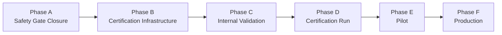
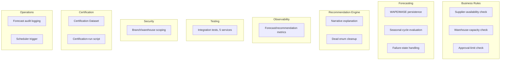
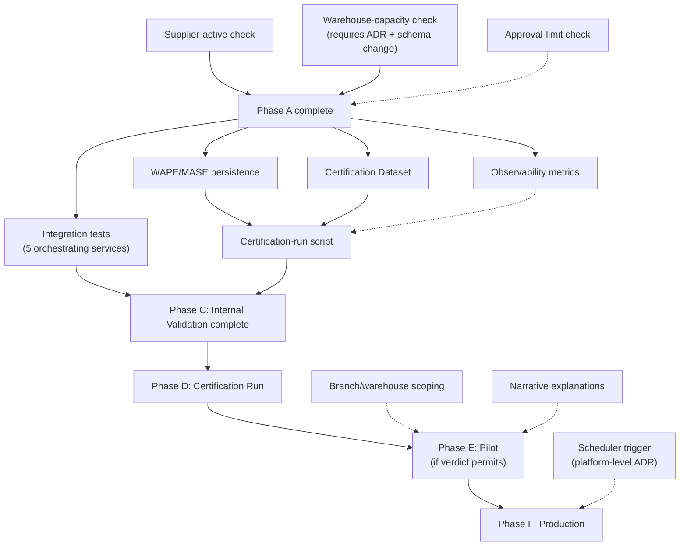
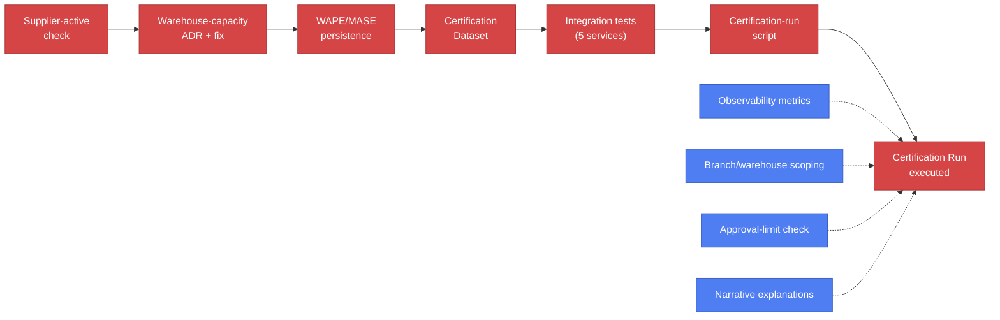
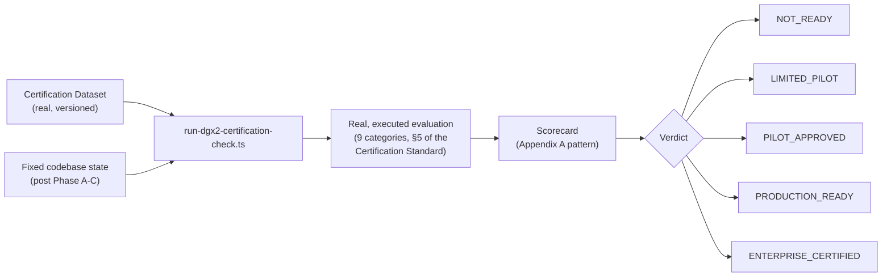

# AIOS Phase II — Engineering Execution Program v1.0

### The Official Implementation Plan Converting the DGX 2.0 Engineering Backlog Into Sequenced, Governed Execution

---

> This is an execution plan, not an architecture document. It does not modify, and remains strictly subordinate to, every frozen Phase I document (`AIOS_FOUNDATION_ARCHITECTURE_SPECIFICATION_V1.md`, `AIOS_CAPABILITY_GOVERNANCE_STANDARD_V1.md`, `AIOS_ENTERPRISE_ROADMAP_V1.md`, `AIOS_REFERENCE_ARCHITECTURE_V1.md`, `DGX_2_DEMAND_FORECASTING_SPECIFICATION_V1.md`, `DGX2_DEMAND_FORECASTING_CERTIFICATION_STANDARD_V1.md`) and the real, evidence-based implementation assessment that preceded this document. Every task, gap, and priority named below is drawn directly from that assessment — nothing here is a new finding.
>
> **Historical record**: this document is the pre-Sprint-1 execution plan and reflects DGX 2.0's status *before* Sprints 1-4 and Remediation Cycles 1-2 were carried out. All four sprints and both remediation cycles referenced below as planned/future work have since been executed exactly as sequenced here, ending in two real certification runs (verdict `NOT_READY` both times) and a closed Phase A. For the current, authoritative status, see [`docs/execution/DGX2_PHASE_A_BASELINE_1_0.md`](DGX2_PHASE_A_BASELINE_1_0.md).

---

## 1. Executive Summary

DGX 2.0's real, current maturity: a substantially built Phase A deterministic baseline (classical forecasting with backtesting, ABC/XYZ classification, purchase and transfer recommendation engines, lost-sales detection, supplier analytics), verified against the capability specification and found to be genuinely solid at its core — but not yet safe to certify. Two real Safety Gates are currently open (an inactive supplier can still be recommended; no warehouse-capacity check exists at all), the Evaluation Framework computes but does not persist two of its required metrics, no orchestrating service has integration-test coverage, and no Certification Dataset or certification-run script exists. This program sequences the closure of those gaps into six governed phases, ending at a real, evidence-based certification verdict — never a declared one.

---

## 2. Current Capability Status

| Area | Status |
| --- | --- |
| Forecasting engine (classical methods, backtesting) | **Implemented** |
| Recommendation engines (purchase, transfer) | **Implemented**, with 2 Critical and 3 High-severity gaps |
| Human approval workflow | **Implemented** |
| Confidence philosophy | **Implemented** |
| Business rules (6 required) | **Partial** — 4 of 6 real; 2 (warehouse capacity, supplier availability) not enforced |
| Evaluation Framework | **Partial** — MAPE/RMSE/MAE/bias persisted; WAPE/MASE computed but not persisted; business-value KPIs not computed at all |
| Observability | **Missing** — no forecast/recommendation metrics exist in the observability layer |
| Security/scope | **Partial** — permissions real; branch/warehouse visibility scoping not enforced on recommendation reads |
| Testing | **Partial** — pure-math unit tests exist; zero integration tests for any orchestrating service |
| Certification Dataset | **Missing** |
| Certification run | **Missing** — never executed |
| Certification verdict | **Not Certified** — a real attempt today would yield `NOT_READY` |

---

## 3. Execution Principles

- **Safety before features.** Every open Safety Gate is closed before any new capability surface is added.
- **Evidence before release.** No phase advances on the strength of an assertion — only on real, measured, executed evidence.
- **Certification before production.** No exceptions, no informal "it's basically ready" shortcuts.
- **Business value before optimization.** A working, honest Bronze-level capability beats a partially-optimized, uncertified one.
- **Architecture before implementation.** Any change touching a Foundation contract, a schema, or an architectural boundary stops for review before code is written (§9).

---

## 4. Execution Phases

| Phase | Exit criteria |
| --- | --- |
| A — Safety Gate Closure | Every Safety Gate in `DGX2_DEMAND_FORECASTING_CERTIFICATION_STANDARD_V1.md` §8 passes under a real, executed test — not by code review alone. |
| B — Certification Infrastructure | WAPE/MASE persisted on every real `ForecastRun`; forecast/recommendation metrics exported from the observability layer; a real, versioned Certification Dataset exists; `scripts/run-dgx2-certification-check.ts` exists and executes end-to-end against real data. |
| C — Internal Validation | Business rules, forecast correctness, confidence calculation, recommendation generation, failure handling, security, performance, and regression are all verified by real, executed tests (unit *and* integration) — per the capability spec's own Internal Testing stage. |
| D — Certification Run | A real certification run executes to completion and produces a scorecard and a verdict, per `DGX2_DEMAND_FORECASTING_CERTIFICATION_STANDARD_V1.md` §22 and §26. |
| E — Pilot | Only entered if the Phase D verdict is `LIMITED_PILOT` or higher; exit criteria is real, measured pilot evidence (adoption, acceptance rate, business value) matching or exceeding the certified level's requirements. |
| F — Production | Only entered after Certification, Pilot evidence, and all four sign-offs (Business, Operational, Engineering, Governance) required by `AIOS_CAPABILITY_GOVERNANCE_STANDARD_V1.md` §15. |

---

## 5. Workstream Breakdown

| Workstream | Backlog items | Real current state |
| --- | --- | --- |
| Business Rules | Supplier-availability check, warehouse-capacity check, procurement approval-limit check | 4 of 6 spec rules already enforced; these 3 items close the remainder |
| Forecasting | WAPE/MASE persistence, real seasonal-cycle evaluation, explicit incomplete-data/seasonality-unavailable handling | Core forecasting math and backtesting are real; these items close Evaluation/Failure-Philosophy gaps |
| Recommendation Engine | Narrative "why not another action" explanation, resolving the dead `TRANSFER` enum value | Action logic is real and sound; these are explainability/cleanliness items |
| Observability | Forecast/recommendation metrics in `metrics.service.ts` | Currently zero coverage |
| Testing | Integration tests for all five orchestrating services | Currently zero coverage beyond pure math |
| Security | Branch/warehouse visibility scoping on recommendation reads | Permission gates real; data-level scoping missing |
| Certification | Certification Dataset construction, certification-run script | Neither exists yet |
| Operations | Audit logging for forecast generation, scheduler trigger for recurring runs | Recommendation approval/reject already audited; forecast generation and recurring execution are not |

---

## 6. Execution Dependency Graph

Solid arrows are hard blockers. Dotted arrows are real, important work that strengthens the certification outcome and is required before Pilot/Production, but does not block the *execution* of the first certification run itself.

---

## 7. Sprint Roadmap

```mermaid
gantt
    title Execution Timeline (directional — evidence-gated, not calendar-fixed)
    dateFormat  X
    axisFormat Sprint %s
    section Sprint 1
    Supplier-active check           :s1a, 0, 1
    Warehouse-capacity ADR + fix    :s1b, 0, 1
    section Sprint 2
    WAPE/MASE persistence           :s2a, 1, 1
    Observability metrics           :s2b, 1, 1
    Integration tests (2 services)  :s2c, 1, 1
    section Sprint 3
    Integration tests (3 services)  :s3a, 2, 1
    Certification Dataset v1        :s3b, 2, 1
    Approval-limit + branch scoping :s3c, 2, 1
    section Sprint 4
    Certification-run script        :s4a, 3, 1
    Certification Run executed      :s4b, 3, 1
```

| | Objectives | Deliverables | Dependencies | Success criteria |
| --- | --- | --- | --- | --- |
| **Sprint 1** | Close both Critical safety gates | Supplier-active check implemented and tested; ADR filed and approved for warehouse capacity; warehouse-capacity field added and enforced | None | Both gates pass under a real, executed test |
| **Sprint 2** | Build certification infrastructure, start testing | WAPE/MASE persisted; forecast/recommendation metrics exported; integration tests for `ForecastingService` and `PurchaseRecommendationsService` | Sprint 1 | Metrics visible in real dashboard queries; two of five services have real integration coverage |
| **Sprint 3** | Complete testing and dataset construction | Integration tests for the remaining three orchestrating services; Certification Dataset v1 built and versioned; approval-limit and branch-scoping fixes landed | Sprint 2 | All five services have real integration coverage; dataset exists with documented coverage |
| **Sprint 4** | Execute certification | `scripts/run-dgx2-certification-check.ts` written and run against the real dataset; scorecard produced; verdict issued | Sprint 3 | A real, evidence-based verdict exists — of any value, including `NOT_READY`, as long as it is real |

---

## 8. Critical Path

*Red nodes are the critical path — every one is a hard blocker for a first certification run. Blue nodes run in parallel, strengthening the eventual verdict but not blocking the run's execution.*

**Shortest real path to `READY_FOR_CERTIFICATION`:**

Supplier-active check → Warehouse-capacity ADR + fix → WAPE/MASE persistence → Certification Dataset → Integration tests (all five services) → Certification-run script → Certification Run executed.

This is the critical path because every other backlog item (branch scoping, approval limits, observability, narrative explanations, scheduler) either (a) strengthens the eventual verdict without blocking the *first* real execution of a certification run, or (b) is required before Pilot/Production but not before Certification itself. The two Critical safety-gate items are on the critical path unconditionally — the Certification Standard's own Bronze level cannot be claimed while either is open, regardless of how much other work is completed.

---

## 9. Architecture-impact Changes

Only two items in this program touch anything requiring an ADR, per `AIOS_CAPABILITY_GOVERNANCE_STANDARD_V1.md` §13:

| Change | Trigger | ADR required |
| --- | --- | --- |
| Warehouse Capacity field | Schema change touching Operational Core data | Yes — filed before Sprint 1's schema work begins |
| Scheduler (recurring trigger for forecast/recommendation generation) | A platform-level infrastructure decision, not scoped to this capability alone | Yes — filed separately, owned at the Architecture/Governance level, not by this program alone |

No other item in this program's backlog touches a Foundation contract, an architectural boundary, or a cross-capability concern.

---

## 10. Schema Changes

| Change | Description | Risk | Rollback |
| --- | --- | --- | --- |
| `Warehouse.capacity` (or equivalent field name, decided at ADR time) | An additive, nullable numeric field | Low — additive-only, no existing row requires a value, no existing query is affected until the new business-rule check is also deployed | Trivial — drop the column; the business-rule check that reads it is deployed and rolled back together, never independently |

No other schema change is required by this program. Every other backlog item is implementable against the existing schema.

---

## 11. Testing Strategy

| Level | Current state | Required for this program |
| --- | --- | --- |
| Unit | Real, exists for every pure math function (`forecast-math.ts`, `purchase-recommendation-math.ts`, `transfer-recommendation-math.ts`, `metrics-math.ts`, `supplier-metric-math.ts`) | Extend for every new business-rule check (items in Phase A) |
| Integration | **Does not exist** for any orchestrating service | Build for all five: `ForecastingService`, `PurchaseRecommendationsService`, `TransferRecommendationsService`, `LostSalesEngineService`, `SupplierAnalyticsService` — real Postgres, real data, matching the existing integration-test convention used elsewhere in AIOS |
| Regression | Real, full suite exists at the platform level | Every fix in this program runs the full existing suite before being considered done, per the Foundation's own regression discipline |
| Certification | **Does not exist** | The Scenario Test Suite and Operational Safety Testing from `DGX2_DEMAND_FORECASTING_CERTIFICATION_STANDARD_V1.md` §11-§12 must be built as real, executed tests, not theoretical descriptions |
| Pilot | Not yet applicable | Real usage monitoring, per Phase E |

---

## 12. Observability Rollout

| Element | Plan |
| --- | --- |
| Metrics | Add forecast/recommendation-specific Prometheus-format metrics to the existing `observability/metrics.service.ts`, following its established Counter/Gauge/Histogram convention |
| Logs | Add `AuditService.log()` calls to `ForecastingService.generate()`, matching the pattern already real in the recommendation services |
| Dashboards | Extend the existing self-hosted static-HTML dashboard pattern (`ai-benchmark/reports/`) with a capability-specific view, once real certification data exists to display |
| Alerts | Defined once real production thresholds exist — not before Phase D |
| KPIs | Wire the real business-value metrics named in the capability spec §16 into a real, queryable report, sourced from existing `ForecastRun`/`PurchaseRecommendation`/`TransferRecommendation` data |

---

## 13. Certification Dataset Plan

| Aspect | Plan |
| --- | --- |
| Dataset sources | Real historical `SalesDocumentLine`, `PurchaseDocumentLine`, `InventoryMovement`, `GarageJob`, and `StockTransfer` data already present in the operational database — no synthetic data |
| Versioning | Append-only, mirroring the AI Foundation's own Gold Dataset versioning discipline — v1 frozen once built, corrections create v2, never an in-place edit |
| Ownership | The Engineering Owner and Business Owner named for DGX 2.0 under `AIOS_CAPABILITY_GOVERNANCE_STANDARD_V1.md` §12 (not yet formally assigned — see Risk Register, §15) |
| Refresh strategy | Real, periodic addition of new cases as real production issues are found, per the Certification Standard's own regression-testing principle (§19) — never a wholesale rebuild that discards prior cases |
| Coverage | Must include every scenario category named in `DGX2_DEMAND_FORECASTING_CERTIFICATION_STANDARD_V1.md` §11 (fast/slow-moving, intermittent, seasonal, new products, stockout recovery, supplier delay, branch expansion/closure, missing data, garage/lubricant/parts/emergency demand) — coverage against this list is itself a real, checkable exit criterion for this workstream |

---

## 14. Certification Run Plan

| Element | Plan |
| --- | --- |
| Inputs | The real Certification Dataset (§13), the current, fixed codebase state after Phases A-C |
| Outputs | A real scorecard (per `DGX2_DEMAND_FORECASTING_CERTIFICATION_STANDARD_V1.md` §26, Appendix A), covering all nine evaluation categories (§5 of that standard) |
| Evidence | Real, executed test logs, real gate pass/fail results, real KPI measurements — no simulated or assumed results |
| Scorecard | Produced by `scripts/run-dgx2-certification-check.ts`, following the same `EXECUTED_PASSED`/`EXECUTED_FAILED`/`SKIPPED` discipline the AI Foundation's own verification scripts established |
| Verdict | Exactly one of `NOT_READY` / `LIMITED_PILOT` / `PILOT_APPROVED` / `PRODUCTION_READY` / `ENTERPRISE_CERTIFIED`, computed from real evidence, never asserted |

---

## 15. Risk Register

| Risk | Probability | Impact | Mitigation | Owner |
| --- | --- | --- | --- | --- |
| Warehouse-capacity schema change delayed by ADR review | Medium | High (blocks Phase A, and therefore everything after it) | File the ADR immediately, in parallel with Sprint 1 planning, not after | Engineering Owner |
| Integration-test effort underestimated (five services, real Postgres) | Medium | High (blocks Phase C) | Scope Sprint 2/3 conservatively; treat this as the program's largest real unknown | Engineering Owner |
| Branch/warehouse scoping fix changes real, relied-upon behavior | Medium | Medium | Ship behind a real, tested rollout; verify against real current usage before removing old behavior | Engineering + Operational Sponsor |
| Certification Dataset coverage gaps discovered late | Medium | High (a late-discovered gap forces a real rework of the dataset before Phase D) | Check dataset coverage against the Certification Standard's §11 scenario list explicitly, before declaring Phase B complete | Business Owner |
| No formally named Capability Owners yet (Governance Standard §12) | High | Medium | Name Engineering Owner, Business Owner, Operational Sponsor, and Approval Committee before Sprint 1 begins | Governance / Architecture |
| Scheduler ADR treated as in-scope for this program and delaying it | Low | Medium | Explicitly scope the scheduler decision to the Architecture/Governance level, outside this program's critical path (§8) | Architecture |

---

## 16. Resource Plan

| Function | Role in this program |
| --- | --- |
| Engineering | Implements every backlog item; owns unit/integration test coverage; builds the certification-run script |
| Architecture | Reviews and approves the two required ADRs (§9); confirms no Foundation contract is touched at any point |
| Operations | Confirms real monitoring/alerting readiness before Phase E/F; owns the eventual scheduler decision |
| Business | Confirms the Certification Dataset's real coverage and business relevance; provides Business Owner sign-off at Phase D/F |
| QA | Independently verifies integration and certification test results are real and reproducible, not merely reported |

---

## 17. Parallelization Plan

**Can run together:**

- Supplier-active check and the warehouse-capacity ADR filing (Sprint 1) — independent code paths.
- Observability metrics work and Certification Dataset construction (Sprint 2-3) — independent workstreams.
- Integration tests across different services (Sprint 2-3) — each service's test suite is independent of the others.
- Approval-limit check and branch/warehouse scoping (Sprint 3) — independent of the certification-critical-path items.

**Cannot run together (hard sequential dependency):**

- The warehouse-capacity business-rule check cannot be implemented before its schema field exists (ADR approval → migration → code).
- The certification-run script cannot be finished before both the Certification Dataset and WAPE/MASE persistence exist — it depends on both as real inputs.
- Phase D (Certification Run) cannot begin before Phase C (Internal Validation) is fully exited — no partial-credit certification attempts.
- Phase E (Pilot) cannot begin before a real Phase D verdict of `LIMITED_PILOT` or above exists.

---

## 18. Definition of Done

| Workstream | Done means |
| --- | --- |
| Business Rules | Every rule in capability spec §14 is enforced by real code, verified by a real, executed test that demonstrates the violating case is actually rejected |
| Forecasting | WAPE/MASE persisted on every real `ForecastRun`; seasonal-cycle evaluation backtested against real, measured accuracy |
| Recommendation Engine | Every action includes a real, human-readable "why not another action" explanation; no dead enum values remain unaddressed |
| Observability | Real, live-queryable forecast/recommendation metrics exist and are confirmed populated by a real run |
| Testing | All five orchestrating services have real, passing integration tests against real Postgres |
| Security | Recommendation reads are verified, by a real test, to respect branch/warehouse scope for every role in capability spec §5 |
| Certification | The Certification Dataset exists, is versioned, and its coverage is checked against the Certification Standard's own scenario list; the certification-run script executes end-to-end and produces a real verdict |
| Operations | Forecast generation is audited; the scheduler decision has a filed ADR (implementation itself may be sequenced after this program, per §9) |

---

## 19. Release Gates

| Gate | Criteria |
| --- | --- |
| Internal Validation | Business rules, forecast correctness, confidence calculation, recommendation generation, failure handling, security, performance, and regression all verified by real, executed tests (capability spec's own Internal Testing stage). |
| Certification | A real certification run executes to completion against the real Certification Dataset and produces a verdict of `LIMITED_PILOT` or above (`NOT_READY` sends the program back to Phase A/B/C, not forward). |
| Pilot | Real, measured pilot evidence (planner adoption, forecast accuracy, recommendation acceptance, business value, operational issues, human trust) meets or exceeds the certified level's requirements. |
| Production | Certification, Pilot evidence, and all four sign-offs (Governance, Business, Operational, Engineering) per `AIOS_CAPABILITY_GOVERNANCE_STANDARD_V1.md` §15 are all real and complete. |

---

## 20. Production Readiness Checklist

- [ ] **Infrastructure** — real, running observability (metrics, dashboards) confirmed operating, not just built.
- [ ] **Security** — branch/warehouse/supplier scoping verified in real production-equivalent testing.
- [ ] **Testing** — full regression suite (unit + integration + certification scenario tests) passes with zero known open Critical/High findings.
- [ ] **Monitoring** — real alerting configured for Safety Gate violations and KPI degradation.
- [ ] **Support** — Operational Sponsor and incident-response process named and real (§21).

---

## 21. Operational Handover

- **Runbooks** — a real, written runbook for regenerating forecasts/recommendations, investigating a Safety Gate alert, and responding to a certification-level regression, produced during Phase C-D, not deferred to after Production.
- **Support** — the Operational Sponsor named under Governance Standard §12 owns first response to any real production incident.
- **Incident response** — any real incident becomes a durable regression case in the Certification Dataset, per the Certification Standard's own §19 principle.
- **Ownership** — Engineering Owner, Business Owner, Operational Sponsor, and Approval Committee membership are confirmed, named, and current before Phase F begins.

---

## 22. Success Metrics

| Category | Metric |
| --- | --- |
| Technical | All five orchestrating services have real integration coverage; zero open Critical/High findings from the traceability matrix. |
| Business | Real, measured movement in the KPIs named in capability spec §3/§16, once Pilot/Production data exists. |
| Operational | Real, running observability and alerting; a real, exercised runbook. |
| Certification | A real, executed certification run producing a verdict of `LIMITED_PILOT` or above. |

---

## 23. Post-Certification Plan

Once a real certification verdict permits Pilot (Phase E): capture real pilot learning (adoption, acceptance/override rates, real operational friction) as the first entries in the capability's own continuous-monitoring record (`AIOS_CAPABILITY_GOVERNANCE_STANDARD_V1.md` §16). Improvements identified during Pilot feed back into the backlog exactly as any other real finding would — never bypassing re-validation before their own release.

---

## 24. Transition to DGX 3.0

**DGX 3.0 (Predictive Maintenance) work begins only after DGX 2.0 reaches the governance milestone required by `AIOS_CAPABILITY_GOVERNANCE_STANDARD_V1.md` and `AIOS_ENTERPRISE_ROADMAP_V1.md` — real Certification at `LIMITED_PILOT` or above — unless an explicit, documented Architecture Board exception is approved.** No engineering time is allocated to DGX 3.0 specification or implementation while this program's Phase A-D remain open, absent that exception.

---

## 25. Engineering Commitment

**Safety before features. Evidence before release. Certification before production.**

This program exists to convert a real, already-substantial engineering effort into a real, certifiable one — not to build something new for its own sake. Every task in this plan closes a real, verified gap; none is speculative.

---

## 26. Program Closure

**This program concludes AIOS Phase II planning.**

**The next deliverable is working software, measured evidence, and successful certification.**
