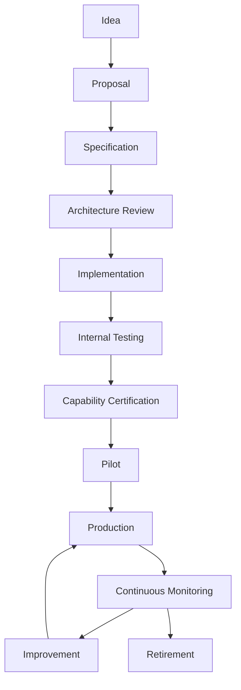
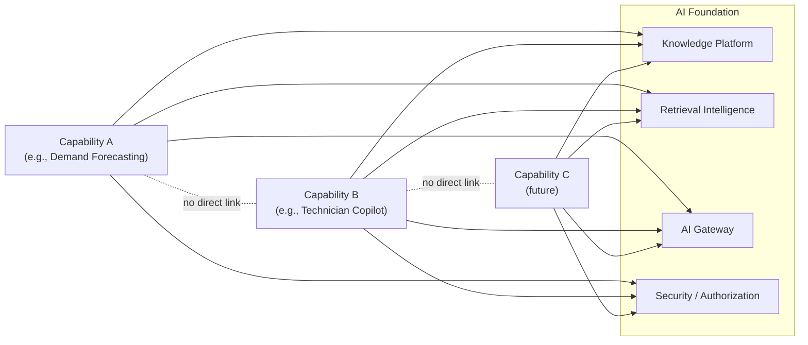
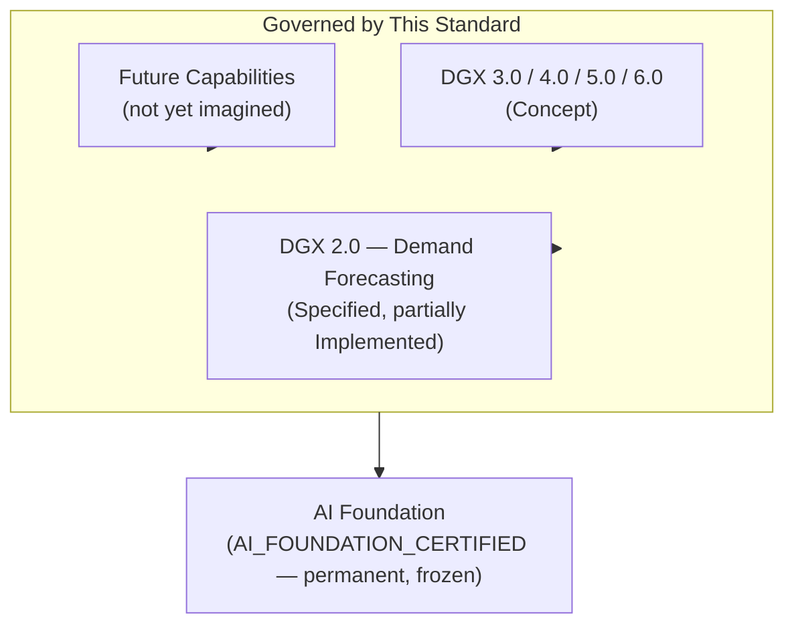
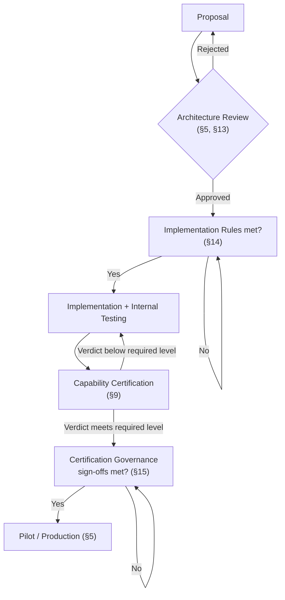
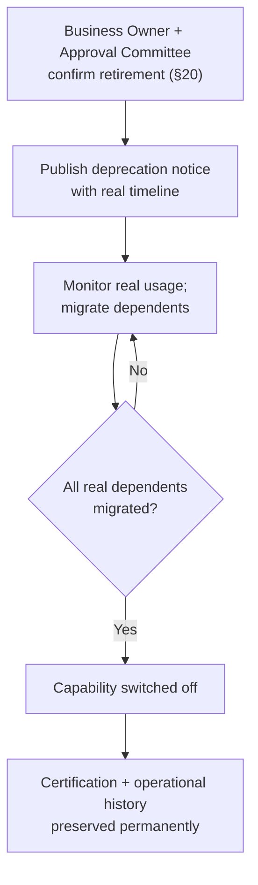

# AIOS Capability Governance Standard v1.0

### The Permanent Constitution Governing How Every AI Capability Inside AIOS Is Conceived, Built, Certified, Operated, and Retired

---

## 1. Document Control

| Field | Value |
|---|---|
| Document name | AIOS Capability Governance Standard |
| Version | 1.0 |
| Status | APPROVED — Capability Governance is now formally **Defined** (previously "Not Yet Defined") |
| Owner | AIOS Architecture (Molas Solutions Engineering), jointly with the Capability Approval Committee (§12) |
| Review cycle | Reviewed at every new capability's Architecture Review (§5), and at minimum annually. |
| Audience | Anyone proposing, designing, building, certifying, operating, or retiring an AI capability inside AIOS — engineers, business owners, operational sponsors, and governance approvers alike. |
| Dependencies | Requires [`docs/architecture/AIOS_FOUNDATION_ARCHITECTURE_SPECIFICATION_V1.md`](../architecture/AIOS_FOUNDATION_ARCHITECTURE_SPECIFICATION_V1.md) — every rule in that document is a precondition for everything in this one. |
| Related standards | [`docs/capabilities/DGX_2_DEMAND_FORECASTING_SPECIFICATION_V1.md`](../capabilities/DGX_2_DEMAND_FORECASTING_SPECIFICATION_V1.md) and [`docs/certification/DGX2_DEMAND_FORECASTING_CERTIFICATION_STANDARD_V1.md`](../certification/DGX2_DEMAND_FORECASTING_CERTIFICATION_STANDARD_V1.md) are the first real, worked example of a capability specification and a capability certification standard produced under this governance model. Every future capability specification and certification standard must follow the same pattern. |

| Foundation status | Value |
|---|---|
| AI Foundation | `AI_FOUNDATION_CERTIFIED` |
| Foundation Architecture | `APPROVED` |
| Capability Governance | **Defined**, as of this document |

This is not a feature specification, a sprint report, or a single capability's rulebook. It is the constitution that every capability's own specification and certification standard must be written under. Where a capability document (such as the two named above) defines *what a specific capability does and how it earns trust*, this document defines *the process every capability, without exception, must go through to be allowed to exist inside AIOS at all.*

---

## 2. Purpose

**The AI Foundation governs correctness. Capability Governance governs evolution.**

The Foundation answers "does retrieval find the right knowledge?" A capability answers "does this specific business feature deliver real value, safely?" But there is a third question neither of those addresses: **"how does AIOS decide, consistently, which capabilities get built, how, and when they are allowed to touch real business operations — across every team, every quarter, for years?"** That is what this document answers.

### Why every AI feature cannot simply be merged into AIOS

An AI Foundation that is `AI_FOUNDATION_CERTIFIED` proves the retrieval layer is trustworthy *today*. It says nothing about whether the next feature request — a demand forecast, a diagnostic assistant, a copilot, an idea not yet imagined — will be built in a way that preserves that trust. Without a governing standard, each new capability would reinvent its own definition of "done," its own idea of what evidence is enough, and its own relationship to the Foundation — some correctly, some not. **Merging code is not the same as earning the right to influence a real business decision.**

### Why uncontrolled AI growth creates technical debt

Left ungoverned, AI capability growth tends toward the same failure pattern, repeatedly:

- Every capability invents its own data access pattern, some of them bypassing governed knowledge and retrieval entirely.
- Every capability calls its preferred model provider directly, making the whole platform brittle to a single vendor's API changes.
- Every capability claims "AI-powered" as if that were self-certifying, with no real, comparable evidence of safety or value.
- Every capability accumulates its own undocumented exceptions to authorization, review, and rollback discipline.
- Eventually, no one can say with confidence which capabilities are trustworthy, which are experimental, and which are quietly dangerous — this is technical debt in its most consequential form, because the "debt" is trust, not just code.

Capability Governance exists specifically to prevent that outcome — not by slowing capability delivery for its own sake, but by making every capability's maturity, ownership, and trustworthiness a matter of real, inspectable record rather than an assumption.

---

## 3. Capability Definition

- **Capability** — a specific, bounded, business-facing AI-assisted feature (e.g., Demand Forecasting) that consumes the AI Foundation and produces business value, without becoming a system of record or redefining Foundation contracts (`AIOS_FOUNDATION_ARCHITECTURE_SPECIFICATION_V1.md` §5, Layer 5).
- **Capability Layer** — the architectural layer (Layer 5 of the Foundation's five layers) where every capability lives, as a peer to other capabilities, never above or beneath the Foundation's own four layers.
- **Capability Service** — the concrete NestJS module(s) implementing a capability (e.g., `forecasting/`, `purchase-recommendations/`, `ai-assistants/`).
- **Capability Owner** — the accountable individual(s) defined in §12 (Engineering Owner and Business Owner), named for the life of the capability, not a rotating or implied responsibility.
- **Capability Contract** — the permanent, documented set of promises a capability makes about its inputs, outputs, failure behavior, and trust boundaries (§11) — the capability-level equivalent of the Foundation's own Permanent Contracts.
- **Capability Certification** — the real, evidence-based, executed evaluation (following the pattern of `docs/certification/DGX2_DEMAND_FORECASTING_CERTIFICATION_STANDARD_V1.md`) that determines whether a capability may be trusted at a given maturity level (§6).
- **Capability Lifecycle** — the permanent, ordered sequence every capability moves through, from idea to retirement (§5).
- **Capability Boundary** — the explicit limits on what a capability may and may never do (§10).
- **Capability Dependency** — a real, declared reliance on the Foundation, another capability's public contract (never its internals), or an external system — always explicit, never implicit or discovered by accident during an incident.

---

## 4. Relationship to AI Foundation

**The Foundation provides:**

- Governed **Knowledge** (Knowledge Platform).
- **Retrieval** (Retrieval Intelligence Platform).
- **Security** (Identity, Authorization, Permissions).
- **Evaluation** (the Benchmark/Evaluation Framework and its certification discipline).
- **Provider abstraction** (the AI Gateway).

**A capability provides:**

- Business intelligence specific to its domain (e.g., demand signals, diagnostic hypotheses).
- Recommendations (never autonomous decisions — see the Foundation's §7 and §13 failure philosophy).
- Automation *assistance* — never unattended automation of an irreversible or high-impact action (`AIOS_FOUNDATION_ARCHITECTURE_SPECIFICATION_V1.md` invariant 17).
- Explainability specific to its own domain's reasoning (built on, never replacing, the Foundation's own explainability discipline, §14).
- Human workflows that route its recommendations to accountable people.
- Measurable business value (§7 of the Demand Forecasting Certification Standard is the first real, worked example of what "measurable" means in practice).

> **Capabilities consume the Foundation. They never redefine it.**

A capability that finds the Foundation's retrieval, knowledge, security, or evaluation contracts insufficient for its needs does not get to quietly work around them. It raises the gap through an Architecture Decision Record (§13; `AIOS_FOUNDATION_ARCHITECTURE_SPECIFICATION_V1.md` §20) — the Foundation may be *extended* through its own governed change process, but a capability itself has no authority to reinterpret or bypass a Foundation contract.

---

## 5. Capability Lifecycle

### Stage explanations

- **Idea** — an informal statement of a real business problem (e.g., "procurement wants better reorder timing"). No commitment, no code, no specification yet.
- **Proposal** — a short, real business case: the problem, the intended users, and why it belongs in AIOS at all (and, per §4, why it cannot simply redefine the Foundation).
- **Specification** — a full capability specification is written, following the exact structure `docs/capabilities/DGX_2_DEMAND_FORECASTING_SPECIFICATION_V1.md` established: mission, scope, users, KPIs, architecture, dependencies, security, failure philosophy, human workflow, business rules, roadmap, explainability (§8).
- **Architecture Review** — the Foundation Architecture (and this governance standard) are checked against the specification; any needed Foundation-touching change is raised as an ADR (§13), never assumed.
- **Implementation** — code is written only after the gates in §14 are met — never before.
- **Internal Testing** — real, executed tests (unit, integration, and capability-specific scenario tests) confirm the specification's promises hold in practice.
- **Capability Certification** — a dedicated certification standard (following `docs/certification/DGX2_DEMAND_FORECASTING_CERTIFICATION_STANDARD_V1.md`'s pattern) is written and executed against real evidence, producing a real verdict (§9, §15).
- **Pilot** — real, limited-scope use by real users, under close monitoring, per the capability's own certification level (§6).
- **Production** — broad, real use across the certified scope, never beyond it.
- **Continuous Monitoring** — real, ongoing observability (§16) — certification is never a one-time event.
- **Improvement** — real, evidence-based changes loop back into Production, each material change subject to re-certification per §19's versioning policy.
- **Retirement** — a capability that no longer serves real business value, or has been superseded, is retired deliberately and safely (§20) — never abandoned silently.

---

## 6. Capability Maturity Model

| Level | Name | Requirements |
|---|---|---|
| **0** | Concept | An Idea or Proposal (§5) exists. No specification, no commitment. |
| **1** | Specified | A full capability specification (§8) exists and is approved at Architecture Review. No code has shipped. |
| **2** | Implemented | Code exists matching the approved specification. Not yet independently tested or certified. |
| **3** | Internally Validated | Real, executed unit/integration/scenario tests pass. Still not certified — internal testing is not a substitute for certification (§9). |
| **4** | Certified | A real, dedicated certification standard (§9) has been executed, producing at minimum the equivalent of the Demand Forecasting Certification Standard's Bronze level — Safety Gates and Human Trust Gates pass in full, with real evidence. |
| **5** | Pilot | Certified at a level equivalent to Silver or above; real, limited-scope use by real users is underway, per §5's Pilot stage. |
| **6** | Production | Certified at a level equivalent to Gold or above; broad, real production use is underway, within the certified scope only. |
| **7** | Enterprise Standard | Certified at the highest level (equivalent to Enterprise/`ENTERPRISE_CERTIFIED`); validated across the full intended real business scope, with continuous re-certification actively running, and full governance sign-off (§12, §15) in place. |

A capability's maturity level is a real, current fact — determined by its most recent real certification evidence, never by how long it has existed or how much engineering effort has gone into it. A Level 6 capability can regress to Level 4 the moment a real regression or safety-gate violation is found, exactly as the Demand Forecasting Certification Standard's own continuous-certification principle requires (`docs/certification/DGX2_DEMAND_FORECASTING_CERTIFICATION_STANDARD_V1.md` §19).

---

## 7. Capability Categories

Every capability is classified into at least one of the following categories, so its risk profile and required evidence can be reasoned about consistently:

- **Forecasting** — e.g., DGX 2.0 Demand Forecasting.
- **Diagnostics** — e.g., a future vehicle-fault diagnostic assistant.
- **Recommendation** — e.g., purchase/transfer recommendation engines.
- **Prediction** — e.g., DGX 3.0 Predictive Maintenance.
- **Automation** — any capability that proposes an action for human execution (never one that executes autonomously without the workflow in §17).
- **Planning** — e.g., procurement or workshop capacity planning support.
- **Optimization** — e.g., inventory allocation optimization.
- **Copilot** — e.g., DGX 4.0 Technician Copilot.
- **Analytics** — e.g., supplier or inventory analytics.
- **Knowledge Assistant** — e.g., a RAG-based question-answering assistant over governed knowledge.
- **Future categories** — this list is intentionally not closed. A genuinely new category requires only that it be named and defined at Proposal stage (§5) — it never requires a change to this document itself unless the new category implies a new class of risk not already covered by §21.

---

## 8. Mandatory Capability Specification

Every capability, without exception, must have a written specification covering:

1. **Mission** — the real business problem being solved, stated plainly (see `docs/capabilities/DGX_2_DEMAND_FORECASTING_SPECIFICATION_V1.md` §2 as the reference example).
2. **Scope** — precisely what is in and out of scope (see the same document's §4).
3. **Business users** — named roles and what each may see (§5 of the same document).
4. **Business KPIs** — measurable objectives with real measurement methods (§3 of the same document).
5. **Architecture** — where the capability sits in the system context (§6 of the same document) and how it consumes, never bypasses, the Foundation.
6. **Dependencies** — every real data source and Foundation service it relies on, classified honestly (authoritative/derived/cached/external/unknown — §7 of the same document).
7. **Security** — permissions, scope, and visibility rules (§19 of the same document).
8. **Failure philosophy** — explicit, safe behavior under every realistic failure condition (§18 of the same document).
9. **Human workflow** — how a human reviews, approves, or rejects the capability's output before it has any real effect (§15 of the same document).
10. **Business rules** — deterministic constraints that always override the capability's own output (§14 of the same document).
11. **Roadmap** — a clearly-separated statement of what is implemented today vs. genuine future work (§24 of the same document).
12. **Explainability** — how the capability answers "why" for every output it produces (§13/§15 of the same document, and see also §15 below).

A capability specification missing any of the twelve items above is incomplete and cannot proceed past Architecture Review (§5).

---

## 9. Mandatory Certification Standard

Every capability additionally requires its own certification standard — never a reuse of another capability's, and never a substitute for AI Foundation certification. At minimum, it must define:

1. **Quality Gates** — measurable thresholds specific to the capability's domain.
2. **Safety Gates** — zero-tolerance conditions that block certification outright if violated (see `docs/certification/DGX2_DEMAND_FORECASTING_CERTIFICATION_STANDARD_V1.md` §8 as the reference pattern).
3. **Business KPIs** — real, measured evidence of business value (§7 of the same document).
4. **Human Trust** — explicit gates proving humans can understand, verify, and act on the capability's output (§9 of the same document).
5. **Scenario Tests** — a real, domain-specific test suite covering the capability's realistic operating conditions (§11 of the same document).
6. **Failure Injection** — real, executed tests of degraded/failure conditions (§12 of the same document).
7. **Performance** — real, measured runtime/latency/scalability gates (§16 of the same document).
8. **Audit** — a real, inspectable record of every certification-relevant decision and outcome.
9. **Certification Verdict** — exactly one of a defined, ordered set of outcomes (mirroring `NOT_READY` / `LIMITED_PILOT` / `PILOT_APPROVED` / `PRODUCTION_READY` / `ENTERPRISE_CERTIFIED`), issued from real evidence, never asserted.

---

## 10. Capability Boundaries

**Capabilities cannot, under any circumstance:**

1. Modify the Foundation.
2. Modify Retrieval Intelligence.
3. Modify Security or Authorization.
4. Bypass the AI Gateway.
5. Write directly to an ERP or any external system of record.
6. Become a system of record themselves.
7. Duplicate business logic that an existing Foundation or capability service already owns.
8. Create a hidden database or data store outside the governed schema and Knowledge Platform.

Every boundary above is a restatement, at the capability-governance level, of Foundation invariants already defined in `AIOS_FOUNDATION_ARCHITECTURE_SPECIFICATION_V1.md` §16 — repeated here because a capability team reading only this document must still encounter them without needing to cross-reference to know they are absolute.

---

## 11. Capability Contracts

Every capability must define, in writing, and keep current:

- **Inputs** — exactly what real data and requests it consumes.
- **Outputs** — exactly what it produces (a recommendation, a forecast, an explanation — never an autonomous action, per §17).
- **Dependencies** — every Foundation service and external system it relies on (§3).
- **Failure Modes** — every realistic way it can fail, and its required safe behavior in each case (§8, item 8).
- **Security** — its authorization and scope boundaries (§8, item 7).
- **Confidence** — how it expresses uncertainty about its own output, always visible, never hidden (mirroring `docs/certification/DGX2_DEMAND_FORECASTING_CERTIFICATION_STANDARD_V1.md` §10).
- **Evidence** — how every output traces back to the real data that produced it.
- **Audit** — how every capability-relevant decision is logged and retrievable after the fact.

A capability contract is not a one-time design artifact — it is checked at every Architecture Review (§5) and every certification cycle (§9), and any change to it is itself subject to §13's ADR requirements.

---

## 12. Business Ownership

Every capability has, named and current, never vacant:

- **Engineering Owner** — accountable for the technical correctness, maintenance, and Foundation-compliance of the capability.
- **Business Owner** — accountable for the real business case, KPIs, and continued relevance of the capability.
- **Operational Sponsor** — accountable for the capability's real, ongoing operational health once in production (monitoring response, incident ownership).
- **Approval Committee** — the cross-functional group (mirroring `docs/certification/DGX2_DEMAND_FORECASTING_CERTIFICATION_STANDARD_V1.md` §23's Engineering/Operations/Inventory/Procurement/Management pattern, adapted per capability category) that signs off at every lifecycle gate requiring joint approval (§14, §15).

A capability with any of the four roles above unfilled may not progress past its current lifecycle stage (§5) until the role is filled.

---

## 13. Architecture Governance

An Architecture Decision Record (ADR), following the template already defined in `AIOS_FOUNDATION_ARCHITECTURE_SPECIFICATION_V1.md` §20, is **mandatory** before:

1. Proposing a new capability.
2. Any major redesign of an existing capability.
3. Introducing a new AI provider or model for any capability.
4. Any breaking change to a capability's public contract (§11).
5. Any schema change touching capability-owned data.
6. Any increase in a capability's automation level (e.g., moving from "recommend only" toward any form of automated execution) — this specific trigger is deliberately named on its own, separate from "major redesign," because an automation-level increase is a trust-boundary change even when the underlying code change is small.

**Honest, current gap**: no formal, numbered ADR directory exists in this repository as of this document's writing (confirmed by direct inspection — no `docs/**/adr*` or `ADR-*` files exist today). The ADR *template and trigger list* are real and defined (`AIOS_FOUNDATION_ARCHITECTURE_SPECIFICATION_V1.md` §20); the *operational habit* of actually filing one per trigger is not yet established. Every capability proposed under this governance standard must be the first to establish that habit for real, not assume it already exists elsewhere.

---

## 14. Implementation Rules

**No capability may begin coding before all of the following are true:**

1. Specification Approved (§8, at Architecture Review, §5).
2. Architecture Approved (§13's applicable ADRs filed and approved).
3. Risk Reviewed (§21).
4. Security Reviewed (against `AIOS_FOUNDATION_ARCHITECTURE_SPECIFICATION_V1.md` §12's model).
5. Data Reviewed (every input source classified per §8, item 6, and confirmed real, not assumed).

A single missing item above is sufficient to block implementation start, regardless of schedule pressure. "We'll get the specification approved after the prototype" is not a permitted sequence under this standard.

---

## 15. Certification Governance

**No capability may enter Production (§5) before all of the following are true:**

1. Certification Complete (§9), producing a real verdict at Gold-equivalent or above.
2. Business Sign-off (from the Business Owner and relevant Approval Committee members, §12).
3. Operational Sign-off (from the Operational Sponsor, confirming real monitoring/alerting/incident-response readiness, §16).
4. Engineering Sign-off (from the Engineering Owner, confirming the implementation matches the certified specification exactly, with no undocumented deviation).

A capability may run a real Pilot (§5, Level 5 in §6) with a lower certification level, provided the Pilot's own scope and monitoring match that lower level's real risk profile — Pilot is not a loophole around certification, it is itself a certified, bounded stage.

---

## 16. Operational Governance

Every production capability requires, running in real infrastructure — not merely documented as intended:

- **Monitoring** — real, continuous observation of the capability's key signals.
- **Alerting** — real, actionable alerts on safety-gate or KPI-threshold breaches.
- **KPIs** — the capability's own business KPIs (§8, item 4), tracked continuously, not only at certification time.
- **Drift** — real, detected change in the capability's inputs, outputs, or accuracy over time (e.g., a forecasting capability's confidence calibration drifting, per `docs/certification/DGX2_DEMAND_FORECASTING_CERTIFICATION_STANDARD_V1.md` §6).
- **Incidents** — a real, logged incident process, feeding back into §19's regression discipline exactly as the Foundation's own gold-dataset discipline requires (`AIOS_FOUNDATION_ARCHITECTURE_SPECIFICATION_V1.md` §11).
- **Monthly health** — a real, recurring, lightweight operational check.
- **Quarterly review** — a real, recurring, deeper review involving the full Approval Committee (§12), re-confirming the capability's maturity level (§6) is still accurate.

A capability with no real operating Monitoring/Alerting/KPI infrastructure cannot honestly claim Production maturity (§6, Level 6), regardless of how it performed at certification time.

---

## 17. Human Oversight

> **Humans remain accountable. AI assists. AI never replaces operational accountability.**

This is not a capability-specific rule — it is the Foundation's own philosophy (`AIOS_FOUNDATION_ARCHITECTURE_SPECIFICATION_V1.md` §3: *"Verify before retrieval. Retrieve before generation. Measure before release. Preserve evidence after release."*) restated as a governance requirement that applies to every capability without exception: no capability's maturity level, certification verdict, or operational track record ever transfers accountability for a real business decision away from a named human role. A capability that performs well enough to feel "obviously trustworthy" still requires the same human-approval workflow (§8, item 9) as one that has just entered Pilot — trust earned through governance does not convert into autonomy.

---

## 18. Capability Interaction

**No capability owns another capability.** **No cyclic dependencies are permitted between capabilities.** **Capabilities communicate only through the Foundation** — if Capability B genuinely needs information that Capability A produces, that information becomes governed knowledge (via the Knowledge Platform) or a real, published operational fact (via Operational Core), retrieved through the Foundation like any other input — never a direct, capability-to-capability API call that creates a hidden coupling outside governance's visibility.

---

## 19. Versioning Policy

| Versioned artifact | Policy |
|---|---|
| Capability version | Incremented on any material behavior change; every version's certification status is tracked independently (a new version does not inherit its predecessor's verdict). |
| Specification version | Append-only, mirroring the Foundation's own registry pattern (`AIOS_FOUNDATION_ARCHITECTURE_SPECIFICATION_V1.md` §11) — a specification is never silently edited in place once approved; a real revision creates a new version, with the prior one remaining inspectable. |
| Certification version | Each real certification run is its own, dated, evidence-backed record (§26.C of `docs/certification/DGX2_DEMAND_FORECASTING_CERTIFICATION_STANDARD_V1.md` is the reference template) — never overwritten. |
| API version | Follows standard breaking/non-breaking change discipline; a breaking change to a capability's public contract (§11) requires an ADR (§13) and, where consumed by another capability, a coordinated migration. |
| Model version | Any model or algorithm change is its own trackable version, and — per `docs/certification/DGX2_DEMAND_FORECASTING_CERTIFICATION_STANDARD_V1.md` §24 — requires re-certification, never inheriting the prior model's certified status. |

**Compatibility rule**: a capability may not silently break a contract that another real capability or business workflow depends on. Any breaking change requires a real, documented migration path before the old version is retired (§20).

---

## 20. Deprecation Policy

**How capabilities are retired:**

1. The Business Owner and Approval Committee (§12) confirm the capability no longer serves real business value, or has been superseded by a certified replacement.
2. A real deprecation notice is published, with a defined, honest timeline — never an abrupt removal.
3. Real usage is monitored during the deprecation window to confirm genuine business dependents have migrated or been accounted for.
4. The capability's own audit and historical evidence (certification records, operational history) are preserved after retirement — retirement removes the running capability, never its historical record.

**How migrations occur:**

Any real business workflow depending on the retiring capability is migrated to its replacement (or to a manual process, if no replacement exists) before the capability is switched off — never left to fail silently mid-transition.

**How business continuity is preserved:**

The retiring capability's advisory role never gets replaced by an ungoverned, ad hoc process — if human judgment alone must temporarily fill the gap, that is itself named and accepted explicitly by the Approval Committee, not treated as an invisible fallback.

---

## 21. Risk Management

Every capability's Risk Review (§14, item 3) must consider, at minimum:

- **Operational Risk** — the business impact if the capability fails, degrades, or produces a bad recommendation that is acted on.
- **AI Risk** — model/method-specific risk (bias, drift, overconfidence, the embedding-artifact-class risk the Foundation itself documented, `AIOS_FOUNDATION_ARCHITECTURE_SPECIFICATION_V1.md` §9).
- **Security Risk** — unauthorized access, data leakage, scope violations (Foundation §12).
- **Business Risk** — the real cost of the capability being wrong, ignored, or over-trusted.
- **Compliance Risk** — any regulatory, licensing, or contractual obligation the capability's data or outputs touch.
- **Reputation Risk** — the real business/customer trust impact of a visible capability failure.
- **Data Risk** — the quality, completeness, and provenance of the capability's real input data (see the honest data-source classification discipline in `docs/capabilities/DGX_2_DEMAND_FORECASTING_SPECIFICATION_V1.md` §7).

A capability whose Risk Review identifies a real, unmitigated high-severity risk in any category above may not proceed past Implementation Rules (§14) until that risk is either mitigated or explicitly, formally accepted by the Approval Committee.

---

## 22. Anti-patterns

1. **Building before specification** — writing capability code before §8's specification is approved.
2. **Skipping certification** — reaching Production (§5) without a real, executed certification run (§9).
3. **No business owner** — a capability with an engineering owner but no accountable business owner (§12).
4. **No evidence** — a certification verdict or maturity-level claim with no real, inspectable data behind it.
5. **Auto-production release** — promoting a capability to Production without the sign-offs required in §15.
6. **Foundation modification** — a capability team changing Foundation code to make its own feature easier to build (§10).
7. **Shadow AI** — a capability calling a model provider directly, bypassing the AI Gateway (§10, §18).
8. **Duplicate capability** — building a new capability that substantially re-implements an existing one's function instead of extending or reusing it.
9. **No rollback** — shipping a capability change with no real, tested path back to the prior known-good state.
10. **No observability** — a Production capability with no real Monitoring/Alerting/KPI infrastructure (§16).
11. **Hidden database** — a capability maintaining its own private data store outside the governed schema (§10).
12. **Direct ERP write** — a capability writing to an external system of record without a human-approved workflow (§10, §17).
13. **Confidence inflation** — presenting a capability's output with a higher confidence label than its real evidence supports.
14. **Certification reuse** — assuming a new capability, or a materially changed one, inherits a prior certification verdict without new evidence (§19).
15. **Cyclic capability dependency** — two capabilities calling each other directly instead of communicating through the Foundation (§18).
16. **Capability owning another capability** — one capability team controlling or gating another's release without governance's involvement.
17. **Silent breaking change** — changing a capability's public contract without an ADR or a coordinated migration (§13, §19).
18. **Retirement without migration** — switching off a capability real business workflows still depend on, with no transition plan (§20).
19. **Risk acceptance without approval** — proceeding past a known high-severity risk without explicit Approval Committee sign-off (§21).
20. **Treating a pilot as a loophole** — using "it's just a pilot" to skip real certification evidence-gathering (§15).
21. **Manufacturing evidence** — backfilling certification data to match a desired verdict rather than measuring first and reporting honestly.
22. **Category mislabeling** — classifying a high-risk automation capability as a low-risk "analytics" category to reduce its governance burden (§7, §21).
23. **Governance theater** — writing a specification or certification standard that is never actually executed against, existing only as a document (the exact failure this standard exists to prevent).
24. **Undocumented automation-level increase** — quietly moving a capability from "recommend only" toward more autonomous behavior without the ADR §13 explicitly requires for that trigger.
25. **Ignoring drift** — continuing to operate a Production capability whose real, monitored KPIs have degraded, without triggering a re-certification review (§16, §19).

---

## 23. Capability Scorecard

Every capability, at every Quarterly Review (§16) and every certification cycle (§9), is scored across:

| Dimension | What it measures |
|---|---|
| Business Value | Real, measured KPI impact (§8, item 4). |
| Technical Quality | Real code quality, test coverage, and adherence to its own capability contract (§11). |
| Operational Readiness | Real Monitoring/Alerting/incident-response maturity (§16). |
| Security | Real, verified compliance with Foundation security boundaries (§10, §21). |
| Trust | Real human acceptance/override behavior — the same discipline `docs/certification/DGX2_DEMAND_FORECASTING_CERTIFICATION_STANDARD_V1.md` §14 established for forecasting, generalized to any capability's recommendations. |
| Adoption | Real, measured usage by its intended business users. |
| Maintainability | Real, assessed ease of safely evolving the capability without regression. |
| Explainability | Real evidence that its outputs answer "why" in human-readable terms (§8, item 12). |

A capability scoring poorly on any dimension is not automatically retired, but the score is a real, mandatory input to the Approval Committee's next lifecycle or maturity-level decision — it may never be omitted from that decision.

---

## 24. Capability Portfolio

| Capability | Category | Status |
|---|---|---|
| AI Foundation | Foundation (not a capability itself — the platform every capability depends on) | **Implemented and Certified** (`AI_FOUNDATION_CERTIFIED`) |
| DGX 2.0 — Demand Forecasting | Forecasting | **Phase A Implemented and Closed.** A real classical-statistical baseline (`forecasting/`, `inventory-analytics/`, `purchase-recommendations/`, `transfer-recommendations/`, `lost-sales/`, `supplier-analytics/`) exists in the repository, with its frozen historical record at `docs/execution/DGX2_PHASE_A_BASELINE_1_0.md`. Its capability specification and dedicated certification standard both exist (`docs/capabilities/DGX_2_DEMAND_FORECASTING_SPECIFICATION_V1.md`, `docs/certification/DGX2_DEMAND_FORECASTING_CERTIFICATION_STANDARD_V1.md`, amended to v1.1). **Two real certification runs have been executed — both returned `NOT_READY`.** Current honest maturity remains Level 2-3 (§6) — a certification run having occurred is not, by itself, Level 4 (Certified); Level 4 requires the run to actually pass at a Bronze-equivalent level, which neither run did. The capability operates under a confirmed Manual model, owned by Business Operations. |
| DGX 3.0 — Predictive Maintenance | Prediction | **Concept.** Named in the Foundation's transition rule (`AIOS_FOUNDATION_ARCHITECTURE_SPECIFICATION_V1.md` §17) as a future capability layer. No specification exists yet. |
| DGX 4.0 — Technician Copilot | Copilot | **Concept.** Same status as DGX 3.0. |
| DGX 5.0 — Customer Intelligence | Analytics / Recommendation | **Concept.** Same status as DGX 3.0. |
| DGX 6.0 — Management Intelligence | Analytics / Planning | **Concept.** Same status as DGX 3.0. |
| Future capabilities | Any (§7) | **Not yet imagined.** This governance standard applies to them identically, from their first Idea (§5) onward, without needing an update to this document. |

No capability above DGX 2.0's honest current status may be described, in any other document, as more mature than the table above states. This table is itself subject to the same "no fabricated evidence" discipline as everything else in this governance model — it is corrected the moment real status changes, never left stale to look more advanced than reality.

---

## 25. Engineering Commitment

**We build capabilities for business value. Not AI novelty.**

**We certify before production. Not after incidents.**

**We measure trust. Not marketing.**

**We preserve architecture. Not shortcuts.**

A capability is not justified by being technically interesting, by using a fashionable model, or by existing already. It is justified only by real, measured business value, delivered safely, inside the boundaries this standard and the Foundation define — and it remains justified only for as long as continuous, honest evidence says so.

---

## 26. Capability Governance Oath

### The AIOS Capability Governance Oath

**Every capability must earn the right to exist.**

**No capability is trusted because it is intelligent.**

**It is trusted because it is measurable. Explainable. Auditable. Governed.**

The Foundation is permanent. Capabilities are temporary — built, proven, operated, improved, and eventually retired, one governed lifecycle at a time. None of them may ever, for any reason, become larger than the platform that makes their trust possible.

---

## Appendix: Additional Required Diagrams

### Capability Governance Pyramid

*Read bottom-up: the Foundation is the widest, most permanent base — nothing above it may redefine it. Each capability is a narrower, temporary layer built on top, governed identically by this standard regardless of how many capabilities eventually exist.*

### Capability Approval Workflow

### Capability Retirement

