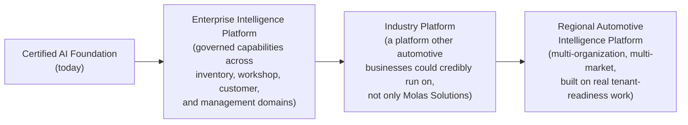
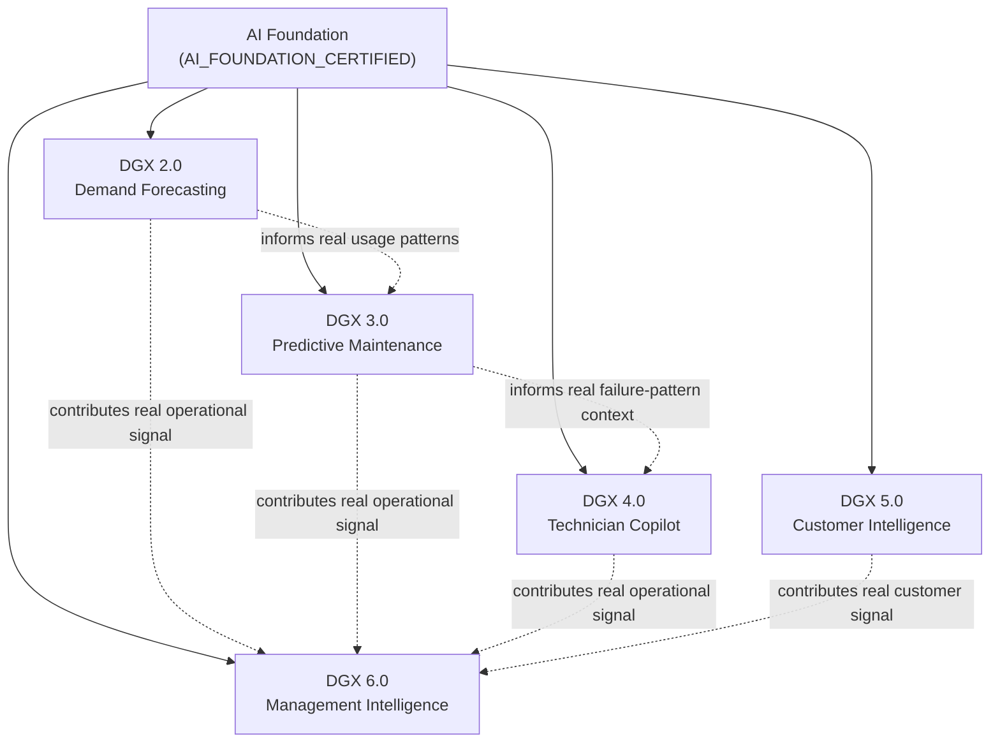
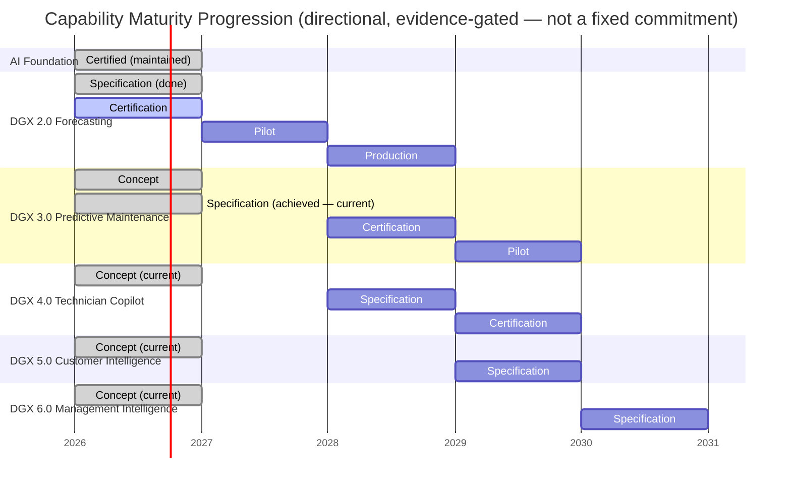
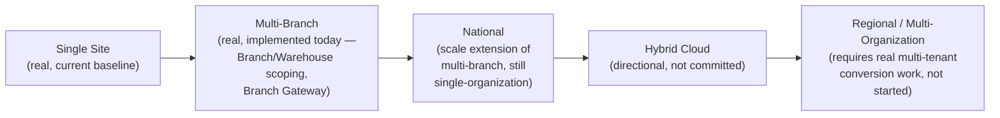
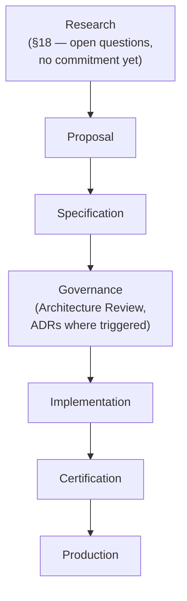

# AIOS Enterprise Roadmap v1.0

### The Long-Term Strategic Engineering Roadmap for the Molas Solutions Automotive Intelligence Operating System

**Time Horizon: 2026 – 2030**

---

> This is a strategic roadmap, not a feature backlog, sprint plan, release note, or marketing document. It describes *direction and sequencing* — why capabilities are built in a particular order and what depends on what — not implementation detail. Implementation detail lives in the capability specifications this document points to, never here.
>
> This document does not modify, and is subordinate to: [`AIOS_FOUNDATION_ARCHITECTURE_SPECIFICATION_V1.md`](../architecture/AIOS_FOUNDATION_ARCHITECTURE_SPECIFICATION_V1.md), [`AIOS_CAPABILITY_GOVERNANCE_STANDARD_V1.md`](../governance/AIOS_CAPABILITY_GOVERNANCE_STANDARD_V1.md), [`DGX_2_DEMAND_FORECASTING_SPECIFICATION_V1.md`](../capabilities/DGX_2_DEMAND_FORECASTING_SPECIFICATION_V1.md), and [`DGX2_DEMAND_FORECASTING_CERTIFICATION_STANDARD_V1.md`](../certification/DGX2_DEMAND_FORECASTING_CERTIFICATION_STANDARD_V1.md). Every maturity label used below (Concept / Planned / Specified / Implemented / Certified) uses the exact stage definitions from the Capability Governance Standard §5-§6 — never a looser, roadmap-specific redefinition.

---

## 1. Executive Vision

**AIOS exists to transform verified automotive data into trusted operational decisions.**

Not the most intelligent automotive AI. The most trusted automotive decision platform — a distinction this document returns to explicitly in its closing section, because it is the single sentence every other page here exists to serve.

---

## 2. Current Position

| Dimension | Status |
|---|---|
| **Foundation** | `AI_FOUNDATION_CERTIFIED`. Retrieval Intelligence, Knowledge Platform, and the Evaluation Framework are certified against a real, 1,851-case gold benchmark (Gold Dataset v2). Architecture is frozen (`AIOS_FOUNDATION_ARCHITECTURE_SPECIFICATION_V1.md`). |
| **Governance** | Defined. `AIOS_CAPABILITY_GOVERNANCE_STANDARD_V1.md` establishes the permanent capability lifecycle, maturity model, and boundaries — but its own operational habits (a real, numbered ADR directory; a running Quarterly Review cadence) are not yet established in practice. |
| **Capabilities** | One capability area has a real specification and certification standard: DGX 2.0, Demand Forecasting. Its Phase A baseline (classical statistical forecasting, ABC/XYZ classification, purchase/transfer recommendations, lost-sales detection, supplier analytics) is real, implemented, and **Phase A implementation is now closed** (frozen baseline `DGX2-PHASE-A-BASELINE-1.0`, `docs/execution/DGX2_PHASE_A_BASELINE_1_0.md`). **Two real certification runs have been executed** against `DGX2_DEMAND_FORECASTING_CERTIFICATION_STANDARD_V1.md` (v1.1) — both returned `NOT_READY`. The capability operates today under a confirmed Manual operational model, owned by Business Operations/Inventory Planners; it does not yet meet Capability Governance Standard §6's Level 4 (Certified) bar, since that requires the certification run to produce at minimum a Bronze-equivalent pass, not merely to have been executed. Future certification depends solely on new, genuine operational evidence. DGX 4.0-6.0 exist only as named concepts in the Foundation's transition rule — no specification exists for any of them. DGX 3.0 now has an approved specification (`docs/capabilities/DGX_3_PREDICTIVE_MAINTENANCE_SPECIFICATION_V1.md`) at **Specified** maturity — Formal Review #1 returned `APPROVED_WITH_CONDITIONS`, conditions CR-001 through CR-005 were closed, and final closure returned `APPROVED_AS_SPECIFIED`. Implementation, certification, Pilot, and Production remain not started and not authorized; `DGX3-ADR-0001` is mandatory before any Implemented-stage engineering begins. |
| **Operational readiness** | Operational Core (vehicles, parts, inventory, sales, purchases, garage operations) is real, tested, and in active use across Phases 1-3. Multi-tenant/regional operation is *prepared, not converted* — real primitives exist (`OrganizationConfiguration`, `TenantContextService.assertBranchBelongsToOrganization()`, `organizationId`/`branchId` on every relevant model), but this deployment remains genuinely single-organization, with no tenant-scoped rate limiting, per-tenant database routing, or tenant-resolution middleware (`docs/architecture/tenant-readiness.md`). |
| **Certification status** | AI Foundation: certified. Demand Forecasting: Phase A implemented and closed; two real certification runs executed under Certification Standard v1.1, both `NOT_READY`; not yet Certified (Governance Standard §6, Level 4). DGX 3.0: **Specified** — specification formally reviewed (`APPROVED_WITH_CONDITIONS`, Formal Review #1), conditions closed, final closure `APPROVED_AS_SPECIFIED`; certification work has not begun. DGX 4.0-6.0: not specified. |
| **Known limitations** | Legacy authorization gaps (a non-rejecting global JWT guard, a still-present legacy `RolesGuard` on a few routes), no enterprise job queue or scheduler, no external APM/Grafana in this environment, real data gaps (`PartAlternateNumber`, verified `LubricantApproval` rows, confirmed VIN-to-fitment data), and no operating ADR process yet — all documented honestly in the Foundation Specification's own §21 and this document's §16. |

---

## 3. Strategic Principles

These are not aspirational — they are the same principles the Foundation and Governance standards already encode, restated here as the lens every roadmap decision below is made through:

- **Business before AI.** A capability is justified by a real business problem, never by the availability of an interesting model.
- **Evidence before automation.** No capability earns more autonomy than its real, measured track record supports.
- **Trust before intelligence.** A capability's value is measured by whether humans actually rely on it, not by its raw statistical performance.
- **Certification before production.** No capability reaches real business scale without a real, executed certification run.
- **Explainability before autonomy.** A capability that cannot explain itself does not get to act with less human oversight.
- **Foundation before capability.** Every capability consumes the Foundation; none may redefine it.
- **Humans remain accountable.** No capability's maturity ever transfers accountability away from a named human role.
- **Long-term maintainability over short-term novelty.** A roadmap item that trades future maintainability for a faster demo is rejected on principle, not case by case.

---

## 4. Vision 2030

**Stage 1 — Certified AI Foundation (today).** A single-organization platform with a certified retrieval/knowledge/evaluation foundation and one capability under active specification.

**Stage 2 — Enterprise Intelligence Platform.** AIOS grows a governed portfolio of certified capabilities (forecasting, and — subject to real evidence at each step — predictive maintenance, technician assistance, customer and management intelligence) that together make Molas Solutions' own operations measurably better, still as a single organization.

**Stage 3 — Industry Platform.** The architecture, governance discipline, and capability portfolio become mature and general enough that the platform's *pattern* — not necessarily its exact deployment — is credible for other automotive businesses to build on. This stage requires real, demonstrated multi-tenant operation, which does not exist today.

**Stage 4 — Regional Automotive Intelligence Platform.** Multiple organizations, potentially multiple markets, sharing a common, governed intelligence foundation while keeping their own operational data properly isolated. This is the most distant, least certain stage in this roadmap, and is stated here as direction, not commitment.

**This vision is deliberately not exaggerated.** Reaching Stage 3 or 4 depends on real multi-tenancy work that has not started (§2, §11), real capability certifications that have not happened (§6), and real business decisions outside engineering's control (§21, §24). Every stage after today's is a direction, evaluated and re-confirmed at each Annual Strategy Review (§23), not a promise.

---

## 5. Strategic Objectives

| Objective | Business value | Dependencies | Success indicators |
|---|---|---|---|
| Operational Excellence | Reduce cost and error in day-to-day operations already running on Operational Core. | Operational Core (implemented). | Real, measured reduction in operational incident rate and manual correction volume. |
| Inventory Optimization | Reduce stockouts and excess inventory. | DGX 2.0 Demand Forecasting, certified (§6, §14). | Real KPI movement per `DGX2_DEMAND_FORECASTING_CERTIFICATION_STANDARD_V1.md` §7. |
| Workshop Intelligence | Improve diagnostic speed and repair quality. | A future Predictive Maintenance / Technician Copilot specification (§14) — not yet written. | Real reduction in diagnostic time, real technician adoption (§17). |
| Knowledge Governance | Keep AI answers traceable to real, approved sources as the knowledge base grows. | Knowledge Platform (implemented, certified as part of the Foundation). | Zero real leakage/citation-correctness regressions as content volume grows. |
| Customer Intelligence | Improve customer retention and service relevance. | A future Customer Intelligence specification (§14) — not yet written; depends on real customer-lifecycle data (§11). | Real, measured customer-satisfaction or retention movement. |
| Management Intelligence | Give management a real, evidence-based operational view instead of fragmented reports. | Depends on maturity of every capability below it in §7's dependency map. | Real management adoption of the capability's own dashboards over ad hoc reporting. |
| Supplier Intelligence | Improve supplier negotiation position and reliability tracking. | Real `supplier-analytics/` (implemented, part of DGX 2.0's Phase A baseline). | Real, measured supplier lead-time/reliability trend improvement. |
| Enterprise Integration | Keep AIOS interoperable with the systems the business already depends on. | Existing SAP/Odoo adapters (implemented); future integrations (§12) are not yet scoped. | Real, sustained integration uptime and data-consistency metrics. |
| Offline-first Intelligence | Keep branch operations functional without continuous connectivity. | Branch Gateway (implemented, real store-and-forward outbox). | Real, measured successful reconciliation rate after offline periods. |
| Regional Scalability | Enable the Stage 3/4 vision (§4) without a rewrite. | Real multi-tenant conversion work, starting from the existing tenancy-readiness primitives (§2, §11) — not yet begun. | A real, documented, successfully onboarded second organization — the first concrete proof point, not yet achieved. |

---

## 6. Capability Portfolio

| Capability | Purpose | Current maturity | Target maturity (by 2030) | Dependencies | Priority | Owner |
|---|---|---|---|---|---|---|
| AI Foundation | Governed knowledge, retrieval, evaluation, provider abstraction | **Implemented, Certified** | Maintained, certified | None (base layer) | Ongoing maintenance | AIOS Architecture |
| DGX 2.0 — Demand Forecasting | Inventory/procurement decision support | **Phase A Implemented and Closed**; two certification runs completed under Certification Standard v1.1 (both `NOT_READY`); operating under the Manual model, owned by Business Operations; not yet Certified (Governance Standard §6, Level 4) | Certified, Production (Governance Standard §6, Level 6) | AI Foundation | Highest — Phase A closed; further progress is evidence-gated, not scheduled | Engineering + Business Owner per Governance Standard §12 (not yet formally named in this document) |
| DGX 3.0 — Predictive Maintenance | Anticipate vehicle/component failure before it happens | **Specified** — specification formally reviewed (`APPROVED_WITH_CONDITIONS`, Formal Review #1), conditions CR-001 through CR-005 closed, final closure `APPROVED_AS_SPECIFIED`; implementation not started, engineering not authorized, `DGX3-ADR-0001` mandatory before it begins | Certified, Pilot at minimum | AI Foundation; benefits from DGX 2.0's real consumption/usage data patterns | High, sequenced after DGX 2.0 certification | Not yet assigned |
| DGX 4.0 — Technician Copilot | Assist technicians with diagnosis and repair guidance | **Concept** | Specified and Certified, Pilot at minimum | AI Foundation; benefits from DGX 3.0's failure-pattern data where real and available | Medium, sequenced after DGX 3.0 | Not yet assigned |
| DGX 5.0 — Customer Intelligence | Improve customer retention, service relevance, communication | **Concept** | Specified | AI Foundation; real customer-lifecycle data maturity (§11) | Medium, dependent on real data readiness | Not yet assigned |
| DGX 6.0 — Management Intelligence | Evidence-based operational visibility for leadership | **Concept** | Specified | AI Foundation; meaningfully benefits from DGX 2.0-5.0 already operating | Lower — deliberately last, since it aggregates value from the others | Not yet assigned |
| Future capabilities | Not yet imagined | **N/A** | Governed identically from first Idea (Governance Standard §5) | AI Foundation | Evaluated case by case | N/A |

No maturity or priority value above may be cited elsewhere as more advanced than what this table states — this table is corrected the moment real status changes, exactly as the Capability Governance Standard's own Capability Portfolio principle requires (`AIOS_CAPABILITY_GOVERNANCE_STANDARD_V1.md` §24).

---

## 7. Capability Dependency Map

Every capability depends directly on the Foundation (solid lines) — that dependency is structural and permanent (`AIOS_FOUNDATION_ARCHITECTURE_SPECIFICATION_V1.md` §5, §17). The dotted lines are real *sequencing rationale*, not code-level dependencies: DGX 3.0 benefits from DGX 2.0 having established real, governed consumption/demand data patterns first; DGX 4.0 benefits from DGX 3.0's failure-pattern work; DGX 6.0 is deliberately sequenced last because its value is largely aggregating evidence the earlier capabilities produce. **No capability depends on another capability's internals** — any real information flow between them happens through the Foundation, per the Governance Standard's no-cyclic-dependency rule (`AIOS_CAPABILITY_GOVERNANCE_STANDARD_V1.md` §18).

---

## 8. Capability Timeline

This timeline expresses **intent and sequencing**, not a guaranteed delivery date. Per the Capability Governance Standard, a capability advances a stage only when its real evidence gate (specification approval, certification verdict, sign-offs) is actually met — a calendar year passing is never, by itself, a reason to advance a maturity label.

| Year | AI Foundation | DGX 2.0 | DGX 3.0 | DGX 4.0 | DGX 5.0 | DGX 6.0 |
|---|---|---|---|---|---|---|
| 2026 | Certified (maintained) | Certification | Specified (achieved) | Concept | Concept | Concept |
| 2027 | Certified (maintained) | Pilot | Specification | Concept | Concept | Concept |
| 2028 | Certified (maintained) | Production | Certification | Specification | Concept | Concept |
| 2029 | Certified (maintained) | Production / Enterprise (if evidence supports) | Pilot | Certification | Specification | Concept |
| 2030 | Certified (maintained) | Enterprise (if evidence supports) | Production | Pilot | Specification | Specification |

---

## 9. Business Value Roadmap

| Domain | Expected outcome | How it is measured |
|---|---|---|
| Inventory | Reduced stockouts, reduced excess/dead stock | Real inventory turnover, stockout rate (`DGX2_DEMAND_FORECASTING_CERTIFICATION_STANDARD_V1.md` §7). |
| Procurement | Fewer emergency purchases, better-timed reorders | Real emergency-purchase rate, reorder-timing accuracy. |
| Garage | Faster, more accurate diagnosis (once DGX 3.0/4.0 are real) | Real diagnostic time and repeat-repair rate — the existing `vehicle-lifecycle/repeat-repair` infrastructure already measures this today and would extend naturally. |
| Customers | More relevant, timely engagement (once DGX 5.0 is real) | Real retention/satisfaction metrics, once a real specification defines them. |
| Management | Evidence-based visibility replacing fragmented manual reporting (once DGX 6.0 is real) | Real adoption of the capability's own dashboards. |
| Suppliers | Stronger negotiating position from real reliability data | Real supplier lead-time/reliability trend (`supplier-analytics/`, already implemented). |
| Knowledge | A governed knowledge base that grows without degrading trust | Zero real regression in the Foundation's own certified gates as content volume increases. |

Every "expected outcome" above is stated as a direction the business intends to pursue — it becomes a real, reportable number only once the underlying capability is actually certified and operating, per §6's maturity table.

---

## 10. Technology Evolution

Models, vector databases, cloud infrastructure, edge deployment, DGX generations, and inference providers may all change over the 2026-2030 horizon. **Technology changes. Architecture contracts remain** (`AIOS_FOUNDATION_ARCHITECTURE_SPECIFICATION_V1.md` §15) — this is not a hope, it is the specific reason the AI Gateway abstraction and the Foundation's replaceable-technology table exist. Any of the following are plausible, unscheduled, evidence-gated changes, none of them committed here:

- A different or additional inference provider alongside or replacing DGX, evaluated the same way §14 of this document requires for any AI generation change.
- A different embedding model or vector-index implementation, subject to the Foundation's own embedding-artifact caution (`AIOS_FOUNDATION_ARCHITECTURE_SPECIFICATION_V1.md` §9).
- Cloud and edge deployment topology changes (§13), driven by real regional/offline requirements, not by technology preference alone.

No such change may bypass the AI Gateway abstraction or any Foundation invariant, regardless of how compelling the new technology appears.

---

## 11. Data Evolution

Future capabilities will require data domains that do not exist, or exist only partially, in AIOS today. Each is named honestly, with its real dependency:

| Future data domain | Status today | Depends on |
|---|---|---|
| Workshop history | Real, partial — `GarageJob` and repeat-repair data exist; broader longitudinal history depends on continued real operation. | Operational Core (implemented). |
| Vehicle telemetry | Not present today. | A real telematics/OEM data source, not yet identified (§21). |
| Diagnostic data | Real, partial — `diagnostics/` module exists for garage operations; a structured, model-ready diagnostic dataset for DGX 3.0/4.0 does not yet exist. | DGX 3.0/4.0 specification work. |
| Supplier quality | Real, partial — `supplier-analytics/` exists; a broader quality dataset (defect rates, warranty claims by supplier) is not yet modeled. | Real supplier-side data-sharing, not yet in place. |
| Regional pricing | Not present today — single-organization deployment (§2). | Real multi-tenant/regional expansion (§4, Stage 3-4). |
| Customer lifecycle | Real, partial — `customers/` exists as Operational Core data; a lifecycle/behavioral view for DGX 5.0 does not yet exist. | DGX 5.0 specification work. |
| Predictive maintenance signals | Not present today. | Vehicle telemetry and/or diagnostic data maturing first. |

A future capability specification may not assume a data domain in this table is "available" — it must confirm the domain's real, current state directly, the same evidence discipline the Foundation Specification itself applied throughout (`AIOS_FOUNDATION_ARCHITECTURE_SPECIFICATION_V1.md`, throughout).

---

## 12. Enterprise Integration Roadmap

| Integration | Status |
|---|---|
| SAP Business One | Real, implemented adapter (`integration/adapters/sap-business-one.adapter.ts`). |
| Odoo | Real, implemented adapter (`integration/adapters/odoo.adapter.ts`). |
| Branch Gateway (offline-capable edge sites) | Real, implemented (`branch-gateway/`). |
| Shopify | Not present today — a named future opportunity, not a committed integration. |
| Mobile | The Web Management Portal exists (`services/web-portal/`) as a real, browser-based client; a dedicated native mobile client is not committed in this roadmap. |
| Edge nodes (beyond the existing Branch Gateway) | The existing Branch Gateway already provides real, store-and-forward offline capability; further edge-computing investment (§13) is a direction, not a committed project. |
| Warehouse devices (barcode/RFID scanners, etc.) | Not present today — a named future opportunity dependent on real warehouse-operations requirements. |
| Future OEM integrations | Not present today — dependent on real partnership discussions (§21), not yet verified. |

---

## 13. Deployment Strategy

| Deployment mode | Status |
|---|---|
| Single site | Real, current baseline. |
| Multi-branch | Real, implemented — `Branch`/`Warehouse` scoping and the Branch Gateway already support multiple real branches under one organization. |
| National | A scale extension of multi-branch, not a distinct architecture — plausible without new tenancy work, since it remains single-organization. |
| Regional (multi-organization) | Requires real multi-tenant conversion (§2, §11) — not yet started. |
| Hybrid cloud | Not committed; a plausible future direction if regional/national scale requires it. |
| Edge computing | The existing Branch Gateway is the real, current edge/offline mechanism; further edge investment is directional, not committed. |
| Offline operation | Real, implemented at the branch level via the Branch Gateway's store-and-forward outbox. |

---

## 14. AI Evolution

| Generation | Mission | Business value | Certification requirement | Expected maturity by 2030 |
|---|---|---|---|---|
| DGX 2.0 — Demand Forecasting | Support inventory/procurement decisions with explainable, measurable forecasts | §5, §9 of this document | `DGX2_DEMAND_FORECASTING_CERTIFICATION_STANDARD_V1.md`, in full | Production, possibly Enterprise if evidence supports it |
| DGX 3.0 — Predictive Maintenance | Anticipate real vehicle/component issues before failure, from real data | Reduced unplanned downtime and repeat repairs | A dedicated certification standard, written under the Governance Standard's §9 pattern — not yet written | Pilot at minimum |
| DGX 4.0 — Technician Copilot | Assist technicians with diagnosis and repair guidance from governed knowledge | Faster, more consistent diagnosis and repair quality | A dedicated certification standard — not yet written | Pilot at minimum |
| DGX 5.0 — Customer Intelligence | Improve customer retention and service relevance from real lifecycle data | Improved retention and service relevance | A dedicated certification standard — not yet written | Specification complete |
| DGX 6.0 — Management Intelligence | Give leadership a real, evidence-based operational view | Better-informed, faster management decisions | A dedicated certification standard — not yet written | Specification complete |

Every generation above is subject to the Foundation's invariant that certification of one capability, or of the Foundation itself, never certifies another (`AIOS_FOUNDATION_ARCHITECTURE_SPECIFICATION_V1.md`, invariant 20; `AIOS_CAPABILITY_GOVERNANCE_STANDARD_V1.md` §19, §24).

---

## 15. Governance Evolution

Governance itself is expected to mature over this horizon, in step with the real number of capabilities it must oversee:

- **ADR process** — move from "defined but not yet operating" (§2) to a real, numbered, consistently-used ADR directory.
- **Architecture board** — as more than one or two capabilities are in flight simultaneously, a standing review body (drawing on the Capability Governance Standard's Approval Committee model, §12) becomes necessary rather than ad hoc.
- **Capability reviews** — per-capability Quarterly Reviews (`AIOS_CAPABILITY_GOVERNANCE_STANDARD_V1.md` §16), becoming a real, running cadence rather than a documented intention.
- **Operational reviews** — real, recurring operational health checks once more than one capability is in Production.
- **Quarterly roadmap review** — this document itself is reviewed and, where real evidence has changed the picture, revised.
- **Annual strategy review** — a deeper, yearly re-confirmation of §4's Vision 2030 direction against real progress.

---

## 16. Risk Roadmap

| Risk category | Description | Current known exposure |
|---|---|---|
| Technology risk | A relied-upon model, database, or framework changes or is deprecated. | Mitigated structurally by the Foundation's replaceable-technology principle (§10), not eliminated. |
| Business risk | A capability fails to deliver real value despite technical success. | Mitigated by the Capability Governance Standard's business-value evidence requirements (§9, §17). |
| Operational risk | A production capability degrades or fails in real use. | Mitigated by real Monitoring/Alerting requirements (`AIOS_CAPABILITY_GOVERNANCE_STANDARD_V1.md` §16); not yet tested at scale for any capability beyond the Foundation. |
| AI risk | Model bias, drift, overconfidence, or a real artifact class like the Foundation's own documented embedding-similarity false positive. | A real, confirmed example already exists and was fixed in the Foundation (`AIOS_FOUNDATION_ARCHITECTURE_SPECIFICATION_V1.md` §9) — proof the risk is real, not hypothetical. |
| Security risk | Unauthorized access, data leakage, scope violations. | Known, honestly documented gaps exist today (legacy `RolesGuard`, non-rejecting JWT guard — Foundation §12, §21) and must be closed before broad exposure of any new capability. |
| Compliance risk | Regulatory or licensing obligations tied to governed knowledge or customer data. | Not yet formally assessed for future data domains (§11) such as customer lifecycle or regional pricing. |
| Talent risk | Loss of the specific engineering knowledge this documentation set is meant to preserve. | Directly mitigated by the existence of this documentation series itself. |
| Vendor dependency | Over-reliance on a single AI provider or external system. | Mitigated structurally by the AI Gateway abstraction (Foundation §6); the Foundation currently depends on one real provider (DGX) in practice, even though the architecture does not require it to. |

---

## 17. Success Metrics

| Metric | What it tracks |
|---|---|
| Capabilities Certified | Real count of capabilities that have passed a real certification run at Bronze-equivalent or above. |
| Business KPIs improved | Real, measured movement in each certified capability's own KPIs (e.g., §7 of the Forecasting Certification Standard). |
| Inventory reduction | Real change in carrying cost / excess stock, once DGX 2.0 is certified and operating. |
| Stockout reduction | Real change in stockout rate, same dependency. |
| Planner adoption | Real recommendation acceptance rate (`DGX2_DEMAND_FORECASTING_CERTIFICATION_STANDARD_V1.md` §14), once DGX 2.0 is in Pilot/Production. |
| Technician adoption | Real usage of DGX 4.0, once it exists. |
| Customer satisfaction | Real, measured outcome of DGX 5.0, once it exists. |
| Management adoption | Real usage of DGX 6.0's dashboards, once it exists. |
| System availability | Real, measured uptime of the Foundation and every certified capability. |

Every metric above is reported honestly against its real current value — a metric with no capability yet operating to produce it is reported as "not yet measurable," never estimated to fill the gap.

---

## 18. Research Areas

**These are topics requiring real research before any roadmap commitment — explicitly distinguished from the committed sequencing in §6-§8.**

- **Agentic AI** — autonomous, multi-step AI action-taking. Directly in tension with the Foundation's human-accountability principle (§3, §17 of the Governance Standard) unless a real, governed pattern for bounded autonomy is researched and proven first.
- **Multi-agent collaboration** — multiple AI components coordinating. Raises real questions about which single accountable human role governs a multi-agent outcome — unresolved, requires research.
- **OEM integrations** — direct vehicle-manufacturer data partnerships. Requires real business partnership work (§21) before any technical research is even relevant.
- **Predictive diagnostics** — the technical core of DGX 3.0/4.0. Requires real vehicle telemetry/diagnostic data (§11) that does not yet exist.
- **Autonomous planning** — automated, unattended procurement or scheduling decisions. Directly prohibited by current Capability Boundaries (`AIOS_CAPABILITY_GOVERNANCE_STANDARD_V1.md` §10, §17) unless a future, explicit governance change permits a narrowly-scoped exception with full human-oversight controls.
- **Simulation** — modeling "what if" business scenarios (e.g., a supplier disruption) before they happen. A plausible extension of the Business Simulation replay methodology already defined for forecasting certification (`DGX2_DEMAND_FORECASTING_CERTIFICATION_STANDARD_V1.md` §13), but not yet generalized.
- **Digital Twins** — the existing `vehicle-lifecycle`/`twin-intelligence` modules already provide a real, computed Vehicle Digital Twin; extending this concept further (e.g., a workshop or supply-chain digital twin) is a research question, not a committed capability.

None of the above may be treated as a roadmap commitment (§6-§8) until real research produces a specification that passes Architecture Review, per the Governance Standard's own lifecycle (§5).

---

## 19. Innovation Framework

This is the same Capability Lifecycle the Governance Standard already defines (`AIOS_CAPABILITY_GOVERNANCE_STANDARD_V1.md` §5), with **Research** named explicitly as the honest entry point for the ideas in §18 — a research topic never skips directly to Specification without first producing enough real understanding to write one honestly.

---

## 20. Enterprise Architecture Evolution

**Architecture grows. Foundation remains stable. Capabilities increase. Complexity remains governed.**

As the Capability Portfolio (§6) grows from one specified capability today toward the five-generation DGX 2.0-6.0 vision, the *number* of moving parts in AIOS will increase substantially. The Foundation Architecture Specification's five layers, invariants, and permanent contracts are what keep that growth from becoming unmanageable — every new capability is a peer addition to Layer 5, never a reason to add a sixth layer or bend an existing one. Complexity is expected and accepted; *ungoverned* complexity is the failure mode this entire documentation series exists to prevent (`AIOS_CAPABILITY_GOVERNANCE_STANDARD_V1.md` §2).

---

## 21. Partnership Strategy

**The following are strategic opportunities under consideration. None are confirmed, existing partnerships as of this document.**

- Vehicle manufacturers (OEMs) — for real telemetry/diagnostic data (§11, §18).
- Parts catalogue providers — extending the real TecDoc relationship already in place for governed knowledge.
- Lubricant manufacturers — extending the real Liqui Moly data relationship already in place.
- Fleet operators — a plausible customer/data-partnership opportunity for DGX 5.0/6.0.
- Insurance — a plausible opportunity tied to real vehicle-condition and repair-history data.
- Finance — a plausible opportunity tied to real working-capital and procurement data (§5).
- Universities and research partners — a plausible source for the Research Areas in §18, particularly agentic AI and simulation.

---

## 22. AIOS Product Strategy

AIOS is, today, an internal enterprise platform for Molas Solutions — not a licensed, externally-sold product. This roadmap's Stage 3 vision (§4, "Industry Platform") is a direction that would require a deliberate, separate product and licensing strategy decision, not an automatic consequence of technical maturity. Until that decision is made:

- **Licensing philosophy** — not applicable; AIOS is not licensed externally today.
- **Internal platform** — its current and near-term identity, serving Molas Solutions' own operations.
- **Future extensibility** — preserved by the Foundation's own layered architecture and the Governance Standard's capability boundaries, so that a future product decision would not require an architectural rewrite.
- **Customer value** — currently expressed entirely as internal business value (§9); an external customer value proposition is a future business decision, not yet defined.
- **Support model** — an internal engineering support model today; an external support model is undefined until a real product decision is made.

---

## 23. Roadmap Governance

**How this roadmap changes:**

- Any change to §4 (Vision 2030), §6 (Capability Portfolio priorities/targets), or §7 (Dependency Map) requires review at the next Quarterly Roadmap Review, at minimum.
- Any change that would alter the sequencing logic between capabilities (e.g., reordering DGX 3.0 ahead of DGX 2.0) requires the same Architecture Review discipline a new capability proposal would (`AIOS_CAPABILITY_GOVERNANCE_STANDARD_V1.md` §5, §13).
- **Who approves**: the same Approval Committee model the Governance Standard defines (§12), plus explicit Business Owner sign-off for any change to §5's Strategic Objectives.
- **Review cadence**: Quarterly Roadmap Review (tactical adjustments, real progress check against §8's timeline) and Annual Strategy Review (re-confirming §4's direction).
- **Versioning**: this document follows the same append-only, no-silent-edit versioning discipline as every other standard in this series (`AIOS_CAPABILITY_GOVERNANCE_STANDARD_V1.md` §19) — a material revision produces a new version, with v1.0 remaining inspectable.

---

## 24. Beyond 2030

This document deliberately makes no specific commitments beyond 2030. What direction AIOS takes past this horizon depends on:

- **Technology** — what inference providers, models, and infrastructure are viable and trustworthy by then.
- **Business** — what Molas Solutions' real operational priorities are at that time.
- **Customers** — what real customer needs and expectations have become.
- **Data** — what real data domains (§11) have actually matured into usable, governed assets.
- **Regulation** — what real compliance obligations apply to automotive data and AI-assisted decisions by then.

The only commitment this document makes about beyond-2030 is a principle, not a plan: **whatever AIOS becomes, it remains built on a Foundation that governs correctness and a Governance Standard that governs evolution** — both are designed to outlast any single roadmap.

---

## 25. Engineering Commitment

**Build platforms. Not features.**

**Preserve trust. Not hype.**

**Measure value. Not novelty.**

**Leave the architecture stronger than you found it.**

Every capability added under this roadmap is expected to leave AIOS's Foundation exactly as strong as it was before, and the platform's real, evidenced trust strictly greater than it was before — never the reverse, regardless of how much short-term value a shortcut might appear to offer.

---

## 26. Closing Vision

**Our ambition is not to build the most intelligent automotive AI.**

**Our ambition is to build the most trusted automotive decision platform.**

Every stage in this roadmap — from today's certified Foundation, through a governed portfolio of certified capabilities, toward whatever industry or regional scale real evidence eventually justifies — is measured against that one sentence, and against no other definition of success.
